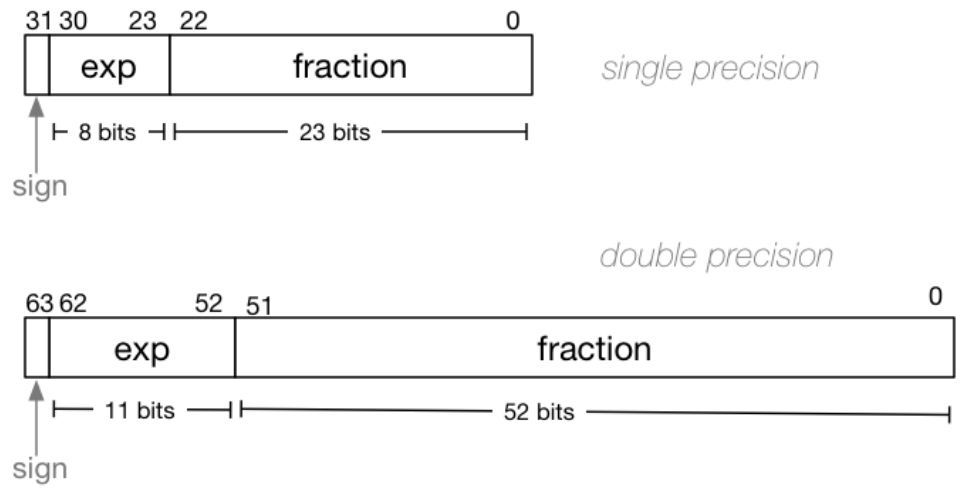

# Floating point numbers

- Float (typically 32-bit) - lower precision, narrower range
- Double (typically 64-bit) - higher precision, wider range
- Long double (typically 128-bit) - but maybe only 80 bits used

```c
double d = 4.0 / 7;
// Rounds to nearest 1 decimal place
printf("%.1lf", d);
// 0.6
// Uses ten spaces to print entire output, still rounding to nearest 1 decimal place
printf("%10.1lf", d);
//        0.6
// %lf prints in decimal
// %le prints in scientific notation
// %lg picks best of decimal and scientific notation
```

Almost all real values will have no exact representation - closest value to be represented has error

Fractional numbers in other bases:

- Decimal: $10^4$ $10^3$ $10^2$ $10^1$ $10^0$ . $10^{-1}$ $10^{-2}$ $10^{-3}$ $10^{-4}$
- Binary: $2^4$ $2^3$ $2^2$ $2^1$ $2^0$ . $2^{-1}$ $2^{-2}$ $2^{-3}$ $2^{-4}$

Number: WHOLE (16 bits) . FRACTION (16 bits) - assume decimal point in fixed position

- Minimum $2^{-16}$ (0.000015)
- Maximum $2^{15}$ (32768)

Same as storing values as integers after multiplying (scaling) by $2^{16}$

## IEEE 754 standard

3 parts to sign fraction x 2<sup>exponent</sup> (similar to scientific notation):

- Sign (positive or negative)
- Fraction (always has 1 bit before binary point - normalised) e.g. **1**.101
  - Always has 1 before the decimal point - assumed to be there, doesn't need to be stored
- Exponent (stored as a positive number by adding constant value (bias))

Numbers close to zero have high precision (more accurate)

Binary point moved to after the first bit, bits after become exponent, rest are fraction

Example: 1010.1011 is normalized as $1.0101011 \times 2^{011}$ = $(1+\frac{43}{128}) \times 2^3$ = 10.6875

Determinig the exponent in binary:

- if exponent is 8-bits, then the bias = $2^{8-1} - 1$ = 127
- Valid bit patterns for exponent 00000001 .. 11111110
- Correspond to B exponent values -126 .. 127 (32 bit IEEE 754 - float)

e.g. exponent of 3 in decimal --> 130 in binary



```c
Example: 0.15625 is represented in IEEE-754 single-precision by 0 01111100 01000000000000000000000
Sign: 0 (positive)
Exponent: 01111100 = 124 (decimal).
	Actual exponent = 124 - exponent_bias = 124 - 127 = -3
Fraction: 01000000000000000000000
  Actual fraction (assumed 1. + remaining) = 1.01
Thus, number = 1.01 * 2^(-3) = 0.15625
```

Exponent special cases:

- 00000000 (e.g. representation for 0.0 --> all zeroes) - subnormal numbers

- 11111111 - inf and nan

Testing for equality with floating point is b

ad e.g. 0 (all zeroes) and -0 (all zeroes except first bit)

Infinity (inf) = 1.0/0.0 (works logically as well - exponent all 1's; -inf has sign 1

- e.g. 1.0/0.0
- can use isinf(x)

0.0/0.0 is nan (NaN - not a real number - undefined) - infinity with 1 as first bit in fraction component

- e.g. sqrt(-1)
- all logical comparisons to nan is false (including nan == nan)
  - use isnan(x)

inf - inf = nan

## Errors in calculation and logical operations

a = 0.1 - no bit pattern to exactly represent .1

b = 1 - a - a - a - a .. 10 times --> should be equal to 0

However, b = 1.11022e<sup>-16</sup> ≠ 0

Avoid using exact logical comparisons == and != for floats and doubles

- Instead of b == 0, do `-0.000001 < b && b < 0.000001` (epsilon, close enough) or `fabs(b) < 0.000001` - b is approximately 0

Storing currency - store as 2 separate values for dollars and cents instead

### Catastrophic Cancellation

```c
double x = 0.000000011;
double y = (1 - cos(x)) / (x * x); // 0.917540
```

(1 - cos(x)) very close to (x * x) - slight representation error in both becomes magnified

```c
long double x = 0.000000011; // 128 bits
double y = (1 - cosl(x)) / (x * x); // 0.499987
```

### Big double int addition (safe up to 2^52)

```c
double d = 9007199254740990;
while (d < 9007199254740999) d = d + 1 // expected to run 9 times. However..
```

Largest integer to be represented as a double: 9007199254740992 (2 ^ 53)

Closest value to be represented for 9007199254740993 = 9007199254740992 (thus, infinite loop)

## Representation

```c
typedef struct float_components {
    uint32_t sign;
    uint32_t exponent;
    uint32_t fraction;
} float_components_t;

// separate out the 3 components of a float
float_components_t float_bits(uint32_t f) {
    float_components_t new;
    // Bits ordered from left to right
    // Extract first bit
    new.sign = f >> 31;
    // new.sign = f < 0;

    // Extract next 8 bits (no bias?)
    new.exponent = ((f >> 23) & 0xFF);

    // Extract remaining 23 bits
    uint32_t mask = (1u << 23) - 1;
    new.fraction = f & mask;
    return new;
}

// given the 3 components of a float
// return 1 if it is NaN, 0 otherwise
int is_nan(float_components_t f) {
    // NaN if exponents all 1 and first bit in fraction is 1
    return f.exponent == 0xFF && f.fraction == 1u << 22;
}

// given the 3 components of a float
// return 1 if it is inf, 0 otherwise
int is_positive_infinity(float_components_t f) {
    // Sign positive and exponent all 1 and fraction all 0 (not NaN)
    return f.sign == 0 && f.exponent == 0xFF && f.fraction == 0;
}

// given the 3 components of a float
// return 1 if it is -inf, 0 otherwise
int is_negative_infinity(float_components_t f) {
    // Sign negative and exponent all 1 and fraction all 0 (not NaN)
    return f.sign == 1 && f.exponent == 0xFF && f.fraction == 0;
}

// given the 3 components of a float
// return 1 if it is 0 or -0, 0 otherwise
int is_zero(float_components_t f) {
    // Exponent and Fraction both 0
    return f.exponent == 0 && f.fraction == 0;
}
```

## Struct vs Union

Struct - can use all fields at once - sets mem to store all fields

Union - can only use one field at once - sets mem to store largest field - saves memory

```c
union overlay_float {
  float f;
  uint32_t u;
}

// return the raw bits of a float
uint32_t get_float_bits(float f) {
  union overlay_float overlay;
  overlay.f = f;
  return overlay.u;
}
```

