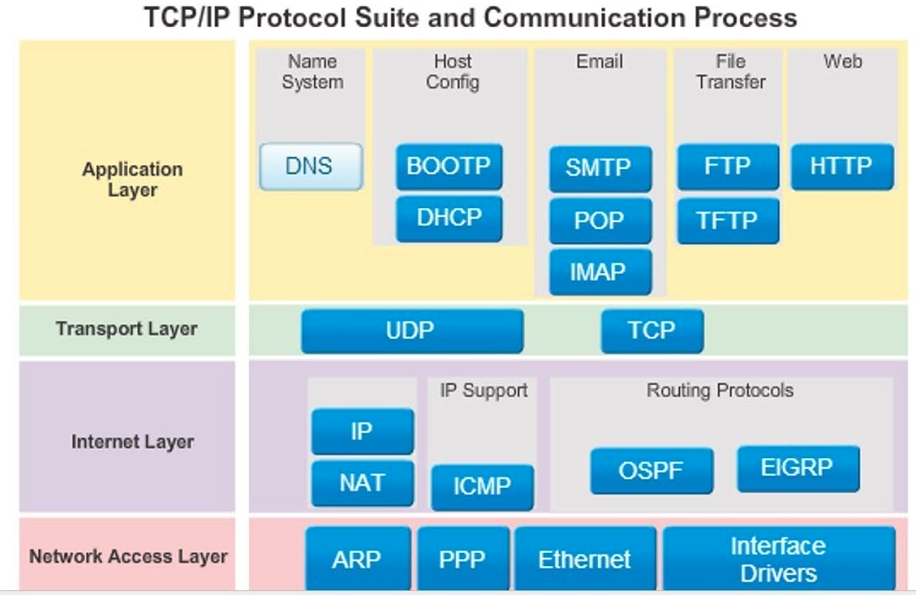

# Pythonic

```python
[2 * num if num % 2 == 0 else num for num in numbers]
```

- Value difference (if before)
- Element inclusion (if after)

Coverage

Pylint (statistically analyses Python code) - constant in uppercase

Docstrings - include description, parameters, return

# Exceptions

```python
try:
  pass
except ValueError as e:
  print(e)
else:
  print('No error')
finally:
  print('Always run')
```

For range:

if end reached return -1

Custom exception

```python
class CustomException(Exception):
  pass
raise CustomException("comment")
```

Pytest catch with

```python
import pytest
def test():
  with pytest.raises(CustomException):
    # failing condition
    pass
```

# Destructing

```python
a, b = (a, b)
a, _ = (a, b)
```

# Enumerate

`for index, element in enumerate(list):`

# Multi-line strings

```python
text1 = """hi
very
long"""
text2 = (
	"hi"
  "very"
  "long"
  "without"
  "\n newline"
)
```

# SDLC Testing

Verification - compare to requirement (system has been built right). Formal verification:

- formally, done mathematically (software/algorithm as object) - proof assistants, model checkers or automatic theorem provers
- high effort cost

Validation - ensure system able to accomplish intended use, goals and objectives (the right system has been built)

Unit testing - testing of individual software components (white-box, software engineers)

Integration testing - testing to expose defects in the interfaces and in the interactions between integrated components or systems (white/black box, software engineers or independent testers)

System testing - testing an integrated system to verify that it meets specified requirements (black-box, independent testers)

Acceptance testing - testing with respect to user needs and requirements (black-box, user/customer)

Good testing:

- Test coverage - measure of how much of the feature set is covered with tests
- Code coverage - measure of how much code is executed during testings
  - `python3-coverage run --source=. -m pytest`
  - `python3-coverage report`
  - `python3-coverage html`
- Branch/edge coverage - more accurate than statement coverage (add --branch flag after --source)

# Data transfer

JSON, YAML (common for configurations), XML (legacy)

Conversion:

```python
import json
import yaml

### JSON TO YAML
data = {}
with open('data1.json', 'rb') as f:
  data = json.load(f)
with open('data1.yml', 'w') as f:
  yaml.dump(data, f)

### YAML TO JSON
with open('data2.yml', 'rb') as f:
  data = yaml.load(f)
with open('data2.json', 'w') as f:
  json.dump(data, f)
```


# HTTP & Flask


- **Network** - a group of interconnected computers that can communicate
- **Internet** - a global infrastructure for networking computers around the entire world together
- World Wide **Web** - a system of documents and resources linked together, accessible via URLs

Network protocols (structures):



HTTP (Hypertext Transfer Protocol) - protocol for sending and receiving HTML documents (nowdays much more) - web browsers are applications to request and receive HTTP

Flask debug mode:

```shell
export FLASK_APP=app.py
export FLASK_DEBUG=1
python3 -m flask run
```

`export FLASK_RUN_PORT=5000` - force a port if app.run(port=5000) doesn't work in debug mode ^

API (application programming interface) - interface (black-box function) exposed by a particular piece of software (commonly, Web API - a "contract" that a particular service provides), e.g. Stripe

RESTful API - API that uses HTTP requests to GET, PUT, POST and DELETE data. GET, PUT, POST, DELETE are HTTP methods.

| Method | Operation                                                    |
| ------ | ------------------------------------------------------------ |
| POST   | **C**reate                                                   |
| GET    | **R**ead                                                     |
| PUT    | **U**pdate (idempotent - applying an operation once or applying it multiple times has the same effect) |
| DELETE | **D**elete                                                   |

```python
from flask import Flask, request
from json import dumps
APP = Flask(__name__)

@APP.route("/login", methods=["GET"])
def login():
  return dumps({
    'ID': request.args.get('username'),
    'PWD': request.args.get('password')
  })
```

.../login?username=axie&password=ax

{"ID": "axie", "PWD": "ax"}

**<u>Input:</u>**

- **GET:** via URL and "request.args.get"
- **PUT, POST, DELETE:** via post-data and "request.get_json()"

Output: same for all types (should be packaged as JSON)

Talking to Flask - via API client (e.g. Postman, ARC Client), Web browser, Python URLLib

```python
from flask import Flask, request
from json import dumps

# url/get?data1=x&data2=y&data3=unused
@APP.route("/get", methods=['GET'])
def get():
  return dumps({
    '1': request.args.get('data1'),
    '2': request.args.get('data2'),
  })

# Need to post JSON - or else get 500 server internal error (empty data dict)
@APP.route("/post", methods=['POST'])
def post():
  data = request.get_json()
  return dumps({
    '1': data['data1'],
    '2': data['data2'],
  })

@APP.route("/put", methods=['PUT'])
def put():
  data = request.get_json()
  return dumps({
    '1': data['data1'],
    '2': data['data2'],
  })

@APP.route("/delete", methods=['DELETE'])
def delete():
  data = request.get_json()
  return dumps({
    '1': data['data1'],
    '2': data['data2'],
  })
```

HTTP status codes:

- 1xx informational response - request received, continuing process
- 2xx successful - request successfully received, understood and accepted
- 3xx redirection - further action needs to be taken in order to complete the request
- 4xx client error - request contains bad syntax or cannot be fulfilled
- 5xx server error - server failed to fulfil an apparently valid request

Python requests

```python
import json
import requests

def get_payload():
  response = requests.get("url/login?data=test")
  # response = requests.get("url/login", params={'data': 'hi'})
  payload = response.json()
  assert payload == {'data': 'test'}
```

Web server as a wrapper

```python
@APP.route("/input", methods=['GET'])
def input():
  return dumps(function(requests.args.get('token'), request.args.get('query')))
```

for def function(token, query)

# HTTP Testing


