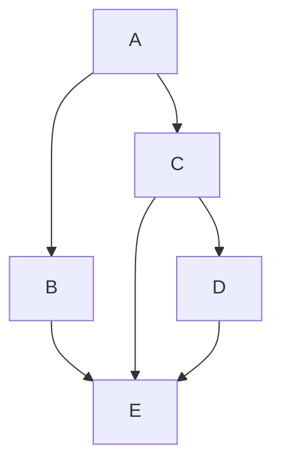
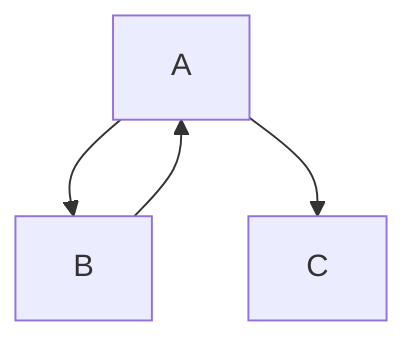
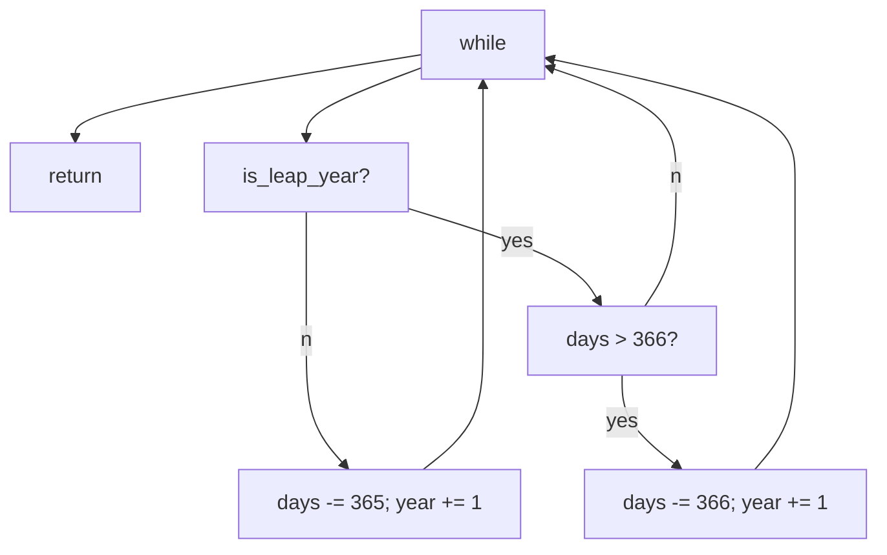
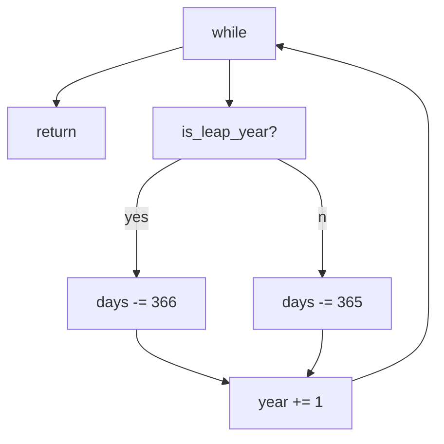
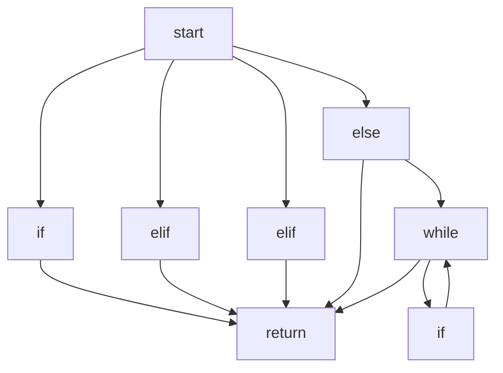

# SDLC Design: Software Complexity

Essential - complexity that is inherent to the problem - fundamentally can't be removed, but can be managed with good software design

Accidental - complexity that is not inherent to the problem (e.g. generating/parsing data in specific formats) - can be somewhat mitigated by engineering decisions (e.g. smart use of libraries, standards etc) - hard to remove entirely

Coupling - a measure of how closely connected different software components are - 'loose' or 'tight', e.g. web applications tend to have a frontend that is loosely coupled from the backend (big reliance on each other)

Cohesion - degree to which elements of a module belong together - elements belong together if they're somehow related - 'low' or 'high', e.g. other.py from project

Cyclomatic complexity - a measure of the branching complexity of functions - computed by counting the number of linearly-independent paths through a function

- To compute, convert function into a control flow graph and calculate the value of the formula `V(G) = e - n + 2` (e = #edges, n = #nodes)
- Maximum cyclomatic complexity of a function - around 8 to 10
- Flaw 1: assumes non-branching statements have no complexity
- Flaw 2: keeping cyclomatic complexity low encourages splitting functions up, regardless of whether that really makes the code more understandable

Example 1:

```python
def foo():
  if A():
    B()
  else:
    C()
  D()
```


Cyclomatic complexity = 4 - 4 + 2 = 2

Example 2:

```python
def foo():
  if A():
    B()
  else:
    if C():
      D()
  E()
```



Cyclomatic complexity = 6 - 5 + 2 = 3

Example 3:

```python
def foo():
  while A():
    B()
  C()
```



Cyclomatic complexity = 3 - 3 + 2 = 2

Example 4 (Zune bug):

```python
def day_to_year(days):
  year = 1970
  while days > 365:
    if is_leap_year(year):
      if days > 366:
        days -= 366
        year += 1
    else:
      days -= 365
      year += 1
  return year
```



Cyclomatic complexity = 8 - 6 + 2 = 4

Example 5:

```python
def day_to_year(days):
  year = 1970
  while days > 0:
    if is_leap_year(year):
      days -= 366
    else:
      days -= 365
    year += 1
  return year - 1
```



Cyclomatic complexity = 7 - 6 + 2 = 3

Example 6:

```python
def is_prime(n):
  if n <= 1:
    prime = False
  elif n <= 3:
    prime = True
  elif n % 2 == 0 or n % 3 == 0:
    prime = False
  else:
    prime = True
    i = 5
    while i*i <= n and prime:
      if n % i == 0 or n % (i + 2) == 0:
        prime = False
      i += 6
  return prime
```



Cyclomatic complexity = 12 - 8 + 2 = 5

==**Note:** "while" is a branch so the function can return without getting to the "while" branch==

# SDLC Development - Safety and Type Checking

Safety - protection from accidental misuse

Security - protection from deliberate misuse

Software Safety - things that could go wrong:

- C: Reading from memory that has not been initialised, Dereferencing a null pointer, "Using" memory after it has been freed, Writing outside the bounds of an array, Forgetting to free allocated memory
- Python: Accessing a variable that hasn't been initialised, Accessing a member that an object doesn't have, Passing a function a type of object it doesn't expect

Static properties: can be inferred without executing the code (e.g. Pylint statically checks that variables are initialised before they're used)

Dynamic properties: checked during execution (e.g. list index valid within bounds, unlike arrays in C)

Memory safety: Python is memory safe (protecting from bugs relating the memory access) as it prevents access memory that hasn't been initialised or allocated (dynamic checks during runtime). Python prioritises safety over the negligible performance cost of bounds-checking, unlike C which prioritises performance over safety and security.

Runtime errors are handled by Exceptions in Python. In C, errors typically have to be included in the return value.

**Easier to ask for forgiveness than permission** (EAFP) convention for handling errors - encourages you to assume something will work and just have an exception handler to deal with anything that might go wrong

- Pros: can simply the core logic and multiple types of errors can be handled with one except block
- Cons: makes code non-structured and harder to reason what code will be executed

**Look before you leap** (LBYL) convention for avoiding errors popular in languages like C - encourages you to check that something can be done before you do it

- Pros: doesn't require exceptions, and code is structured --> easier to reason about
- Cons: core logic can be obscured by error checks

Errors can also be removed statically - rather than dynamically checking for certain errors --> rules out entire classes of bugs. Python - Pylint can statically detect certain errors such as unknown identifier. C - compiler detects a number of errors including type errors

Type checking and safety - C is mostly type-safe as types must be declared and the compiler will check that the types are correct. However, Python, without certain external libraries, is not type-safe as the type is not known until runtime

Mypy - a type checker for Python

```python
from typing import Optional
def count(needle: str, haystack: str) -> int:
  ''' Returns the number of needles in haystack '''
  return count(needle, haystack)

def search(needle: str, haystack: str) -> Optional[str]:
  ''' Returns the needle if found in haystack '''
  for hay in haystack:
    if hay == needle:
      return needle
  return None
```

https://dropbox.tech/application/our-journey-to-type-checking-4-million-lines-of-python

Some benefits of a type checker include preventing forgetting to handle a None value; easy refactoring - indicating what code needs to be changed

# Git Submodules and Rebase

Merge only fast-forward - "catchup" - diff is only new additions

Commits store diff

HEAD - pointer to the current branch reference - pointer to the last commit

Staging branch origin/branch_name (hidden)

Git pull: git fetch; git merge origin/branch_name

Merge vs Rebase for integrating changes:

- merge tries to merge commits into single commit while rebase adjusts commits in feature branch to be based off master branch for other commits (diff)
- Rebase rewrites history - need to --force push - should do often if want to do


git submodule add (.git link) new_dir_name

- git repo within a git repo
- "base" repo does not keep track of file changes within submodule, but knows if files have changed - commit hash differs
- Submodule works like a normal git repo


