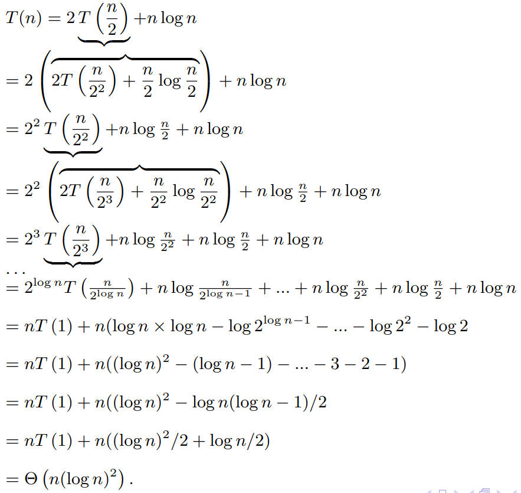

# Asymptotic notation

- Big Oh: $f(n) = O(g(n))$
  - There exist positive constants $c$ and $n_0$ such that $0 \leq f(n) \leq c g(n)$ for all $n \geq n_0$
  - $g(n)$ is an asymptotic upper bound for $f(n)$
  - $f(n)$ does not grow substantially faster than $g(n)$ because a multiple of $g(n)$ eventually dominates $f(n)$
- Omega: $f(n) = \Omega(g(n))$
  - There exists positive constants $c$ and $n_0$ such that $0 \leq c g(n) \leq f(n)$ for all $n \geq n_0$
  - $g(n)$ is an asymptotic lower bound for $f(n)$
  - $f(n)$ grows at least as fast as $g(n)$, because $f(n)$ eventually dominates a multiple of $g(n)$
  - Since $c g(n) \leq f(n)$ if and only if $g(n) \leq \frac{1}{c} f(n)$, we have $f(n) = \Omega(g(n))$ if and only if $g(n) = O(f(n))$
- Theta: $f(n) = \Theta(g(n))$
  - $f(n) = \Theta(g(n))$ if and only if $f(n) = O(g(n))$ and $f(n) = \Omega (g(n))$
  - $f(n)$ and $g(n)$ have the same asymptotic growth rate

# Recurrences

- Allow us to estimate the time complexity of divide and conquer algorithms
- Equation $T(n) = a T(\frac{n}{b}) + f(n)$
  - Let $a \geq 1$ and $b \gt 1$ be a real number
  - If a divide and conquer algorithm reduces a problem of size $n$ to $a$ many problems of smaller size $n/b$, the overhead cost of splitting up or combining the solutions for size $n/b$ into a solution of size $n$ is $f(n)$
  - Should be T of the ceiling of $n/b$ but ignoring the integer parts and additive constants is ok when it comes to obtaining the asymptotics
- For example, merge-sort satisfies the recurrence $T(n) = 2T(\frac{n}{2}) + cn$ since there are two merge-sort calls on the upper and lower halves, and merging occurs in linear time

# Master Theorem

Let:

- $a \geq 1$ be an integer and $b \gt 1$ a real number
- $f(n) \gt 0$ be a non-decreasing function
- $T(n)$ be the solution of the recurrence $T(n) = a T(\frac{n}{b}) + f(n)$

Then:

1. If $f(n) = O(n^{\log_b a -\epsilon})$ for some $\epsilon \gt 0$, then $T(n) = \Theta(n^{\log_b a})$.
2. If $f(n) = \Theta(n^{\log_ba})$, then $T(n) = \Theta(n^{\log_b a} \log_2 n)$.
3. If $f(n) = \Omega(n^{\log_b{a + \epsilon}})$ for some $\epsilon \gt 0$, **and** for some $c \lt 1$ and some $n_0$, $a f(n/b) \leq c f(n)$ holds for all $n \gt n_0$, then $T(n) = \Theta(f(n))$.
4. If none of these conditions hold, the master theorem is not applicable. 

However, often the proof of the master theorem can be tweaked to obtain the asymptotic of the solution $T(n)$ in such a case when the master theorem does not apply, e.g. $T(n) = 2 T(n/2) + n \log n$.

Whenever we have $f = \Theta(g(n) \log n)$, we do not have to specify what base the log is, since all bases produce equivalent asymptotic estimates. However, we do have to specify $b$ in expressions such as $n^{\log_b a}$.

Examples:

- Let $T(n) = 4T(n/2) + n$
  - First condition: $f(n) = n = O(n^{\log_2 4 - \epsilon}) = O(n^{2 - \epsilon})$ for some $\epsilon > 0$?
    - True for any $\epsilon < 1$, therefore $T(n) = \Theta(n^2)$
- Let $T(n) = 2T(n/2) +5n$
  - First condition: $f(n) = 5n = O(n^{\log_2 2 - \epsilon}) = O(n^{1-\epsilon})$ for some $\epsilon > 0$?
    - False for any $\epsilon \gt 0$
  - Second condition: $f(n) = 5n = \Theta(n^{\log_2 2}) = \Theta(n)$?
    - True, therefore $T(n) = \Theta(n \log n)$
- Let $T(n) = 3T(n/4) + n$
  - First condition: $f(n) = n = O(n^{\log_4 3 - \epsilon}) \lt O(n^{0.8 - \epsilon})$ for some $\epsilon \gt 0$?
    - False
  - Second condition: $f(n) = n = \Theta(n^{\log_4 3}) < \Theta(n^{0.8})$?
    - $f(n) = O(n^{0.8})$? False.
  - Third condition:
    - $f(n) = \Omega(n^{\log_4 3 + \epsilon})$ for some $\epsilon \gt 0$?
      - $f(n) = n < \Omega(n^{0.8 + \epsilon})$? True since $0 \leq c (n ^ {\log_4 3 + \epsilon}) \leq n$ when $\epsilon \leq 1 - \log_4 3$ and $0 \lt c \leq 1$.
    - $3f(n/4) \leq cf(n)$?
      - $f(n) = n$ so $\frac{3}{4}n \leq cn$ is true when $c = \frac{3}{4} \lt 1$
- Let $T(n) = 2T(n/2) + n \log_2 n$
  - First condition: $f(n) = n \log_2 n = O(n^{1 - \epsilon})$ for some $\epsilon > 0$? False.
  - Second condition: $f(n) = n \log_2 n = \Theta(n)$? False.
  - Third condition:
    - $f(n) = n \log_2 n = \Omega(n^{1 + \epsilon})$ for some $\epsilon \gt 0$? False since for every $\epsilon \gt 0$ and every $c \gt 0$, no matter how small, $\log_2 n \lt c n^\epsilon$ for all sufficiently large $n$ (use L'Hopital's Rule to show that $c = \log n / n^\epsilon \to 0$).
  - In this case, the master theorem does not apply. However, the asymptotic growth rate of $T(n)$ can still be estimated with a similar technique to the proof of the master theorem.
    - Recursively substituting and expanding at each step to obtain $\Theta(n(\log n) ^ 2)$
    - 

# Tips

- For any $b \gt 1$, $\log_bn = \log_b2 \log_2n$
- $a ^ {\log_b n} = n ^ {\log_b a}$

