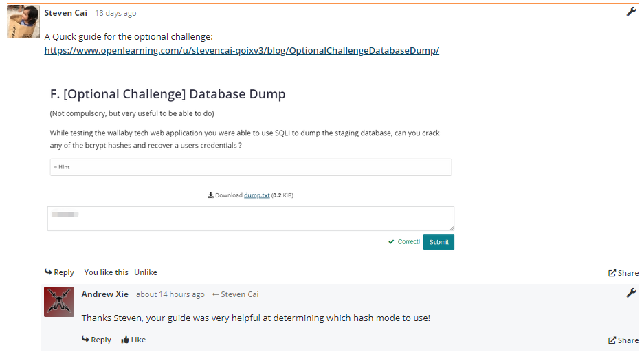

# Portfolio Checkin 1

## Portfolio Summary

- **Who (zID):** Andrew Xie (z5317337)
- **Date:** 27 February 2021
- **Blog:** https://www.openlearning.com/u/axie/blog/
- **Facilitator Group:** [W15B](https://www.openlearning.com/unswcourses/courses/sec-21t1/cohorts/classof21t1/groups/602c9606f2a5d7000035a382/?cl=1)
- **Facilitator:** [Brendan N](https://www.openlearning.com/u/chapachap/)
- **Course:** COMP6841

## Professionalism

<u>Time management</u>

Although I spent a lot of time on this subject so far, completing the majority of the activities each week, I am still spending a bit too much time even though I really enjoy learning about security and find the activities very interesting. As mentioned in my week 1 reflection, I planned to reduce my hours spent during week 2, which I have been able to do so by about 8 hours. This is shown in my breakdown below:

- Week 1 breakdown (26 hours):
  - 10 hours on lectures/seminars/webinars/tutorials/law-podcast
  - 11 hours on activities:
    - 1.5 hours on Community
    - 4.5 hours on Foundations
    - 4 hours on Extension
    - 1 hour on Optional
  - 1 hour on case study 2 preparation
  - 3 hours on Something Awesome research and proposal
  - 5 minutes on weekly quiz
  - 45 minutes on week 1 reflection
- Week 2 breakdown (18 hours):
  - 9 hours on lectures/seminars/webinars/tutorials
  - 8 hours on activities:
    - 0.5 hours on Community
    - 4.5 hours on Foundations (mostly from the crypto challenge and write-ups)
    - 1.5 hours on Security Engineering
    - 30 minutes on Extension
    - 1 hour on Optional
  - 30 minutes on case study 3 preparation
  - 15 minutes on weekly quiz
  - 30 minutes on week 2 reflection
  - 2 hours on this portfolio

As mentioned in my week 2 reflection, I am planning to focus more on my other subjects and commitments, so I amended my plan to reflect less hours being spent on security, although just as effectively. 

<u>Communication</u>

Since I planned to spend less time on writing activities from week 2 onwards, I decided to make up for my learning by doing research and reading other students' blog posts instead, as well as browsing over blog posts for activities I've completed to see how others managed to complete them. I have liked and commented on more than 20 posts, with several notable ones being:

- [Providing help example](https://www.openlearning.com/unswcourses/courses/sec-21t1/week01/sqli_wargame?inCohort=unswcourses%2Fcourses%2Fsec-21t1%2FCohorts%2FClassOf21T1#comment-6030898f41cf3829b5eec776)
- [Blog reading example](https://www.openlearning.com/u/fangyiguo-q61j5u/blog/Reasonable/#comment-602feb75097c38546090a2b5)
- [Community engagment example](https://www.openlearning.com/unswcourses/courses/sec-21t1?inCohort=unswcourses%2Fcourses%2Fsec-21t1%2FCohorts%2FClassOf21T1#comment-60362e1cf1ce384d515ec21b)
- [Discussion example](https://www.openlearning.com/u/axie/blog/DeepwaterHorizonOilSpillTypeITypeIiErrors#comment-6039f246d2b5306af7b952b0)
- [Encouragement example](https://www.openlearning.com/u/amamiya/blog/0X2TypeITypeIiErrors#comment-60391a6db5c038583fb7e2bc)

I was also quite prepared for case study 2 discussion during our second tutorial, allowing me to contribute significantly to our group discussions whilst being mindful of others and their contributions. Furthermore, my communication skills were demonstrated in my email conversation thread with my tutor regarding my Something Awesome project proposal, allowing me to get it approved during the first week.

<u>Community building</u>

I have completed all of the community activities:

- [Course Introduction](https://www.openlearning.com/unswcourses/courses/sec-21t1?notificationEndEventIndex=1&channelId=6028da5b45813873d1b4bc55&notificationStartEventIndex=0&inCohort=unswcourses%2Fcourses%2Fsec-21t1%2Fcohorts%2Fclassof21t1&notificationClientType=web%2Fmobile)
- [Wisdom Quote](https://www.openlearning.com/u/axie/blog/WisdomQuote/)
- [Security Everywhere Week 1](https://www.openlearning.com/u/axie/blog/DiscordSecure/)
- [Music I Love](https://www.openlearning.com/unswcourses/courses/sec-21t1?inCohort=unswcourses%2Fcourses%2Fsec-21t1%2FCohorts%2FClassOf21T1#comment-60362e1cf1ce384d515ec21b) (attracted much community engagement)
- [Security Everywhere Week 2](https://www.openlearning.com/u/axie/blog/ScammedBySydneyTransport/)

I am also quite active with reading/liking/commenting on other's blog posts, as suggested above.

<u>Ethical behaviour</u>

During Week 1's Dumpster Diving activity, I uncovered a lot of information about the subject in question. Although there was quite a lot of extra personal information that could be extracted through OSINT, I stopped myself from continuing further as it felt quite unethical to post all my findings on a public blog about someone, so I limited myself to only sharing information relevant to the activity. I also considered ethics quite substantially when writing my Something Awesome proposal, where my tutor advised me to expand on how I was going to get consent from my testers. My revised strategy can be found on my proposal blog post (please see below). 

## Analysis

Most of my analysis are featured in my activity blog posts and weekly reflections on lectures, tutorials and activities. The weekly reflections include a brief evaluation of my week, as well as my plans for the upcoming week. My blog posts are usually very analytical (e.g. [NSA Game](https://www.openlearning.com/u/axie/blog/NsaGame/), [SQLi](https://www.openlearning.com/u/axie/blog/SqlInjection/) and [Dumpster Diving](https://www.openlearning.com/u/axie/blog/DumpsterDiving/)), as well as my [case study 2 preparation notes](https://www.openlearning.com/u/axie/blog/CaseStudy2Preparation/). Here are my weekly reflections:

- [Week 1](https://www.openlearning.com/u/axie/blog/Week1Reflection/)
- [Week 2](https://www.openlearning.com/u/axie/blog/Week2Reflection/)

## Core and Engineering Activities

I have completed most of the activities from week 1 and week 2, which have been linked below. 

Week 1:

- [Thinking like an attacker](https://www.openlearning.com/u/axie/blog/BestPlaceToHideYourJewels/)
- [Cyber security through the ages](https://www.openlearning.com/u/axie/blog/Ransomware/)
- [Bluetooth traces](https://www.openlearning.com/u/axie/blog/BluetoothTraces/)
- [Dumpster Diving](https://www.openlearning.com/u/axie/blog/DumpsterDiving/)
- [Reasonable](https://www.openlearning.com/u/axie/blog/QuickFireEstimation/)

Week 2:

- [Warmup Crypto Challenge](https://www.openlearning.com/u/axie/blog/WarmupCryptoChallenge/)
- [NSA Game](https://www.openlearning.com/u/axie/blog/NsaGame/)
- [have i been pwned?](https://www.openlearning.com/u/axie/blog/PwnedOverflow/)
- [Explain TI/TII with an example](https://www.openlearning.com/u/axie/blog/DeepwaterHorizonOilSpillTypeITypeIiErrors/)

## Extension Activities

I have completed all the extension activities, as well as some of the optional challenges. They all have write-ups which can be found in the blog posts attached below.

Week 1:

- [Cryptography Wargame - Steganography](https://www.openlearning.com/u/axie/blog/Steganography/)
- [SQLi Wargame](https://www.openlearning.com/u/axie/blog/SqlInjection/)
- [Network recon - port scanning](https://www.openlearning.com/u/axie/blog/TryHackMeReconChallengeZzen9201Knock/)
- [OSINT](https://www.openlearning.com/u/axie/blog/WallabytechOsint/)

Week 2:

- [XSS Wargame](https://www.openlearning.com/u/axie/blog/AnUnintendedXssVulnerability/) (found a potentially unintentional XSS exploit)
- [Classic Ciphers](https://www.openlearning.com/u/axie/blog/ClassicalCiphers/)
- [Steganography](https://www.openlearning.com/u/axie/blog/Steganography0/)

## Something Awesome

Although I had several ideas when brainstorming potential topics for my Something Awesome Project, I decided to pick a Chrome Credential Stealer for my project as it covered a lot of technical topics I am interested in and hope to learn more about, as mentioned in my [proposal](https://www.openlearning.com/u/axie/blog/SomethingAwesomeProposalChromeCredentialStealer/). I was able to get it approved within the first week, even with several revisions of the marking criteria and suggestions to the project from my tutor. 

# Portfolio Checkin 2

## Portfolio Summary

- **Who (zID):** Andrew Xie (z5317337)
- **Date:** 15 March 2021
- **Blog:** https://www.openlearning.com/u/axie/blog/
- **Facilitator Group:** [W15B](https://www.openlearning.com/unswcourses/courses/sec-21t1/cohorts/classof21t1/groups/602c9606f2a5d7000035a382/?cl=1)
- **Facilitator:** [Brendan N](https://www.openlearning.com/u/chapachap/)
- **Course:** COMP6841

## Professionalism

<u>Time management</u>

For the previous checkin, I spent a total of 44 hours on the course, which was way too much for two weeks of work. For the next two weeks, I have managed to cut my hours significantly, due to my busy schedule as described in my [week 3](https://www.openlearning.com/u/axie/blog/Week4Reflection/) and [week 4](https://www.openlearning.com/u/axie/blog/Week4Reflection/) reflections. Keeping this schedule in mind, here is a breakdown of my work over the two weeks:

- Week 3 breakdown (8.5 hours):
  - 2 hours on in-person tutorial
  - 1 hour on lecture content - reading and writing lecture and webinar notes
  - 4 hours on activities
    - 30 minutes on Community
    - 1 hour on Foundations
    - 2.5 hours on Security Engineering
    - 30 minutes on Extension
  - 30 minutes on case study 4 preparation
  - 15 minutes on weekly quiz
  - 1 hour on week 2 reflection
- Week 4 breakdown (13 hours):
  - 2 hours on in-person tutorial
  - 3 hours on lecture content - reading and writing lecture and webinar notes (including rewatching the webinar and also the live lecture recordings)
  - 4 hours on activities (explained in my week 4 reflection)
    - 30 minutes on Community and Foundations
    - 2.5 hours on Security Engineering
    - 1 hour on Extension
  - 1 hour on Something Awesome research
  - 30 minutes planned on case study 5 preparation
  - 15 minutes on weekly quiz
  - 30 minutes on week 4 reflection
  - 2 hours on this portfolio

As evident in my reflections and quality of blog posts for each activity, I have been able to optimise my time more efficiently, more effectively using my limited time to learn as much as possible.

<u>Communication and Community building</u>

In my [Week 3 Reflection](https://www.openlearning.com/u/axie/blog/Week3Reflection/), I've clearly laid out my plan for the course and how I plan to make better use of my time in the activities I choose to complete. For the activities I've missed out on, I've still managed to catch up by reading other students' blog posts and actively engaging with them, such as:

- [Rickroll Phishing](https://www.openlearning.com/u/seandavidmccaughey-ptysb1/blog/PhishingActivityGoneAwry#comment-604e42a61acb0446ecdf508a)
- [Misdirection and Magic](https://www.openlearning.com/u/yunpengzhuo/blog/Week3MisdirectionAndMagic#comment-604e43c2d2b53042cb326690)
- [Cognitive Vulnerability Research](https://www.openlearning.com/u/cherylxuanenouyang-qoi3u8/blog/SchrdingerSCatBias#comment-604e480df3013d43c00d890d)
- [Exponential Growth](https://www.openlearning.com/u/finleyghosh-qoi390/blog/ExponentialGrowth#comment-604e441c218438293e1a8c88)
- [Self-Interest and Conflict of Interest](https://www.openlearning.com/u/gabrielangeloting-qohwzc/blog/Week4ActivitySelfInterestAndConflictOfInterest#comment-604e456fb729166ba207b689)
- [Format String Wargames](https://www.openlearning.com/u/abiramen/blog/FormatStringWargames#comment-604e460c88ca04375bbfc771)

Several activities I've completed involved community engagement and communication, which I have linked under my blog post for the activity, such as for [Enigma Machine](https://www.openlearning.com/u/axie/blog/2/) and [Merkle Puzzles](https://www.openlearning.com/u/axie/blog/MerklePuzzles/). Some of the community building activities I've completed over the last two weeks include [Security Everywhere](https://www.openlearning.com/u/axie/blog/TrafficSecurityByObscurity/) and [Grand Illusion](https://www.openlearning.com/unswcourses/courses/sec-21t1?inCohort=unswcourses%2Fcourses%2Fsec-21t1%2FCohorts%2FClassOf21T1#comment-604e3e00d2b53039a81e6511). As evident above, I am quite active within the community. I have also added a profile picture to [my profile](https://www.openlearning.com/u/axie/). 

<u>Ethical behaviour</u>

I have considered ethics quite heavily during these two weeks. When completing the [Slip-up activity](https://www.openlearning.com/u/axie/blog/OurOwnSlipUps/), I considered the ethical decency I have always maintained, and the damaging consequences that could arise given my power and privilege having administrator permissions for the school network. I also considered the Good Faith Policy for what I thought were innocent pranks on my classmates back then. In light of my current knowledge, I should have asked for explicit permission from my friends before abusing my power to troll them. In light of feedback from the last checkin, ethical considerations from my Something Awesome Proposal included separating my testers into two main groups in order to test successful operational extraction from the program as well as testing social engineering. This required different ways of gathering permission from my testers as being aware of the true purpose of the program will cause confirmation bias in testing, as explained in the first two paragraphs of my [proposal](https://www.openlearning.com/u/axie/blog/SomethingAwesomeProposalChromeCredentialStealer/). Furthermore, I have made several ethical considerations during my Week 4 Tutorial in the Witness Case Study, regarding the duty of a lawyer and whether defending criminals is the most ethically sound to society in general. More details can be found in my [week 4 reflection](https://www.openlearning.com/u/axie/blog/Week4Reflection/). 

## Analysis

As mentioned before, I significantly improved the quality of my work since reducing the number of activities I have completed due to my busy schedule. This means that most of my blog posts are now very analytical. How I specifically went above and beyond for some of the activities will be explained later on. Some notable examples of analysis include:

- Non-technical
  - [Week 3 Reflection](https://www.openlearning.com/u/axie/blog/Week3Reflection/) - very heavy analysis and reflection
  - [Week 4 Reflection](https://www.openlearning.com/u/axie/blog/Week4Reflection/)
  - [Security by Obscurity](https://www.openlearning.com/u/axie/blog/TrafficSecurityByObscurity/) - analysis of the side effects of security by obscurity in traffic
  - [Research a Cognitive Vulnerability](https://www.openlearning.com/u/axie/blog/1/) - last paragraph
  - [Our Own Slip-ups](https://www.openlearning.com/u/axie/blog/OurOwnSlipUps/)
- Technical
  - [Buffer Overflow](https://www.openlearning.com/u/axie/blog/BufferOverflow/) - multiple methods and strategies
  - [Merkle Puzzles](https://www.openlearning.com/u/axie/blog/MerklePuzzles/) - last paragraph
  - [Auditing Trick](https://www.openlearning.com/u/axie/blog/3/) - data analysis

## Core and Engineering Activities

For the previous checkin, I focused more on completing Core activities as I found them more enjoyable to learn about. Due to this, I've focused on completing more activities from Security Engineering due to my limited time. Also, these engineering tasks are more relevant to my Something Awesome project which involves encryption and decryption, which is why I have planned to complete all of such activities for week 4. 

Week 3:

- [Research a Cognitive Vulnerability](https://www.openlearning.com/u/axie/blog/1/) - spent a lot of time researching cognitive biases and their relation to security
- [Enigma Machine](https://www.openlearning.com/u/axie/blog/2/) - built a simulation in Python to encipher/decipher text quickly
- [Auditing Trick](https://www.openlearning.com/u/axie/blog/3/) - heavy data analysis

Week 4:

- [Our Own Slip-ups](https://www.openlearning.com/u/axie/blog/OurOwnSlipUps/)
- [Merkle Puzzles](https://www.openlearning.com/u/axie/blog/MerklePuzzles/)
- [Learn how RSA works](https://www.openlearning.com/u/axie/blog/Rsa/)
- [Symmetric] - not released yet at time of writing

## Extension Activities

So far, extension activities have definitely been my favourite set of activities. Since they are more technical, I've found that they usually take less time to complete than regular activities which require much blog post writing, which I feel is not a very effective use of my time as I take notes for everything anyways. I've very much enjoyed learning about [Buffer Overflows](https://www.openlearning.com/u/axie/blog/BufferOverflow/) and [Format Strings](https://www.openlearning.com/u/axie/blog/FormatStringWargames/). Similar to the last checkin, I found these extension activities quite straightforward, and ended up spending more time playing around with the code to find alternate methods of exploits, as evident in my blog post for the Buffer Overflow Wargames where I provided three methods of solving the last challenge. As mentioned in my week 3 reflection, I've been able to prioritise my time more efficiently by completing these activities first, allowing me to allocate my remaining time for other activities more effectively.

## Something Awesome

Below is a summary of my Something Awesome update from my [Week 4 Reflection and Something Awesome Update](https://www.openlearning.com/u/axie/blog/Week4Reflection/):

Learning about AES and other encryption standards this week, I spent about an hour doing some additional research into how Chrome uses AES encryption for stored passwords, requiring a secret key, initialisation vector and encrypted password for decryption (will need to do more research to find out where these are located). It seems that on machines running Windows, Chrome uses the Windows API function CryptProtectData for encryption / decryption, which can be exploited with Python using pywin32, which is less secure than the method used by MacOS as mentioned in my proposal. However, the underlying SQLite database has the same structure once exploited. I've also found out about the 2019 CStealer Trojan during my research, which steals Chrome passwords and uploads them to a remote MongoDB database. Looking at alternative methods to Chrome password storage, I've come to the conclusion that using a password manager is one of the most effective ways of password storage for Chrome users, rather than relying on Chrome's underlying password management system, with advantages such as generating strong, unique passwords and keeping them more secure. Furthermore, I am waiting for my last PC part to arrive (CPU) in 1-2 weeks so I can start messing around with Chrome password storage on Windows and figure out how to exploit the database. My project seems promising and I hope to start implementing it soon. 

# Portfolio Checkin 3

## Professionalism

<u>Time management</u>

Although I didn't manage to complete as many activities as I wanted to, I ended up spending 134 hours in total since the last checkin, which meant that I spent an average of nearly 5 hours each day just on security over the last four weeks. As mentioned in my [Something Awesome Reflection](https://www.openlearning.com/u/axie/blog/KrwmtoolsReflection/), I managed my time especially well during this period, spending most of my time on my project, which I was able to learn a lot from. Furthermore, as mentioned in the last paragraph of my [Week 5 Reflection](https://www.openlearning.com/u/axie/blog/Week5Reflection/), I have justified the use of this time despite the late release of activities which meant I was unable to complete as many activities as I usually would. As such, I believe my time management skills have been very effective and have improved since last time, even with my busy commitments this term mentioned at the end of my [Week 1 Reflection](https://www.openlearning.com/u/axie/blog/Week1Reflection/). Similarly to last time, I found that spending more on each activity I do helps with consolidating my understanding of course content and was the most ideal use of my limited time, through my own practical challenges involving code, as evident in the activities with a star next to them in my breakdown of my 134 hours below:

- Community Activities (1.5 hours)
  - [Recharge](https://www.openlearning.com/unswcourses/courses/sec-21t1?inCohort=unswcourses%2Fcourses%2Fsec-21t1%2FCohorts%2FClassOf21T1#comment-606d3829e35bce2452179fe5) (30 minutes)
  - [Security Everywhere Week 4](https://www.openlearning.com/u/axie/blog/BonzibuddyTheInsider/) (30 minutes)
  - [Security Everywhere Week 5](https://www.openlearning.com/u/axie/blog/BsidesCrypto/) (30 minutes)
- Core and Engineering Activities (5.5 hours)
  - *[Password Hash Cracking](https://www.openlearning.com/u/axie/blog/HashCracking/) (2 hours)
  - *[Birthday Attack](https://www.openlearning.com/u/axie/blog/BirthdayAttack/) (2 hours)
  - [Podcast: Blockchain, Bitcoin and Proof of Work](https://www.openlearning.com/u/axie/blog/PodcastBlockchainBitcoinAndProofOfWork/) (30 minutes)
  - *[Bitcoin Mining](https://www.openlearning.com/u/axie/blog/BitcoinMining/) (1 hour)
- Extension Activities (2.5 hours)
  - *[Forensics](https://www.openlearning.com/u/axie/blog/Forensics/) (2.5 hours)
- Something Awesome (122.5 hours)
  - [My final PC part has arrived - time to start my project!](https://www.openlearning.com/u/axie/blog/MyFinalPcPartHasArrivedTimeToStartMyProject/) (30 minutes)
  - [KrwmTools Program](https://github.com/axieax/krwm-tools) (100 hours)
  - [Project Writeup](https://github.com/axieax/krwm-tools/blob/main/writeup.md) (20 hours)
  - [Project Reflection](https://www.openlearning.com/u/axie/blog/KrwmtoolsReflection/) (2 hours) - a further breakdown of time management for my Something Awesome Project can be found in this reflection throughout
- [Week 5 Reflection](https://www.openlearning.com/u/axie/blog/Week5Reflection/) (30 minutes)
- This portfolio (1.5 hours)

<u>Communication and Community building</u>

I have been quite involved within the online community on OpenLearning, with notable examples including:

- [Recharge](https://www.openlearning.com/unswcourses/courses/sec-21t1?inCohort=unswcourses%2Fcourses%2Fsec-21t1%2FCohorts%2FClassOf21T1#comment-606d3829e35bce2452179fe5) involving a conversation between Richard Buckland and me
- Engagement with other students for the Bitcoin Mining activity
  - [Helping another student](https://www.openlearning.com/unswcourses/courses/sec-21t1/activities/blockchain?inCohort=unswcourses%2Fcourses%2Fsec-21t1%2FCohorts%2FClassOf21T1#comment-6074fcbb98fad4499d068d54)
  - [Feedback for another student](https://www.openlearning.com/unswcourses/courses/sec-21t1/activities/blockchain?inCohort=unswcourses%2Fcourses%2Fsec-21t1%2FCohorts%2FClassOf21T1#comment-6074f5be203cb858d14a2116)
- [Feedback for Steven's Database Dump Guide](https://www.openlearning.com/unswcourses/courses/sec-21t1/activities/hash-cracking?inCohort=unswcourses%2Fcourses%2Fsec-21t1%2FCohorts%2FClassOf21T1#comment-607466f821e9cc66ec425339)
  - 
- Comments on Something Awesome Flipgrids
  - [Ali A](https://flipgrid.com/a43486a3)
  - [Xuanen O](https://flipgrid.com/1506ed58)
  - [Zenne R](https://flipgrid.com/48061188)
- [Feedback for Will's Birthday Attack post](https://www.openlearning.com/u/willsieber/blog/BirthdayAttack#comment-60749c9f795fcd54abb6613f)
- [Feedback for Mohammed's Birthday Attack post](https://www.openlearning.com/u/mohammednasef/blog/ThePowerOfBirthdayAttacks#comment-60749be6203cb827c3f1d8a0)
- [Supportive comment on Zenne's Security Everywhere post](https://www.openlearning.com/u/zenneranderath-qojkj1/blog/SecurityEverywhereHumanError#comment-606db84ec212bd40dc33e2ff)

I have also engaged with the security community by attending BSides 2021 in Canberra, which was a very exciting and interesting experience for me. I have discussed more about this experience in my [Security Everywhere Week 5](https://www.openlearning.com/u/axie/blog/BsidesCrypto/) blog post. 

<u>Ethical behaviour</u>

Ethical considerations were a significant part of my Something Awesome Project, which I reflected about in the last paragraph of my [Project Reflection](https://www.openlearning.com/u/axie/blog/KrwmtoolsReflection/) towards the end. Furthermore, I have discussed ethical considerations regarding government surveillance and privacy during Case Study 5: Snoop, which I found very interesting. My points for discussion are evident in my notes for [Case Study 5 Preparation](https://www.openlearning.com/u/axie/blog/CaseStudy5Preparation/), as well as a brief discussion of points I've missed at the very beginning of my [Week 5 Reflection](https://www.openlearning.com/u/axie/blog/Week5Reflection/).

## Analysis

Significant examples of analysis I've done since the last checkin are evident in my Something Awesome [Writeup](https://github.com/axieax/krwm-tools/blob/main/writeup.md) (4000 words of extensive analysis) and [Reflection](https://www.openlearning.com/u/axie/blog/KrwmtoolsReflection/). Other examples of extensive analysis can be found in the activities starred from the breakdown above, with notable ones including my design of an efficient algorithm for [Birthday Attack](https://www.openlearning.com/u/axie/blog/BirthdayAttack/), my analysis of length extension attacks and using hashcat for password cracking in [Password Hash Cracking](https://www.openlearning.com/u/axie/blog/HashCracking/), as well as my analysis for [Bitcoin Mining](https://www.openlearning.com/u/axie/blog/BitcoinMining/) where I walked through what I did with an invalid block. Another example of analysis can be found in the first paragraph of my [Week 5 Reflection](https://www.openlearning.com/u/axie/blog/Week5Reflection/), which describes what I've learned from Week 5 content and activities. 

## Core and Engineering Activities

I spent around my usual amount of weekly effort into the activities this time. As mentioned above, I've had to compromise by spending more time on some of the activities to make sure that I am able to get as much out of each activity I complete. A full list of the activities I've completed can be found in the breakdown above. Some of the notable activities I've completed include my design of an efficient algorithm for [Birthday Attack](https://www.openlearning.com/u/axie/blog/BirthdayAttack/), my analysis of length extension attacks and using hashcat for password cracking in [Password Hash Cracking](https://www.openlearning.com/u/axie/blog/HashCracking/), as well as my analysis for [Bitcoin Mining](https://www.openlearning.com/u/axie/blog/BitcoinMining/) where I walked through what I did with an invalid block. Most of these activities involved me challenging myself to write a practical application to consolidate my understanding of concepts learned, allowing me to achieve better results than I would manually by hand, such as in the Birthday Attack activity where I was able to find collisions up to 9 matching digits, compared to the 2 asked by the question. I found these activities very interested and thoroughly enjoyed pushing myself to do more for these.

## Extension Activities

I usually complete extension activities as soon as they come out. However, I was only able to complete one this time due to the late release of activities as well as there being no wargames in Week 7. In my writeup for the [Forensics](https://www.openlearning.com/u/axie/blog/Forensics/) Wargame, I detailed the steps I took to complete each activity with the steps I missed and would have taken in hindsight for future wargames and CTF's. I stepped through my thought process and an explanation of why I did what I did, as well as the resources I used in order to find the flag, such as the list of file signatures from Wikipedia. I also reflected on my experience doing this activity by illustrating what I gained from it, such as using a hex editor, new things to consider (Wargame 2 head and tail) as well as a deeper understanding of networking protocols. 

## Something Awesome

As mentioned above, I've put a lot into my Something Awesome Project and have gained much from this experience. This is evident in my extensive 4000-word [Project Writeup](https://github.com/axieax/krwm-tools/blob/main/writeup.md) (would recommend reading, but if pressed on time, check out the intro and conclusion at least) as well as my [Project Reflection](https://www.openlearning.com/u/axie/blog/KrwmtoolsReflection/). Other things I've written for this project since the last checkin include a blog post [My final PC part has arrived - time to start my project!](https://www.openlearning.com/u/axie/blog/MyFinalPcPartHasArrivedTimeToStartMyProject/) at the beginning of my project, as well as my repository which can be found [here](https://github.com/axieax/krwm-tools). I am very proud of what I've been able to achieve in this project. 

What I've done since:

- SA blog, reflection
- Bonzi Buddy https://www.openlearning.com/u/axie/blog/BonzibuddyTheInsider/
- https://www.openlearning.com/u/axie/blog/HashCracking/ - end
- 

Community:

https://www.openlearning.com/u/zenneranderath-qojkj1/blog/SecurityEverywhereHumanError#comment-606db84ec212bd40dc33e2ff

**WHAT I LEARNED FROM THIS**

Say where the analysis is

