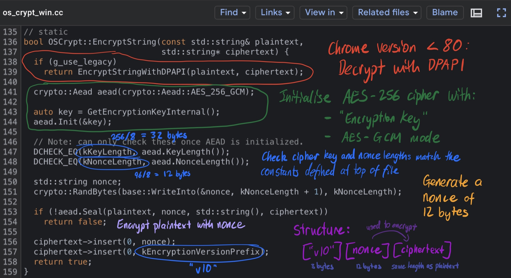
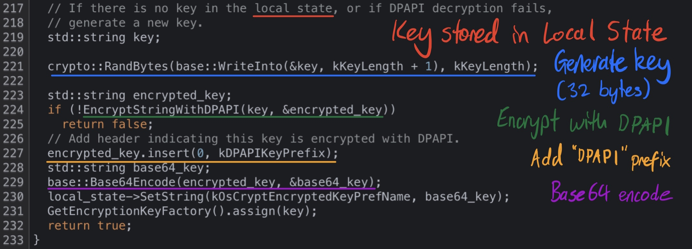

# KrwmTools

# Introduction and Rationale

For my Something Awesome security project, I decided to build a tool kit aimed at extracting sensitive data from Chromium browsers. My project was inspired by the [LaZagne Project](https://github.com/AlessandroZ/LaZagne), an open-source credentials recovery application which can be used to extract browser credentials as well as other passwords stored on a Windows, Mac OS and Linux computers. KrwmTools focuses on Windows machines, extracting credentials, autofill information (fields, profiles, addresses, names, emails, phone numbers), credit card information, cookies and history (search terms and web history) from the ten most popular Chromium browsers, which could help build a profile for the users on a compromised computer. As detailed in my initial proposal, I had originally planned to create a password stealer only for the Google Chrome browser, working on all three operating systems. However, I decided to shift my focus to building a multi-purpose tool after realising the potential of other sensitive data which could be extracted as well, especially since there doesn't seem to be a similar utility available yet (on Google at least). My project is split into two sections: extracting the data, and securely sending the extracted data to a remote server (optional spyware functionality). 

> Git repository for source code and packaged Windows executable available at [https://github.com/axieax/krwm-tools](https://github.com/axieax/krwm-tools)

# Part 1: Chromium Data Extraction

## Part 1.1: Locating and extracting the credentials data

Due to issues with my MacBook, I was only able to start the project once my last PC part arrived so that I could finally assemble my Windows machine. Keeping in mind that I had initially only planned to extract credentials from the Google Chrome browser, I was able to quickly identify where the sqlite3 database for Login Data was stored (in the %APPDATA% directory) and use SQL queries learned from SQL Injection Wargames in the extension course, to learn more about how the data was stored. I discovered that the database would be locked with the browser being open, so I had to operate on a copy of the database file as a compromise. I kept this feature in my production code so that the browser did not have to be closed in order to extract data, and as will be discussed later, certain browsers like the Epic Privacy Browser used temporary databases which would be deleted upon exiting the browser. 

The Python code below is an extract of the reconnaissance attack I used to gain more information about the database structure for Login Data. 

```python
def sqli_recon(db_cursor) -> None:
    """ SQL queries to learn more about the database structure """
    # To find tables
    db_cursor.execute("SELECT name FROM sqlite_master WHERE type='table'")
    print(db_cursor.fetchall())
    # Table of interest: logins

    # To find columns for logins table
    db_cursor.execute('PRAGMA table_info(logins)')
    print([row[1] for row in db_cursor.fetchall()])
    # Columns of interest: action_url, username_value, password_value
```

Upon extracting the rows corresponding to credentials, I was surprised to see values for the action_url and username_value columns stored in plaintext, especially those associated with credentials that I remember saving on my MacBook's Chrome application, which definitely indicated that I was heading in the right direction. Since I had only just set up my machine, I did not expect anything to turn up as I did not realise my credentials were also saved on my Google account, which is pretty convenient I suppose. 

## Part 1.2: Decrypting the data

As expected, the passwords were encrypted (thankfully!). From my research, it seemed that all I needed to do now was pass the encrypted passwords to Window's DPAPI (Data Protection API) for decryption, using the pywin32 Python package in order to make this Windows API call in Python. The DPAPI is a form of encryption at the operating system level which relies on the credentials of the user logged into the computer. Although it offers quite a strong form of encryption, it can be easily exploited using the attacker mindset on the same machine, where processes created by the same user are able to make these system calls without requiring knowledge of the user's login password. As a result, I am able to use this API to decrypt passwords which were encrypted with the same scheme without requiring user authentication once they are already logged into their computer, unlike the Chrome application where the user is prompted to enter their login password in order to view their stored passwords. 

However, once I had finally managed to install the Python dependency using another wrapper package (pypiwin32), I knew something was wrong when the passwords could not be decrypted using this approach. Having a look over my sources again, I noticed that they were quite outdated, ranging from 2013 to 2017. Doing some further research, I encountered [this article](https://hothardware.com/news/google-chrome-aes-256-password-encryption-malware-devs) which pointed that Chrome altered its encryption scheme for versions 80+ to AES-256, which was able to prevent the popular AZORult malware from stealing data from up-to-date Chrome users. This explained why I was unable to simply decrypt the passwords with DPAPI. Without much additional information on how the new encryption scheme worked, I resorted to analysing the open-source [Chromium source code](https://source.chromium.org/chromium/chromium/src) which Google Chrome was built on, in hopes of reverse engineering the password encryption process. 

After several hours of searching, I came across the [components/os_crypt/os_crypt_win.cc file](https://source.chromium.org/chromium/chromium/src/+/master:components/os_crypt/os_crypt_win.cc?q=DPAPI) written in C++ which seemed to contain what I was looking for. One of the functions of interest was the [OSCrypt::EncryptString function](https://source.chromium.org/chromium/chromium/src/+/master:components/os_crypt/os_crypt_win.cc;l=135?q=DPAPI). The annotated code extract below illustrates my findings regarding Chromium password encryption. I now knew which cipher was used to encrypt the passwords, and the structure for the passwords which I had just extracted. However, I was still unsure about two things: what was this "encryption key" and how does AES-GCM work?



Searching the code base for "EncryptionKey", I was able to find where encryption keys were stored and how they were encrypted, surprisingly within a constructor method for OSCrypt defined 30 lines below the extract above. I remembered seeing a Local State file when playing around with my Chrome data in %APPDATA%. Surely enough, I managed to locate the file and find a value for an "encrypted_key" key within the file's JSON-like structure. Loading the Local State file into Python and reversing the encryption process described below, I was able to successfully extract the encryption key and initialise my AES cipher. Although I didn't really understand what the different AES modes referred to, I was still able to plug in my extracted encryption key, nonce and ciphertext values into the cipher and to my pleasant surprise (and relief after more than 10 hours spent looking through the Chromium code base), see my actual password displayed on my screen, followed by some random bytes at the end. 



Up to this point, I still had not explored what the AES-GCM cipher was and how it worked. AES (Advanced Encryption Standard) is a strong encryption specification based on a symmetric-key algorithm, meaning it uses the same key for both encryption and decryption. Plaintext is converted to ciphertext through some byte permutation and substitution cipher, so both texts would have the same length. Since AES has a fixed block size of 128 bits or 16 bytes, the input may also need to be padded to ensure its length is a multiple of the block size. The AES-256 algorithm described refers to a key length of 256 bits or 32 bytes. GCM (Galois/Counter Mode) is an extension of CTR (counter) mode with GMAC (Galois Message Authentication Code) for authentication, where finite field arithmetic on the Galois field is used to authenticate the encryption. An integer counter is used in the encryption process for CTR mode, changing with each block of text when encrypting, before XOR'ing each block with the corresponding plaintext to obtain the ciphertext. The nonce, also commonly known as the initialisation vector, sets the starting state of the counter, affecting the encryption of all the following bytes. A different nonce should be used for encrypting different messages with the same key in order to prevent two-time pad attacks (Joux, 2006). An intercepting attacker can also recover the authentication key and use bitflip attacks to modify the integrity of the received payload (Wong, 2016). This is why Chrome uses a different nonce to encrypt each password. Although the nonce is stored in plaintext next to each encrypted password, this is still generally acceptable as simply using a different nonce prevents an attacker from working out information about the cipher and plaintexts using the ciphertexts. 

Following the function references, I was able to track down a reference to "additional data" or "authentication tag" which reminded me of the GMAC authentication used by the AES-GCM cipher, which I discovered was [hash defined](https://source.chromium.org/chromium/chromium/src/+/master:third_party/boringssl/src/crypto/fipsmodule/cipher/e_aes.c;l=886) to be of length 16 bytes. This explained the seemingly random sequence of bytes appended to my decrypted passwords. Since data integrity was not a major concern for password extraction, I was able to successfully extract all my saved passwords from the Google Chrome browser by ignoring the last 16 bytes. 

## Part 1.3: Extension to autofill information, cookies and history

Having successfully extracted credentials from Google Chrome, I revisited the directory containing my Chrome data to look for other files which could be exploited as well. Noticing the Cookies file reminded me of an extension topic where session tokens may be exploited through XSS attacks, so I tried my previous techniques of using SQL queries to learn more about the database structure before extracting and decrypting the data. From my previous source code analysis, I had a feeling that other sensitive data such as cookies would be encrypted in a similar way to credentials due to how general the os_crypt header file from before seemed for encrypting such data. Another file which caught my attention was the Web data file, where I noticed my address revealed in plaintext whilst scrolling through its contents. Once again, using SQL queries, I was able to find several tables of interest for autofill information from input fields and personal details to credit card information, before extracting these in a similar way to before. With an attacker mindset, I also decided to extract web and search history as they have the potential to reveal additional information about a client, such as what their interests are, their profession and when they work, as well as activity on sites such as Facebook. Unless they use incognito or private browsing mode, even clients using a VPN service to hide their presence can still have their activity tracked through this feature. With all this available information, an attacker is able to better build a profile about their client, and could more easily extort or target ads towards them for example. 

## Part 1.4: Extension to different Chromium browsers


Multiple profiles

Copy and paste

Secure - data authentication


Doing some research, it seemed that extracting data from Windows machines would be the simplest out of the operating systems, utilising API calls to decrypt the data. However, it was more


Extracting the data took significantly longer than anticipated, <-- actually just decrypting


AES MODE, DPAPI

## Reverse engineering the Chromium Source Code


 

Tags: reverse engineering, os, data authentication (DPAPI)

## Data Extraction


Multiple browsers - different encryption schemes, data storage

Tags: sql, decryption

# Part 2: Sending the Data to a Remote Server

Originally planned to do a credentials stealer

Although this can be used to extract data for individuals, an additional malicious payload was also included - interesting

Flask requests

Learn more about TCP

Server on any OS

## Part 2.1: Socket Programming


## Part 2.2: Securing the Stream with End to End Encryption

RSA max size

Hybrid end to end encryption

Explain AES-GCM mode - stream cipher, Netflix

Tags: networking, encryption, socket programming, spyware

## Part 2.3: Remote

localhost, local ip of server, portforwarding public ip


# Conclusion

Security is only as strong as its weakest link https://security.stackexchange.com/questions/230137/did-changes-in-google-chrome-80-weaken-cookie-and-password-encryption

Easy to extract encryption key

Interesting findings when examining the source code:

- How Chrome stores passwords for different operating systems using provided os user storage mechanism
  - https://source.chromium.org/chromium/chromium/src/+/master:docs/security/faq.md;l=612?q=dpapi&ss=chromium%2Fchromium%2Fsrc


Windows executable for those without Python installed

Environment variables for socket channels?

Apply many concepts learned from course

Rewarding

Reliance on autofill features for convenience - don't realise how insecure they could be

Use password managers

# Demo and Testing

Designed


Main - just client (no socket)

Remote - server and client


Good faith policy

**Extraction - Alvin**

exe and python both worked (before remote was implemented)


**Socket test - Jane**

```python
# SERVER
import socket
server = socket.socket(socket.AF_INET, socket.SOCK_STREAM)
server_host = socket.gethostbyname(socket.gethostname())
server.bind((server_host, 4813))
server.listen(1)
while True:
  client, address = server.accept()
  print(f'[CONNECTED]: {address}')
  client.send(b"Please don't ddos me")

# CLIENT
import socket
server = socket.socket(socket.AF_INET, socket.SOCK_STREAM)
server.connect((PUBLIC_IP, 4813))
print(server.recv(20))
```


Demo - both extraction and remote with dummy data

# Sources

[Data Protection API — Threat Hunter Playbook](https://threathunterplaybook.com/library/windows/data_protection_api.html)

[Windows Data Protection | Microsoft Docs](https://docs.microsoft.com/en-us/previous-versions/ms995355(v=msdn.10))

[Breaking https' AES-GCM (or a part of it) (cryptologie.net)](https://cryptologie.net/article/361/breaking-https-aes-gcm-or-a-part-of-it/) - David Wong 2016

[JOUX - Authentication Failures in NIST version of GCM](https://csrc.nist.gov/csrc/media/projects/block-cipher-techniques/documents/bcm/comments/800-38-series-drafts/gcm/joux_comments.pdf)

[Chromium source code](https://source.chromium.org/chromium/chromium/src)

https://hothardware.com/news/google-chrome-aes-256-password-encryption-malware-devs


Tags: cryptography, reverse engineering, cyber security


Todo:

- Finish this
- Video Demo
- Different nonce for socket
- See if GMAC validation works for socket communication - file names created - don't want this to be tampered with if intercepted
- Code review
- Merge remote branch into main, add separate branch for no remote
- Update README - KrwmTools directory


