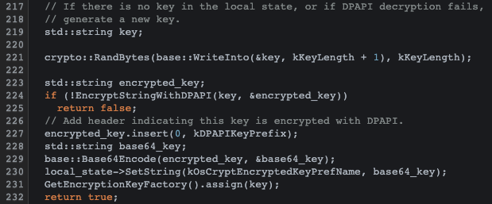

# Chrome Credential Stealer

## Step 1: Examining Chromium Source Code

Reverse Engineering

Findings:

- Different encryptions for Windows (DPAPI), Mac (Keychain Safe Storage) and Linux (KeyRing / Kwallet)
  - https://source.chromium.org/chromium/chromium/src/+/master:docs/security/faq.md;l=612?q=dpapi&ss=chromium%2Fchromium%2Fsrc
- Windows:
  - Encryption Key (stored in local state, base64 encoded with DPAPI prefix)
    - https://source.chromium.org/chromium/chromium/src/+/master:components/os_crypt/os_crypt_win.cc;l=188?q=EncryptStringWithDPAPI&ss=chromium%2Fchromium%2Fsrc
    - 
  - AES
    - https://hothardware.com/news/google-chrome-aes-256-password-encryption-malware-devs
    - Might be CBC - nvm it's GFM
      - https://source.chromium.org/chromium/chromium/src/+/master:third_party/tlslite/tlslite/utils/aes.py;l=27?q=aes&ss=chromium%2Fchromium%2Fsrc
    - Symmetric - same key for encryption and decryption
    - Encryption: iv + AES.new(16-byte key, MODE, iv)
    - kEncryptionVersionPrefix: v10 **old versions use a different version??**
    - Nonce length 12 (https://source.chromium.org/chromium/chromium/src/+/master:components/os_crypt/os_crypt_win.cc;l=157?q=kEncryptionVersionPrefix&ss=chromium%2Fchromium%2Fsrc)
  - Old Chrome code https://chromium.googlesource.com/chromium/src/+/refs/tags/79.0.3941.0/components/os_crypt/os_crypt_win.cc
- Linux:
- Mac:

Ideas:

- Malware that stays on PC
- Master encryption key stored (encrypted with RSA?) so that even changing passwords won't break the Windows API call decryption functionality
- Py to exe
- Sends new request randomly to prevent detection (don't want it periodically, don't want it every time the db gets updated)

KrwmTools

Expand to other Chromium browsers, i.e. Chromium, Edge, Opera, Vivaldi

Suggestions:

IV key saved over web? encrypted with private key

CryptProtectData API Function - only user with the same credentials as the user who encrypted it can decrypt it

What does Firefox do differently?

Cookies

Stealing while Chrome is open - can steal session cookie data

Without user knowing

Windows relys on the fact that data is safe as long as the user trying to decrypt the data is the same as the user who encrypted it

However, this user can be compromised, as demonstrated - what error is this? data validity? auth?

Synced on G account - sign in on any device if you have their account details

Autofill - can steal addresses and other sensitive data

https://source.chromium.org/chromium/chromium/src/+/master:components/test/data/autofill/tools/add_disused_address.py;l=14?q=%22_WEB_DATA_DB%22&ss=chromium%2Fchromium%2Fsrc

Testers:

- Alvin - tested extracted data
  - Doesn't store autofill data - uses Dashlane instead
  - Extracted some useless info
- 

Test requests

