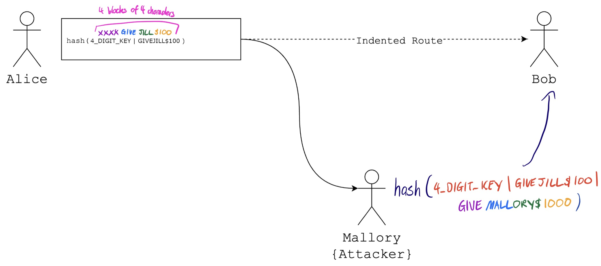
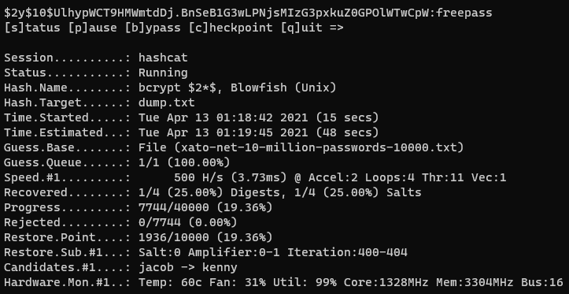
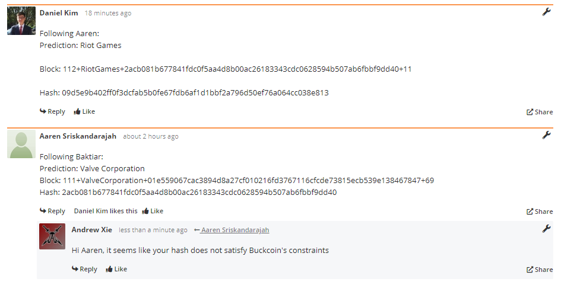

# Community

## Recharge

To avoid burnouts, I play musical instruments to destress myself between coding or study sessions, especially when I'm stuck on a problem. I find this very effective in taking my mind off things and allowing me to regain focus for many long hours of work at a time. 

## Security Everywhere

This week, I went down to Canberra to attend the BSides conference, which was very interesting and I learned a lot about new security topics such as privilege escalation exploits, tools for CTFs and finding vulnerabilities such as Binary Ninja and Procmon, and surprisingly about investing in cryptocurrency as well. On the second day, I was chatting to a former cyber security specialist at Citadel who was explaining the profitability of investing in cryptocurrency to me and his recommendations for investment, as well as how he wouldn't recommend crypto mining for the general population. I found his insights very interesting and relevant to the content learned from Week 5, which further explores how cryptocurrencies work and how blockchains help verify blocks of transactions. Understanding the basics of cryptocurrencies, I now want to invest in them and my goal is to complete more activities which could help me learn more about them.


# Security Engineering

## Password hash cracking

**Definitions**

- Avalanche effect - small changes in the input lead to large changes in the hash output
- Deterministic - hashing the same input always produces the same hash output
- Preimage resistance - given a hash output, it should be hard to find an input which would produce it
- Second preimage resistance - given a hash input, it should be hard to find a different input that has the same hash
- Collision resistance - it should be hard to find two different inputs which produce the same hash output

**Known Common Hash Attacks**

- Dictionary attack - form of brute force attack by trying dictionary words as likely possibilities
- Rainbow/lookup tables - lookup table for hashed outputs mapped to inputs
- Birthday attack - specialised form of brute force assault used to find collisions in a cryptographic hash function. The attacks exploit the underlying probability theory and mathematics of the Birthday Paradox situation to help reduce the number of data samples and iterations on a target required to find matching pairs. (1st vs 3rd person)
  - Repeated attempts to locate two inputs that hash to the same value, rather than trying to find something that collides with a specific hash value
  - Defence
    - Large output length of the hash function - typically about twice as many bits compared to countering an ordinary brute force attack
    - Altering original copy to be passed as input without changing the overall form of the message, keeping personal record of these alterations
  - [Birthday Paradox | When Mathematical Theory is Used in Cyber Attacks (finjan.com)](https://blog.finjan.com/birthday-paradox-when-mathematical-theory-is-used-in-cyber-attacks/)
- Chosen-plaintext attack - trying to learn more about encryption system by analysing generated ciphertext for plaintext data to be encrypted

**Crack an MD5 password hash** - use crackstation.net to get password123 from 482c811da5d5b4bc6d497ffa98491e38

**Securing Stream Ciphers using HMAC**

- Message authentication code (MAC)
- Stream ciphers usually used for video stream encryption - XOR for a pseudo-random key stream (flip bits)
- Message can be intercepted and bits flipped for interference - banks etc. follow a pattern
- Add checksum to end of message m: h(k|m) hash of a key k appended to message - although hash functions used based on Merkle-Damgard construction, whose internal states can be resumed and append to the message (append to message and calculate a new hash)
- HMAC (key hashed authentication code) - two hashes involved for two keys k1 and k2
  - h(k2|h(k1|m))
  - Immune to length extension attacks - don't know internal state for inner hash

**Length Extension Attacks**

- If you have a message that is concatenated with a secret and the resulting hash of the concatenated value (the MAC) – and you know only the length of that secret – you can add your own data to the message and calculate a value that will pass the MAC check without knowing the secret itself.
- Registers updated with hashes of message + padding, broken into 512 bit blocks - returned as hash
  - There is some internal state to hashing, which is returned at the end
- key + message + padding + extension
- Extension must be in its own block so key + message + padding must be a multiple of 512 bits
- [Hash Length Extension Attacks | WhiteHat Security](https://www.whitehatsec.com/blog/hash-length-extension-attacks/)
- https://youtu.be/3R_q5XD-RJU
- If we have state = hash(SECRET|A) and we want to calculate hash(SECRET|A|B), we can change the initial state of hash(B) to be previous state = hash(SECRET|A), and the hash will effectively "continue" from before
- For the example, accounting for the 4 blocks of 4 characters specification, we can change out output to hash(4_DIGIT_KEY | GIVEJILL\$100 | GIVEMALLORY\$1000) using the technique above, which satisfies this specification. If we added GIVEMALLORY$100, an extra byte would have to be added for padding (possibly the null byte). 



**Database Dump**

- After downloading and looking at the help flag for hashcat, I figured out I needed to download a wordlist for the brute-forcing the crack. To do this, I used the [rockyou.txt](https://github.com/brannondorsey/naive-hashcat/releases/download/data/rockyou.txt) which I've heard about before. I tried cloning the SecLists repository but Windows Defender detected three instances of malware so I removed the local repository immediately. 
- However, I was still confused as to which mode to use, so I ended up using a [hash identifier](https://hashes.com/en/tools/hash_identifier), as Steven suggested in his [blog post](https://www.openlearning.com/u/stevencai-qoixv3/blog/OptionalChallengeDatabaseDump/), which showed that the hashes in the dump.txt file were probably using the bcrypt \$2*​\$, Blowfish (Unix) algorithm. This indicated that I should use a mode of 3200.
- With this I ran the command `hashcat -m 3200 -a 0 dump.txt rockyou.txt`
- Without recovering any hashes after 30 minutes, I decided to try a different wordlist, this time using [xato-net-10-million-passwords-10000.txt](https://github.com/danielmiessler/SecLists/blob/master/Passwords/xato-net-10-million-passwords-10000.txt) downloaded directly from the SecLists repository. Although I was using a second-hand Nvidia GeForce GTX 980 Ti, I was able to get one of the hashes within 10 seconds - specifically the third one which revealed to be "freepass".
- It is difficult to determine whether to stick to one word list and hope that it is able to crack a hash, or when to try your luck using another word list. Brute-forcing a hash definitely takes a lot of computational power and luck when it comes to which word list to choose. 



Comment: https://www.openlearning.com/unswcourses/courses/sec-21t1/activities/hash-cracking?inCohort=unswcourses%2Fcourses%2Fsec-21t1%2FCohort#s%2FClassOf21T1#comment-607466f821e9cc66ec425339

## Birthday Attack

Birthday attacks exploit the mathematics behind the birthday problem in probability theory by looking at any two hashes having a collision rather than searching for a hash which collides with a specific hash. I wrote the following Python program to complete this activity. I discovered that my original program was rather slow and had memory issues for a large number of matching digits, using up all of my 32GB of available RAM and causing my computer to freeze. 

```python
from hashlib import sha256
from time import time

MATCHING_DIGITS = 9

def sha_hash_digits(foo: bytes):
    ''' returns relevant digits of foo's sha256 hash '''
    return sha256(foo).hexdigest()[-MATCHING_DIGITS:]


if __name__ == '__main__':
    # import confessions
    with open('confession_real.txt', 'rb') as f:
        real = f.read()

    with open('confession_fake.txt', 'rb') as f:
        fake = f.read()

    start = time()
    
    # hash map to keep track of hashes -> confessions
    hash_map = {}
    while True:
        # get relevant digits of hashes
        real_hash = sha_hash_digits(real)
        fake_hash = sha_hash_digits(fake)

        # check for collisions
        seen_hashes = hash_map.keys()
        if real_hash in seen_hashes:
            # real's hash collides with one of fake's hashes
            real_collision = real
            fake_collision = hash_map[real_hash]
            break
        elif fake_hash in seen_hashes:
            # fake's hash collides with one of real's hashes
            real_collision = hash_map[fake_hash]
            fake_collision = fake
            break
        else:
            # update hash map
            hash_map[real_hash] = real
            hash_map[fake_hash] = fake
            real += b' '
            fake += b' '

    end = time()

    # write new real and fake collisions
    assert sha_hash_digits(real_collision) == sha_hash_digits(fake_collision)
    print(f'Collision found for hash {sha_hash_digits(real_collision)} in {end - start} seconds')

    with open('ax_confession_real.txt', 'wb') as f:
        f.write(real_collision)

    with open('ax_confession_fake.txt', 'wb') as f:
        f.write(fake_collision)
```

A hash map is generally used to store previous hashes with their corresponding text, which has a constant lookup time allowing for efficient checks. However, its linear space complexity means that it scales with the number of hashes calculated, with the entire program having to keep very long strings of real and fake confessions in memory. To deal with this, I decided to store the number of appended spaces to the string in the hash map instead of the entire confession with appended spaces. By doing so, data concerning the original confession (mapped from its hash) will take up less memory when kept in memory, and allow the program to run for a larger number of matching digits without freezing my computer. By rewriting my program with this in mind, I was able to more efficiently find collisions for hashes even though I had to use two separate hash maps for real and fake confessions instead. For a specified number of 9 matching digits, my initial program took 21.8 seconds to find a collision and reached 97% memory usage. My new program only took 15 seconds to find a collision and only used 19% of memory, 1% more than my normal memory usage.

```python
from hashlib import sha256
from time import time

MATCHING_DIGITS = 8

def sha_hash(foo: bytes):
    ''' returns foo's sha256 hash '''
    return sha256(foo).hexdigest()


if __name__ == '__main__':
    # import confessions
    with open('confession_real.txt', 'rb') as f:
        real = f.read()

    with open('confession_fake.txt', 'rb') as f:
        fake = f.read()

    start = time()
    
    # hash map to keep track of hashes -> confessions (only store number of additional spaces)
    real_hash_map = {}
    fake_hash_map = {}
    extra_spaces = 0
    while True:
        # get relevant digits of hashes
        real_hash_digits = sha_hash(real + extra_spaces * b' ')[-MATCHING_DIGITS:]
        fake_hash_digits = sha_hash(fake + extra_spaces * b' ')[-MATCHING_DIGITS:]

        # check for collisions
        if real_hash_digits in fake_hash_map.keys():
            # real's hash collides with one of fake's hashes
            real_collision_spaces = extra_spaces
            fake_collision_spaces = fake_hash_map[real_hash_digits]
            break
        elif fake_hash_digits in real_hash_map.keys():
            # fake's hash collides with one of real's hashes
            real_collision_spaces = real_hash_map[fake_hash_digits]
            fake_collision_spaces = extra_spaces
            break
        else:
            # update hash maps
            real_hash_map[real_hash_digits] = extra_spaces
            fake_hash_map[fake_hash_digits] = extra_spaces
            extra_spaces += 1

    end = time()

    # confirm hash of real and fake collisions match
    real_collision = real + real_collision_spaces * b' '
    real_collision_hash = sha_hash(real_collision)
    fake_collision = fake + fake_collision_spaces * b' '
    fake_collision_hash = sha_hash(fake_collision)
    assert real_collision_hash[-MATCHING_DIGITS:] == fake_collision_hash[-MATCHING_DIGITS:]
    print(f'Collision found for matching hash {real_collision_hash[-MATCHING_DIGITS:]} in {end - start} seconds')

    # write new real and fake collisions
    print(f'Real confession has {real_collision_spaces} extra spaces and a hash of {real_collision_hash}')
    with open('ax_confession_real.txt', 'wb') as f:
        f.write(real_collision)

    print(f'Fake confession has {fake_collision_spaces} extra spaces and a hash of {fake_collision_hash}')
    with open('ax_confession_fake.txt', 'wb') as f:
        f.write(fake_collision)
```

Output for 9 matching digits:

- Collision found for matching hash e3a89353 in 6.35568642616272 seconds
- Real confession has 109806 extra spaces and a hash of acecfca2ef8bfca7ebcbbef053b35407d7ea82f061bd084b457cad90e3a89353
- Fake confession has 4158 extra spaces and a hash of a8e313dd7f6339640e7a5e7dcf6752b9e26cc3487d2777784501ddc9e3a89353

Comments:

- https://www.openlearning.com/u/willsieber/blog/BirthdayAttack#comment-60749c9f795fcd54abb6613f
- https://www.openlearning.com/u/mohammednasef/blog/ThePowerOfBirthdayAttacks#comment-60749be6203cb827c3f1d8a0

## Podcast: Blockchain, Bitcoin and Proof of Work

As mentioned in my [Security Everywhere post this week](https://www.openlearning.com/u/axie/blog/BsidesCrypto/), I have acquired a sense of curiosity for cryptocurrency, which is one of the reasons why I wanted to do this activity.

Notes:

- Digital currency can be forged (can be infinitely copied - can't rely on uniqueness)
  - Currently through a third party (bank, ledger-based)
  - Ensuring integrity without a third party is difficult: ledger can be altered - trust-based system - more difficult to be recognised digitally compared to scribbled out physically
  - Blockchains can help verify its legitimacy - ledger distributed and authentic (has integrity) - confident it hasn't been tampered with
- Block - records ledger transactions
  - Transaction hasn't happened until recorded in ledger
  - **Integrity** - hash - can't tamper with it
- Blockchain - verifies block transactions
  - Transaction will go through once it appears on the blockchain (around 10-15 minutes or more)
  - Most recent block might get lost in the blockchain
    - Might be safer to wait until it is a few blocks in - redone as another block
    - Once it is deep enough within the blockchain, it cannot be undone - verified
  - Miners bundle binary data into a block, adding into the block the hash of the previous block
    - Tries to make a valid block
    - If you change a block, all blocks after it will be changed
  - **Proof of work** - constraint on hash - a lot of work to change 5 to 6 blocks
    - Block not valid until hash satisfies some rules
      - e.g. hash has to start with some pattern like 00
      - Adjust constraints to require miners to do more work - to stop forgery
        - Bits of work, e.g. SHA requires 10 bits of work, 1 million hashes is about 20 bits of work -> 30 bits of work total - not too bad, tighten constraints (should be around 10-15 minutes)
    - Block contains data, previous SHA hash and magic number (calculated to satisfy rule - requires work)
    - Don't have enough time to forge a block several layers deep and correct all the following ones since others are also mining and creating new blocks on the blockchain just as quickly
    - Work gives security
  - **Authentication** - Don't need a centralised source of authority

## Bitcoin Mining

Task:

1. Make a bold data breach prediction
2. Check that the previous block in the chain is valid
3. Increase the chain length by one and make your own block
4. Using OpenSSL, brute force search for a serial number which makes your block valid (meet criteria)
   echo 'block_number+message+previous_hash+serial_number' | openssl sha256 (line break automatically included using echo)
5. Add your block to the chain

Daniel posted:

- Following Aaren:
- Prediction: Riot Games
- Block: 112+RiotGames+2acb081b677841fdc0f5aa4d8b00ac26183343cdc0628594b507ab6fbbf9dd40+11
- Hash: 09d5e9b402ff0f3dcfab5b0fe67fdb6af1d1bbf2a796d50ef76a064cc038e813



However, I noticed that the block before his was invalid due to its hash of 2acb081b677841fdc0f5aa4d8b00ac26183343cdc0628594b507ab6fbbf9dd40. I wasn't sure what to do now, since Daniel did not verify Aaren's incorrect hash properly. Doing some research, it seems like these invalid blocks are meant to be ignored. If I followed Daniel's block that would verify Aaren's block, which should not be allowed in a blockchain. From this, it seems like I am meant to ignore and replace Aaren's block (number 111), and Daniel's block will have to be added sometime later in the blockchain. 

Following Baktiar (block hash of 01e559067cac3894d8a27cf010216fd3767116cfcde73815ecb539e138467847):

- Prediction: Tencent
- Hash begins with 0 and a base10 digit in hex (e.g. 0 then 0-9) - verified
- Block: 111+Tencent+01e559067cac3894d8a27cf010216fd3767116cfcde73815ecb539e138467847+serial_number

Since I enjoy being able to practically apply my programming skills to activities I complete, I wrote the following Python script to calculate the serial number and mine the full valid block. I quickly found that a serial number of 13 would be able to satisfy Buckcoin's constraints. 

```python
from hashlib import sha256

# my block
block_number = 111
message = 'Tencent'
previous_hash = '01e559067cac3894d8a27cf010216fd3767116cfcde73815ecb539e138467847'

# find serial number which satisfies constraints
serial_number = 0
while True:
    block = f'{block_number}+{message}+{previous_hash}+{serial_number}\n'
    block_hash = sha256(block.encode('utf-8')).hexdigest()
    if block_hash[0] == '0' and block_hash[1].isdigit:
        # satisfies constraints
        print(block)
        print(block_hash)
        break
    serial_number += 1
```

It is interesting to actually see how miners can verify the integrity of previous blocks by examining its hash. Since Daniel did not recognise that the block before his was invalid, I could have accidentally verified Aaren's block if I had not checked the previous blocks. With more miners operating to verify the blockchain, it can be seen that such examples of invalid blocks through intentional forgery or accidental miscalculations could be easily recognised and invalidated. 

# Extension: Forensics

## Wargame 1: file

At first, I was very confused about this file - specifically what file format it was in. Inspecting the file using `xxd` for hints on this, I noticed the JFIF (JPEG File Interchange Format) string embedded in the header. From memory, I knew this could be an image file but was probably corrupted in some way. Trying to open this file in my image viewer did not work either. I was wondering why the `file` command did not recognise this as an image file, which reminded me of learning about magic bytes / headers from COMP1521. I then checked with the handy [list of file signatures](https://en.wikipedia.org/wiki/List_of_file_signatures), where I found that the header of the file was similar to what it should be, with the first four bytes not matching (0'd out instead). Searching up for hex editors, I came across VS Code's Hex Editor which I used to easily edit the first four bytes to the expected FF D8 FF E0 and ran `file` on it again, which displayed the expected JPEG/JFIF format. Opening this file in my image viewer, I was able to find the flag COMP6841{MAGIC_BYTES_DONT_GRANT_WISHES_LIKE_MAGIC_BEANS}. Although I have analysed hex files before, it was interesting to finally edit the bytes directly using a hex editor and see its effect. 

## Wargame 2: image.jpg

Given this file was an image (confirmed using `file` as well), I immediately tried all the Steganography techniques I knew on it, where I found the string "flag.txt" as one of the strings hidden in the file (could be alternatively found using `strings`). At this point, I had a feeling this was not just an ordinary image file, especially due to the misleading hint of the file name and extension both affirming that this is just an image, which I thought was kinda sus. Thinking about why an image would reference a txt file in its bytes, I decided to inspect the file further using `xxd` and found that this was located near the end of the file. After several hours away from the problem, I remembered a [video](https://youtu.be/VVdmmN0su6E) from LiveOverflow where the same file could be of several formats at the same time depending on what program was used to run it, since programs selectively look through bytes between its magic header (or beginning of file if it doesn't have one) and magic footer (or end of file if it doesn't have one). It was then that I thought that this could potentially be a zip file, explaining why it would have the "flag.txt" string in it, as I remembered writing the file name to be archived in plaintext for my file archival / compression program in COMP1521. To my surprise, running `unzip image.jpg` seemed to work, except that I needed some sort of password as well. I spent several more hours running through my Steganography techniques again and I couldn't find anything about a password. Browsing through the blog posts for this activity, it seemed that this password was found in the metadata for the image file. However, I remembered checking for this already on my Mac and couldn't find anything. Noticing that others used Windows, I downloaded the image on my PC and voila, the password YmFzZTY0X2lzX25vdF9lbmNyeXB0aW9u was right there in the comments. This seemed like a base64-encoded password so I decoded it to get base64_is_not_encryption. Unzipping with this password, I was able to extract the flag.txt and obtain the flag COMP6841{BUT_BUT_WINDOWS_SAID_IT_WAS_AN_IMAGE}. 

Upon reflection, I was curious why my Mac didn't display the comments, so I searched for "password" within the file using `xxd image.jpg | grep password`, which was actually present at the beginning of the file. From hindsight, I would have saved so much time by simply looking at the beginning (passing to `head`) and end of the file (passing to `tail`). 

## Wargame 3: jaws.pcapng

Although I didn't really understand all the networking protocols, I knew the main two to look out for were TCP and HTTP. From the extension webinar, it seemed that analysing the HTTP packets could reveal something interesting, and possibly the flag as well. Filtering for HTTP protocols, I was able to find one of the flags COMP6841{HTTP_HEADERS_DONT_NEED_FLAGS} as a cookie. Adjusting the filter even more to search packet details for the string "comp6841", I was able to find the next flag COMP6841{IS_HTTPS_REALLY_NECCESSARY?} under an authorization header. After obtaining the flags, I started looking at the differences between the networking protocols, which I found very interesting and ended up applying this knowledge in my Something Awesome Project. 


