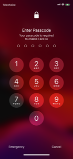

# Community

## Share your security hack

My favourite security hack is being able to quickly disable unlocking my iPhone through its biometric sensors, such as Face ID and Touch ID. One of my primary reasons for doing so is to prevent untrusted people from unlocking my phone by tricking me to look at the Face ID sensor, or using my fingerprint when I'm asleep / unconscious, as well as preventing access to my data if my phone can be easily stolen or compromised. Firstly, we need to understand how iPhones secure biometric data using their secure enclave technology, responsible for storing encryption keys for passwords, Apple Pay, Touch ID and Face ID. As iPhone users know, biometric authentication is disabled by default upon booting or restarting your device, which is not available in the phone's ROM. Once you enter your password however, subsequent unlocks can utilise the biometric sensors and allow access to the iPhone very quickly. This is because your authentication keys get loaded into the iPhone's RAM, allowing for swift authentication as Apple claims. This comes with a drawback however, where hackers and even police can unlock your phone without needing to brute-force the password, even if they don't have access to your biometric data, using special devices allowing them to extract and decrypt the password directly from the phone's RAM. Restarting your iPhone, however, resets the phone to the initial state and prevents this kind of attack. Another way to achieve this without rebooting is by going to menu to shut down the device (holding the power button, or combining this with the volume down button for devices without a home button), and exiting the menu by clicking cancel instead of swiping to shut down or call emergency services (which is another security hack that can come in handy in emergencies). If done right, you will be prompted for your password before able to access your device again, with biometric authentication disabled, as in the picture below. Note this works on iPhones as well as iPads, and is a great way to prevent unauthorised access to your data through biometric authentication or unlawful access. 

# Foundations - Secrets

## No Going Back

https://mango.pdf.zone/finding-former-australian-prime-minister-tony-abbotts-passport-number-on-instagram

Recently, the hacker known as "Alex" presented at BSides Canberra 2021, describing how he was able to find out former prime minister Tony Abbott's passport number simply using an image of the boarding pass Abbott posted on his Instagram and Twitter accounts. His blog post details how he was able to obtain this information, as well as his conversation with the former prime minister who asked for advice to be more conscious about his online security and learn more about "the IT". 

## TIL: Social Credit

https://www.whatsonweibo.com/zhejiang-movie-theatre-displays-blacklisted-individuals-in-avengers-movie-preview/

Today I learned that blacklisted individuals are sometimes publicly shamed, with their mugshots displayed on large LED screens on buildings or shown before the movie in movie theatres. 

## Data Breach

Early last year, SlickWraps, a company providing custom skin wraps to devices such as phones, tablets and computers, suffered a data breach, exposing sensitive information for more than 857000 accounts. Attackers exploited a vulnerability in SlickWraps' server configuration where users are able to upload any file to any location in the highest directory on their server (i.e. the web root), allowing for a .htaccess file to be uploaded and consequently, access to the company's 17GB MySQL database. From there, hackers were able to extract SlickWraps admin account details, sensitive customer data such as addresses, email addresses, phone numbers and transaction history, as well as the company's API credentials for several sites and services. This is what the white-hat hacker Lynx0x00 did to achieve this data breach, and upon notifying the issue to SlickWraps, he found that he was ignored by them on several platforms, even after he went public with his findings. Eventually, he was able to get through to them and the issue was resolved by SlickWraps. Other than the fact that SlickWraps dismissed and downplayed the severity of a data breach, they were also under scrutiny for breaching the GDPR, such as trying to patch the vulnerability without notifying its customers and keeping personal data longer than necessary for the purpose for which the personal data is processed. Something regular users can learn from this is to use different passwords for different websites (a password manager can be helpful) and being aware of the severity of security issues. When designing systems, storing what is necessary and ensuring unnecessary data is deleted accordingly, as well as placing a greater emphasis on security, such as enforcing security through design, hiring penetration testers and not dismissing security alerts would also be very helpful. 

Sources:

- https://www.theverge.com/2020/2/25/21153434/slickwraps-apologizes-customers-bad-data-breach
- https://lifehacker.com/what-you-need-to-know-about-the-slickwraps-data-breach-1841890120
- https://archive.li/yEIJT

# Security Engineering

## Authentication Attack

Initially, I thought that a potential attack to gain access to Barbara's email account would be targeting the OAuth technology, combined with some social engineering. Since Barbara uses one-use only passwords on computers she doesn't trust and OAuth when signing up to new websites, if Barbara were to sign up to a malicious website with a fake Google OAuth service, an attacker would be able to gain access to her Google account credentials if she uses a trusted computer. A way to ensure this is by sending a fake email from E-Corp (such as from HR or her boss) during a time she would be on a trusted computer (which can be found through observing usage patterns). However, I soon realised that although an attacker would have to put in so much work to get her credentials, she would still be protected by her two-factor authentication unless that was compromised. As such, I decided to some extra research into the OAuth technology.

How OAuth works is that a user can choose to sign in with another service, which provides an authorisation grant (token) to the requesting website. Once this is successful, the website can check that this is valid and issue an access token back to the client, allowing them to effectively "sign in". However, a major weakness with OAuth can be exploited through a man in the middle attack to obtain the OAuth token from a malicious website with an insecure implementation of OAuth. Altering the redirect_uri parameter of the authorisation request allows an attacker to use the extracted token to log into other websites using the same OAuth. The vulnerability exists as there is no way for the server to know whose key it is authorising during the handshake. With this, an attacker is able to use social engineering to trick Barbara into using an insecure implementation of OAuth on a malicious website in order to obtain the OAuth token, which an attacker is able to use on other websites with her account.

Readings:

- Kiani, K. (2011). Four Attacks on OAuth - How to Secure Your OAuth Implementation. *SANS Institute*. Retrieved from https://www.sans.org/reading-room/whitepapers/application/attacks-oauth-secure-oauth-implementation-33644.
- TOTP: https://www.openlearning.com/u/avinsingh/blog/TwoFactorAuthentication/
- S/Key: https://www.openlearning.com/u/danielthurairatnam/blog/AuthenticationAttack/

# Optional Challenges

