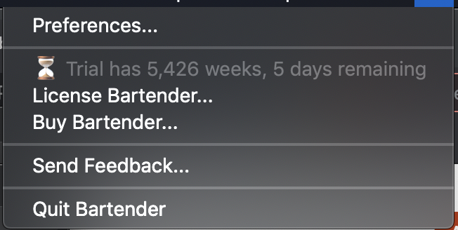
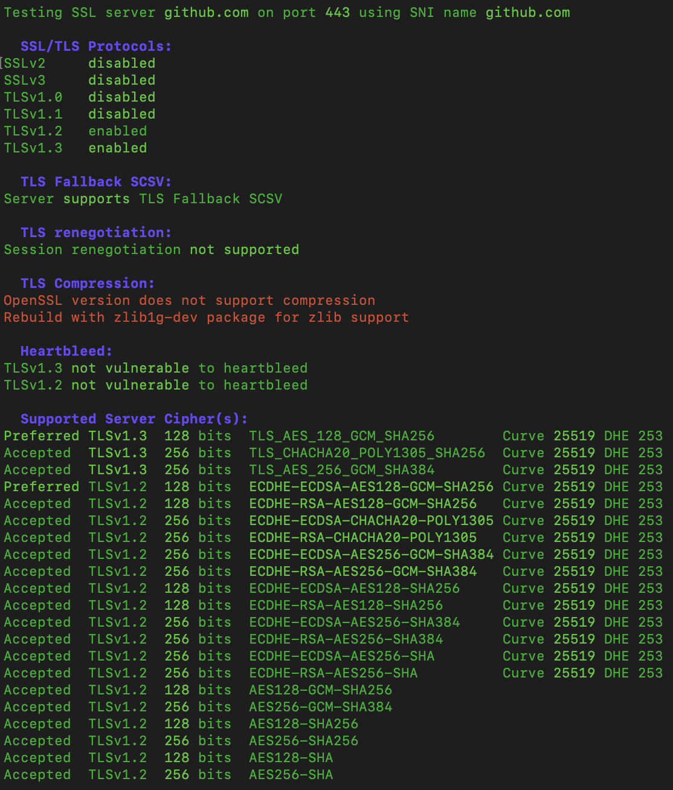
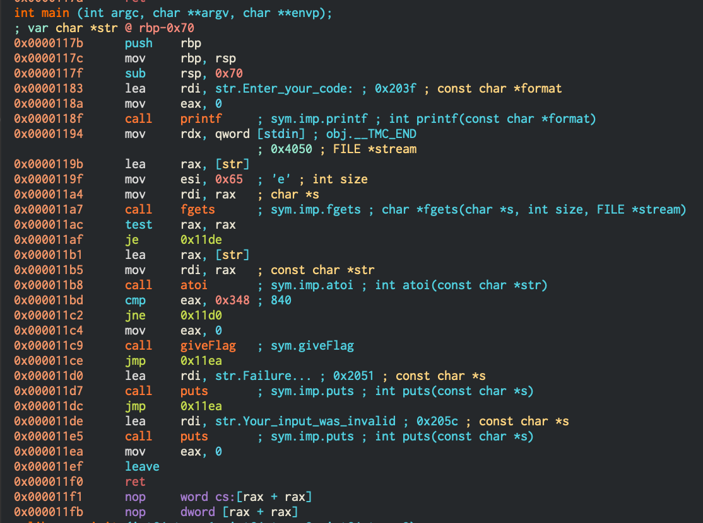
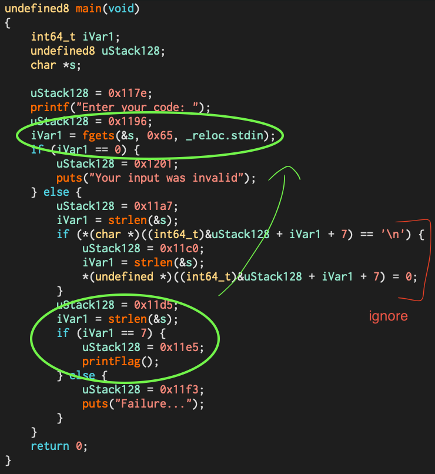
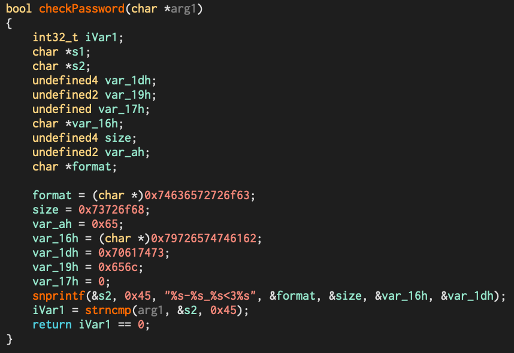

# Community

## Accident

As a curious and (usually) observant individual, I have been quite known for playing around with software to the point of breaking them. One of such examples was when I was entering high school and trying to look at how applications such as Bartender enforce free trial periods on my MacBook. Playing around with plist configuration files on my Mac, I soon found a file corresponding to the application and that I could modify the "trialStart" value to refresh my free trial period every four weeks. However, I soon found that constantly having to locate the hidden file and update it every few weeks was quite annoying, so I experimented with extreme times for this value. Changing the start date to a ridiculous future time such as in the year 2125, I was accidentally able to get the trial period in the image below. However, this was mostly just for fun and just to show to my friends, where the app would then constantly crash and become unusable. 

Looking back, what I had done could have been a major ethical concern with piracy, a term I was not aware of at the time. With my limited understanding of computers, my goal was to find out about how a program knows when your trial period has expired, and discovering an exploit to get an unlimited trial duration was simply an accident. Understanding the ethical concerns with intellectual property and piracy, I know better than to perform similar exploits nowadays for the purposes of getting an unlimited free trial. 

## Security Everywhere - Just Culture

Growing up, I was quite annoyed at the fact that my parents treated me differently when I encountered issues, compared to how the parents of some of my other Caucasian peers were treated. Whenever an issue occurred between me and my friends, I would be immediately blamed in front of everyone even if my parents did not understand what was going on, even though none of the issues were caused by me. On the other hand, other parents, upon hearing about the issue, did not hesitate the play the blame game and put all the blame on other children. I remembered being extremely frustrated at why I was at fault even if I had done nothing wrong, where my parents would refuse to listen to my side of the story. As I matured, I was informed of several reasons why this was the case. Firstly, in Asian culture, specifically Chinese culture, my parents believed in the concept of "face", which refers to the cultural understanding of respect, honour and social standing amongst others. With their excessive emphasis on maintaining their own "face", they would be ashamed to argue and escalate any issues, simply accepting that I was at fault, which definitely took a hit on my self-esteem. Another reason, which I find quite positive upon reflection, is that I have been brought up in a culture similar to the just culture idea explored in lectures this week, where I have always focused on how I can better improve myself in any situation to avoid potential conflicts, rather than try to find someone to blame. Looking back, this kind of mindset definitely allowed me to avoid many future conflicts and become a better individual, even though I was quite traumatised by my upbringing at the time. 

# Foundations - Secrets

## Root Cause Analysis

Recall the **Tips** for carrying out a good root cause analysis (from the safety and accidents lecture notes)

1. Work in a team, make it a diverse team. Solo teams are limited in the range of ideas they can come up with and the breadth of their experiences knowledge and insights. 
2. The team should include people with power to make the organisation change and some who will be involved in implementing the change. 
3. look for organisational causes, not individual causes
4. seek on underlying causes, not symptoms or proximate causes
5. know there will be multiple root causes - don't stop at the first one you identify.
6. keep digging, never feel confident that you can have found all the main root causes, that you have "solved" it.
7. use a range of formal techniques, like "5 whys", as aids to help you need digging deeper for insights and not getting stuck early on with your first impressions and not progressing further. 

**Apollo 13**

The Apollo 13 mission was launched on April 1970 with plans to land on the Moon. However, due to an issue with the rocket, the mission was aborted and the three astronauts had to orbit the Moon and return to Earth without landing. With a limited supply of electrical power, oxygen, heat, water as well as sleep, the lives of the three astronauts were at significant risk. 

**The Problem**

The Apollo 13 mission was compromised by an explosion in one of the oxygen tanks, placing the lives of the three astronauts at risk. 

**Analysis**

- Why did the oxygen tank explode?
  - Stirring of the cryogenic oxygen in the tank caused the explosion. 
- Why was the tank stirred in the first place?
  - The oxygen tank gauge was not working correctly, so a routine stirring of the tank was requested by Mission Control to prevent the cryogenic oxygen inside the tank from solidifying, allowing for a more accurate reading on the quantity of oxygen remaining in the tank. 
- Why did the oxygen tank explode if the tank was meant to be stirred anyways?
  - Stirring the tank caused an ignition in the tank, leading to the explosion. The Teflon insulation on the wires to the stirrer motor had unknowingly been melted during a pre-flight test. The stirring triggered the damaged wires to short out, causing the insulation to ignite inside the oxygen tank.
- Why did the wires get damaged during a pre-flight test?
  - The small tube used to fill and empty the tank of its super-cold components had been damaged two years earlier where technicians handling the tank accidentally dropped it by about two inches. Although this incident had been concluded to not cause any detectable damage in the tank, workers turned on the heaters inside the tank to warm up the remaining liquid oxygen, turning it into gas that could then be vented to the outside. The thermostat which was meant to prevent the temperature from exceeding 25 degrees Centigrade failed to do so, causing the temperature to rise to 500 degrees Centigrade, unknowingly melting the insulation on the wires in the process. 
- Why did the thermostat fail to regulate the internal temperature?
  - Although systems aboard the command and service modules were designed to operate at 28 volts, in 1965, these components had to be redesigned to work with 65 volts as well, which was used for pre-flight tests at the Kennedy Space Centre. It seemed that the thermostat manufacturer was not informed of this new regulation, causing the malfunction during one of the pre-flight tests which nobody was aware of. 

**Root Cause**

The thermostat manufacturer was not informed of the need to redesign their component to work with 65 volts as well as 28 volts, causing it to malfunction during a pre-flight test.

**Recommendations**

- Each component should have been checked to ensure that they meet the voltage specifications
- There may be type 1 and type 2 errors in relying on sensors to obtain data as the sensors themselves could be faulty
- Faulty components should have been thoroughly checked. With the inability to empty the tank, an extensive investigation should have been conducted to check why this is the case, instead of only trying to fix the observable issue directly. Swapping the faulty tank to a new one could have prevented the need to heat it, and save the Apollo 13 mission, but the issue itself was with the thermostat, which if had not been detected to be faulty due to the incident, could have caused a future malfunction as well. If the entire tank itself was investigated, the thermostat issue could have potentially been discovered earlier and prevent related incidents from occurring. 

**Reflection**

I found this root cause analysis activity extremely helpful as it kept questioning my current understanding of what caused the issue, with the constant need to find the underlying root cause to the problem at hand. By following the five why's, I was able to explore multiple sources in order to research and explore more about the root cause, going from my general understanding that a routine stirring of the oxygen tank caused something to ignite within the tank and lead to the explosion in the Apollo 13 incident, to a more detailed breakdown at how the components themselves failed. Although I found it quite time consuming, it is definitely very useful and crucial for finding the root cause to a problem of such a large scale. 

**Sources**

- https://www.space.com/8193-caused-apollo-13-accident.html
- https://www.universetoday.com/62362/13-things-that-saved-apollo-13-part-1-timing/

# Security Engineering

## I Accept

### Transport Layer Security (TLS)

One the the technologies powering the security of the internet is TLS and the Public Key Infrastructure (PKI).

**Note**: you may see SSL used interchangeably with TLS, the important thing to know is that TLS is the new name for the protocol.

TLS is a technology that wraps many desirable cryptographic properties (for example confidentiality, integrity and authentication) into one protocol. When a web browser contacts a website, the browser and the server will conduct a negotiation to determine and agree upon the most secure cipher suite. Cipher suites consist of a key exchange algorithm, an authentication algorithm, a symmetric encryption and an integrity (MAC) algorithm.

If you use a tool like [sslscan](https://github.com/rbsec/sslscan) on a web server you will see a list of cipher suites it supports for client ⇔ server communication. Some of these you may have seen already like RSA, AES, SHA and some like DH (Diffie Hellman) are covered this week. 

~

Using `sslscan` to analyse GitHub's security protocols was a very interesting, revealing that they only accept TLS v1.3 and 1.2, preventing fallback attacks to TLS v1.1 and 1.0, as well as SSLv2 and SSLv3. However, this was not very surprising as GitHub is a very popular website, and would value the three cryptographic properties of confidentiality, integrity and authentication. As discussed in class, TLS v1.3 does not accept anything even potentially insecure such as cipher block chaining, requiring a variance of counter mode instead. TLS v1.2, however, still supports some of older cryptographic algorithms which are prone to major vulnerabilities. Examples of such vulnerabilities include RSA key transport (which doesn't provide forward secrecy), CBC mode ciphers as discussed before and RC4 stream ciphers which are not secure for use in HTTPS. 

Further reading:
https://www.cloudflare.com/en-gb/learning/ssl/why-use-tls-1.3/

## PKI Risks

Risk #3: "How secure is the verifying computer?" explores the idea that computers inherently trust "root certificates", a topmost certificate which identifies the root certificate authority (CA) and signs other certificates. Since computers rely on the certificate chain of trust, an insecure or invalid root certificate could potentially sign a untrustworthy site, causing the computer to allow access to such untrustworthy sites. Furthermore, root certificates are self-signed, meaning that an attacker can add a malicious root certificate to the list of root certificates, which are treated like legitimate certificates on a computer. By doing so, the computer will trust the malicious root certificate for verifying other certificates.

This is what Superfish did to allow access to adware which would usually be untrusted and blocked on computers, and was found to be preinstalled on Lenovo notebooks between September 2014 and February 2015. This malware did what was suggested above, basically adding itself as a root certificate authority and injecting JavaScript into webpages to display advertisements, using a man-in-the-middle attack to intercept encrypted traffic. This is a major security concern since this can also be used to spy on users. Extracting the private key from the root certificate would allow hackers to sign their own certificates (impersonating Superfish) using the key to spy on other Lenovo laptops on the same network. 

https://www.schneier.com/wp-content/uploads/2016/02/paper-pki.pdf

https://support.lenovo.com/au/en/product_security/ps500035-superfish-vulnerability

# Extension: Reverse Engineering Wargames

## exercise0:

Initially, I tried to run strings on the binary, which allowed me to find the flag, before I realised that the question was asking for the input to get this flag. As such, I opened the binary in Cutter and analysed the main function using disassembly. As can be seen in the image below, after atoi on the fgets input is called, a comparison is made to 0x348 (or 840 in decimal), and if this is successful, the giveFlag function will be called. 

## exercise1:

Analysing the main function in Cutter using the decompiler mode (Ghidra), it is evident that in order to call printFlag, iVar1 must equal to 7. Working my way backwards, this variable refers to the length of the string s, which we used fgets to write our input into. By focusing on the variables of interest while working backwards, I noticed that the conditional branch near the middle of the decompiled source code could be ignored since it does not change the value of s, as shown in the image below. As such, entering an input of 7 characters (such as 'aaaaaaa') reveals the flag of `his_is_a_valid_flag:no_strings_this_time:P`.

## exercise2:

Again using Cutter, through analysing the main function in disassembly mode, I found that there is a call to checkPassword before printFlag is able to be called. Also, in order for printFlag to be called, the return value from checkPassword should be non-zero. Looking at the checkPassword function in disassembly was quite tricky, although I could vaguely see subtrings and a call to snprintf before eax (return) is set to 0, which I want to prevent. After a while trying to figure out the disassembly, I decided to use the Ghidra decompiler to view the function, which I realised returned a boolean value. As evident in the image below, to ensure this was non-zero (or true), I had to ensure that a strcmp of the input with the snprintf statement was identical. Analysing the format string for snprintf `%s-%s_%s<3%s` with the constant substrings found earlier substituted, I found that an input of `correct-horse_battery<3staple` matched this, allowing me to get the flag `Password_Check`.

