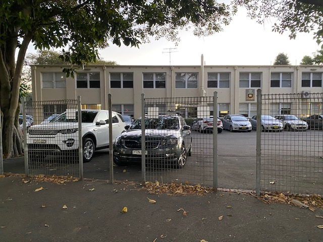
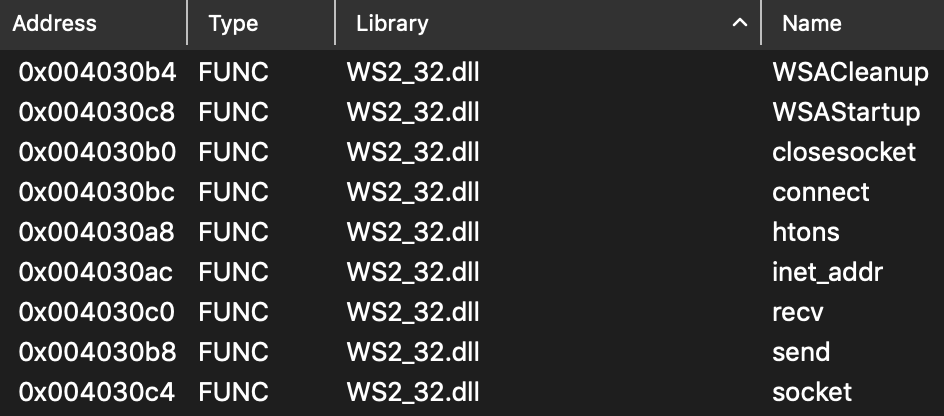

# Community

## Impact on me

An important part of communication is being able to understand different perspectives. During a Year 12 music class, one of my friends was showing us a video of someone doing [overtone singing](https://youtu.be/vC9Qh709gas), which consists of one person singing two notes at the same time. Having absolute pitch and without being told what to listen for, I found that I could only hear one of the harmonies and was very surprised at everyone's shocking reactions to the video. It seems as if I had been instinctively overanalysing the singing and completely missing another part of it. However, it was only after around three or so extra listenings before I was able to "hear" the other harmony, which gave me a reaction similar to everyone else's. From this experience, I realised the importance of perspectives in communication, where looking for the right or common goal is sometimes important in achieving a common understanding. 

## Security Everywhere

On my way home from my security tutorial this week, I walk past Sydney Boys High School and saw an instance of poor security by design. As evident in the image below, part of the fence separating the school from the busy Anzac Parade was a fence with a gaps in them presumably allowing for people to walk through. I found this quite odd, especially since all the previous schools I have been at were completely fenced off, with dedicated gates allowing for people or vehicle access to the school. The fence could have been an extra layer of security for the school, and since it was in front of a carpark which had a boom gate for cars, a bicycle or motorbike could just as easily get pass the vehicle barrier by going through these gaps instead. 

# Extension: Malware Analysis

## Wargame 1

Calculating the hash for the malware was quite simple, running `openssl dgst -sha256 DownloadFreeVBux.exe` to obtain the hash of b467e19eb0f8ee77bb2c203ef276e9088d1dc8088f471c1d15a9671fe479baea.

## Wargame 2

Since I already had Cutter downloaded from the previous wargame, I used it to analyse the malware instead of installing IDA. Seeing "isDebuggerPresent" under strings suggested that this activity should be completed using static analysis. Realising that it also had an 'imports' tab, I checked that out and found that the API calls for network communications, such as connect(), recv() and closesocket() where under the dll (dynamically loaded library) called ws2_32.dll, which I had remembered seeing under the libraries section in the Cutter dashboard. I also realised that I could have obtained the hash from the dashboard as well. 

## Wargame 3

To find the IP address the malware attempts to connect to, I wanted to try to find calls to the connect() function at 0x004030bc, which would likely include information about the IP address being connected to as well. After spending around 45 minutes looking over the functions and unable to find any which reference the connect API call, I remembered that I could use VirusTotal to run a dynamic analysis, which could hopefully catch the IP address trying to be connected to, even though that should be hardcoded as well. Uploading the executable to VirusTotal, I was able to find the IP address of 161.35.102.238 under the contacted IP addresses section in relations. Furthermore, I realised that I could have just used VirusTotal to complete all three wargames as well. Now I know that VirusTotal also displays an imports section, which can be expanded to show the same information as in the image above. 

I have now realised the convenience and benefits that dynamic analysis can bring to malware analysis, where automated analysis using tools such as VirusTotal can find the same results very quickly. They can also be used to monitor network traffic and file changes which a person doing manually may miss. 

