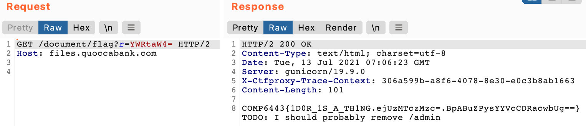
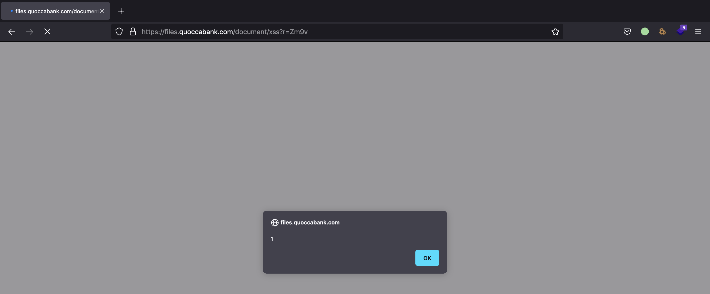
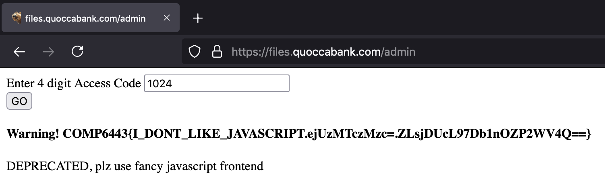
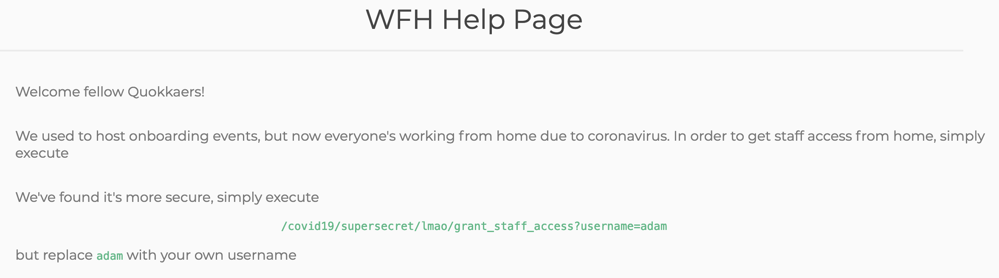
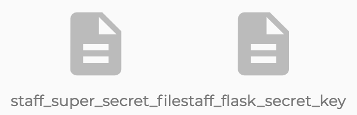
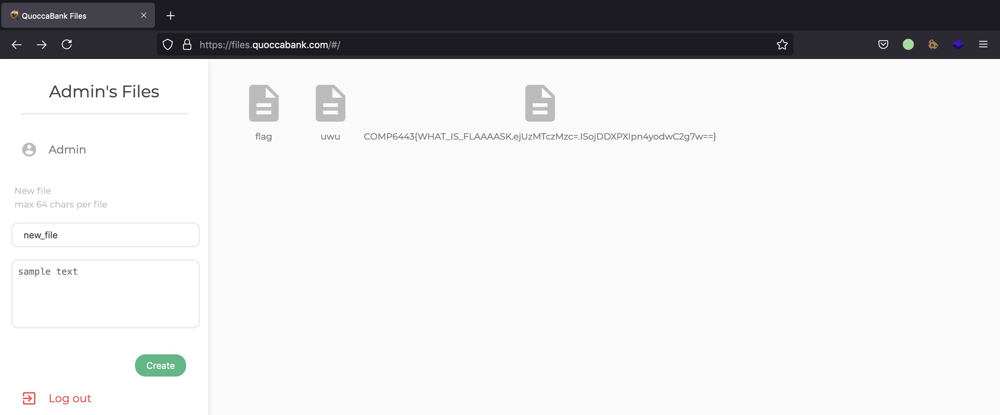

# Report 1

files subdomain authentication and user access vulnerabilities

## Vulnerability 1: IDOR vulnerability in files.quoccabank.com

<u>Vulnerability Details:</u>

Insecure direct object references (IDOR) are a type of access control vulnerability where a user is able to access unauthorised resources in an application directly through manipulating supplied input to object references. For the files application, this means that a user is able to access any file from any other user, bypassing the usual authentication protocol required for accessing the file. 

Vulnerability Severity: Critical

<u>Proof of Concept / Steps to Reproduce:</u>

Registering as a normal user (such as with a username of 'foo') and creating a new file with the default presets (filename of 'new_file' and content of 'sample text'), it can be observed that the newly created file can be accessed with the URL https://files.quoccabank.com/document/new_file?r=Zm9v. Noticing that the file can still be accessed even when the user has already logged out, suggests that an IDOR vulnerability may exist if we are able to manipulate the URL to point to another object reference. Deconstructing the URL structure, it is evident that all files adhere to the following format: `https://files.quoccabank.com/document/{filename}?r={base64encoded_string}`. Base64 decoding 'Zm9v' returns my username of 'foo', suggesting that the application uses both parameters of username and filename to retrieve a queried file. Given that user authentication is not required to access a file, a user is hence able to manipulate both parameters to retrieve any file from any user they want. Say I want to access the sensitive 'flag' file under an admin's account, which would normally be protected by the admin password, anyone can access the file content by visiting `https://files.quoccabank.com/document/flag?r=YWRtaW4=`, where 'YWRtaW4=' is the base64 encoded string for the username of 'admin', as demonstrated in the image below. Note that no authentication session cookie was required in the HTTP request either.



<u>Impact:</u>

The IDOR vulnerability means that any files from any users can be leaked by directly manipulating the query parameters of username and filename. This includes sensitive files such as 'flag' from the admin's account. This is a critical vulnerability since sensitive files from any sensitive Quoccabank clients can be leaked, as well as important data stored on an admin account which could indicate endpoints that regular users wouldn't usually know about, such as the '/admin' endpoint leaked from the admin's flag file in the image above.

<u>Remediation:</u>

The user's session cookie should be used to authenticate the user before access to requested files is given. The cookie should be tamper-proof so that only those who should have access to the files can view them. If file sharing through this method was an intended feature (which doesn't seem likely given that normal users cannot update the permissions of their files), then other authorised users will also need to be validated on the server-side before they are able to view the file. 


## Vulnerability 2: XSS in files.quoccabank.com

<u>Vulnerability Details:</u>

Cross Site Scripting (XSS) is a type of attack where malicious scripts can be injected into otherwise benign and trusted websites. As suggested in the previous vulnerability, it is unclear whether file sharing is an intended feature due to the IDOR vulnerability. However, if it was, files shared could allow for arbitrary client-side JavaScript code execution. 

Vulnerability Severity: High

<u>Proof of Concept / Steps to Reproduce:</u>

Creating a file with the content of `<script>alert(1)</script>`, it can be seen that navigating to and accessing the file will run the script on the client side. As demonstrated in the image below, the popup alert of 1 appeared when loading the page. This proof of concept demonstrates that file content is vulnerable to XSS, and that arbitrary JavaScript code can be executed on the client side. 



<u>Impact:</u>

If file sharing is an intended feature, a malicious user can execute arbitrary client-side JavaScript code on any recipient's browser if they access the page. The vulnerability means that an attacker can steal another user's authentication session token and login as if they were the compromised user, providing access to all their files and permissions. Even if file sharing isn't a feature, staff or admins who have access to any user files may be vulnerable to such an attack when asked to check out the malicious file as well. 

<u>Remediation:</u>

The XSS vulnerability can be remediated by ensuring that file content is saved and rendered as raw text instead of HTML. This includes sanitising user input, such as through HTML encoding untrusted data such as file content. This ensures that user input is not interpreted as HTML and prevents arbitrary JavaScript execution.


## Vulnerability 3: Insecure authentication in files.quoccabank.com/admin

<u>Vulnerability Details:</u>

Although the admin endpoint for files.quoccabank.com requires authentication before access to the page is given, it can be easily brute-forced to access sensitive data behind the insecure method of authentication. 

Vulnerability Severity: Critical

<u>Proof of Concept / Steps to Reproduce:</u>

Upon navigating to the admin portal, it can be seen that the page is protected by a 4 digit access code. Using Burp Suite, the browser's network tab or analysing the page's source code, it is evident that a POST request is made to the same website with the entered pin every time a user enters an access code and clicks on the GO button. Knowing the structure of the request, a script can be run to automate the brute-force process for trying every 4-digit access code combination in order to bypass the authentication, such as in the Python script below. 

```python
# Generate all possible combinations of 4 digit codes
from itertools import product
DIGITS = [str(i) for i in range(10)]
NUM_DIGITS = 4
codes = list(product(DIGITS, repeat=NUM_DIGITS))

# Brute-force authentication by trying all codes
import requests
URL = 'https://files.quoccabank.com/admin'
for a, b, c, d in codes:
  # Send code as a POST request to URL
  data = {'pin': a + b + c + d}
  resp = requests.post(URL, data=data, cert=(CERT_PATH, KEY_PATH))
  if len(resp.text) != 198:
    # Print code used to bypass authentication
    print(data)
    exit()
```

In less than two minutes, the program indicated that 1024 was the expected access code to unlock the admin portal. As evident in the image below, entering this code provided access to the contents behind the admin authentication. 



<u>Impact:</u>

As can be seen above, a normal user is able to access the admin portal content without initially knowing the correct access code. However, brute-forcing and trying every four-digit access code combination allows one to successfully find the correct code and access the contents behind the authentication in less than two minutes. 

<u>Remediation:</u>

Since there are only 10<sup>4</sup> or 10000 such combinations of four-digit codes, someone is able to easily brute-force the authentication by trying each combination. Increasing the complexity of the code (such as having extra digits or using alphanumeric characters like a password) makes brute-forcing more costly. Incorporating rate-limiting to requests slows down the process of brute-forcing, which makes finding the correct access code through a similar method more time-consuming. In such a case, using a secure password instead may be a better alternative. However, as suggested in the image, this portal seems to be deprecated so the best form of prevention is to not have the endpoint in the first place by removing it. 


## Vulnerability 4: Vertical privilege escalation and logging in as any user in files.quoccabank.com

<u>Vulnerability Details:</u>

Using passive reconnaissance, a user is able to find the endpoint to a sensitive page containing instructions on providing staff access to themselves. This also means that any normal user is able to gain staff privileges and access sensitive staff data through vertical privilege escalation. Since staff members have access to the Flask secret key, an attacker can log in as any desired user and access sensitive files on their account, as well as undergo further vertical privilege escalation to obtain the Admin role. 

Vulnerability Severity: Critical

<u>Proof of Concept / Steps to Reproduce:</u>

Inspecting the page source code and/or analysing the network traffic when loading files.quoccabank.com, I noticed that a call to 'app.d4309454.js' was made to dynamically determine content to be rendered on the page using JavaScript. Since Wappalyzer indicated that Vue.js was one of the frontend frameworks used in the application's stack, I had a feeling that additional page routes can be exposed by analysing the JavaScript file. Beautifying the JavaScript code so it is more readable, I noticed the following code snippet which allowed me to find the suspicious route of '/staff/wfh'.

```javascript
{
  path: "/staff/wfh",
  name: "wfh",
  component: L
}
```

Navigating to https://files.quoccabank.com/#/staff/wfh displays the following working from home help page with instructions for staff members on gaining staff privileges through visiting a URL.



Although users are prompted to enter their own username in order to gain staff privileges, it seems that any user is able to gain staff privileges by simply requesting staff access with their username instead. This means that normal users are able to get staff access through following the link, as evident in the image below where sensitive staff files have now been added to a normal user's account (after requesting staff access for their username). 



Finding the Flask secret key of '$hallICompareTHEE2aSummersday' in the staff_flask_secret_key file, an attacker is now able to login as any desired user. Using the Python script below, an attacker is able to generate a session cookie for another user using the Flask secret key, and use this cookie to impersonate and login as them.

```python
# Reference: https://ctftime.org/writeup/11812
import hashlib
from itsdangerous import URLSafeTimedSerializer
from flask.sessions import TaggedJSONSerializer

KEY = '$hallICompareTHEE2aSummersday'

def decode_flask_cookie(secret_key, cookie_str):
    salt = 'cookie-session'
    serializer = TaggedJSONSerializer()
    signer_kwargs = {
        'key_derivation': 'hmac',
        'digest_method': hashlib.sha1
    }
    s = URLSafeTimedSerializer(secret_key, salt=salt, serializer=serializer, signer_kwargs=signer_kwargs)
    return s.loads(cookie_str)


def encode_flask_cookie(secret_key, cookie):
    salt = 'cookie-session'
    serializer = TaggedJSONSerializer()
    signer_kwargs = {
        'key_derivation': 'hmac',
        'digest_method': hashlib.sha1
    }
    s = URLSafeTimedSerializer(secret_key, salt=salt, serializer=serializer, signer_kwargs=signer_kwargs)
    return s.dumps(cookie)


if __name__ == '__main__':
    # Any cookie - determine structure of decoded payload
    cookie = 'eyJyb2xlIjp7IiBiIjoiVTNSaFptWT0ifSwidXNlcm5hbWUiOiJ0ZXN0In0.YM3-0Q.Wr7mv0JrqapDElKfzFs2Vp7caHM'
    cookie_val = (decode_flask_cookie(KEY, cookie))
    print(cookie_val)
    # Generate cookie to login as any user with specified role
    new_cookie = dict(cookie_val)
    new_cookie['username'] = 'Admin'
    new_cookie['role'] = b'Admin'
    print(encode_flask_cookie(KEY, new_cookie)) 
```

In this example, I was able to login to Admin's account, view their stored files as well as create my own file inside of their account, as evident in the image below. I was also able to undergo further vertical privilege escalation by changing my role to an Admin in order to access even more sensitive data. 



<u>Impact:</u>

As evident above, any user is able to exploit vertical privilege escalation to gain access to sensitive staff files, even if they are not Quoccabank staff. This can then be chained with the exposed Flask secret key to generate session cookies allowing an attacker to login as any user and/or undergo further vertical privilege escalation into an admin account, interacting with the application as such a user normally would. 

<u>Remediation:</u>

The WFH help page containing instructions for staff relied on security by obscurity to ensure that normal users wouldn't know about the page itself. However, this could be exposed through passive reconnaissance, and it seems that anyone is able to access the page. A page designed to only be accessed by staff members should not be accessible to all users, nor rely on security by obscurity. The main issue, however, is that the server grants staff access to any username requested using '/covid19/supersecret/lmao/grant_staff_access?username={username}'. There should be server-side authorisation checks to ensure that the user who wants to be granted staff access in files.quoccabank.com is indeed a staff member in the first place. Furthermore, it seems that all staff members have access to the Flask secret key, presumably to be able to access files from any user. By design, this poses a security concern since any staff member can log in like a normal user would, and makes the system vulnerable to insider attacks. The role parameter stored in session cookies can also be updated, which means that all staff members can have further vertical privilege escalation to become admins themselves. User roles should not be stored on session cookies if the Flask secret key is accessible, but ideally be stored on the backend database in order to lookup what permissions a user has access to, rather than the user telling the application what it should have access to. 


## Vulnerability 5: SSRF in haas.quoccabank.com

get through logic hole - bypass waf? trusted internal server

