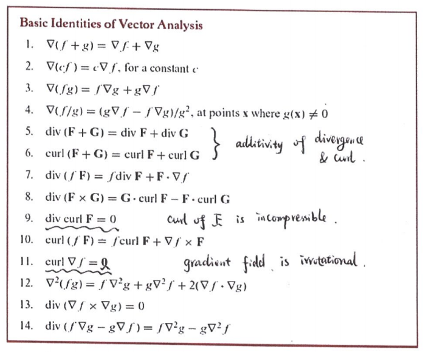

Pointwise convergence series 

$|f(x) - f_N(x)| \rightarrow 0$

$cos(k\pi) = (-1)^k$ for discrete k

ODE notes: https://tutorial.math.lamar.edu/classes/de/de.aspx

# Fourier Series

- Periodic functions approximated by simple periodic functions
- Inner product on V is a map that assigns each $f,g \in V$ a real number $<f,g>$, e.g. dot product, $\int_a^b{f(x)g(x)}$
- Continuous functions f and g are orthogonal in C[a,b] if $<f,g> = \int_a^b{f(x)g(x)} = 0$ or $<f,g> = \frac{1}{L}\int_{-L}^{L}{f(x)g(x)}$ with functions $sin(\frac{nx\pi}{L})$ and $cos(\frac{nx\pi}{L})$. This integral is 0 since f is even and cos is odd, so their product is odd. 
- Two norm: $||f||_2 = \sqrt{\int_a^bf(x)^2dx}$
- Infinity norm: $||f||_{\infty} = \max_{a \leq x \leq b}{|f(x)|}$
- Every inner product on a vector space V induces a norm given by $||f|| = \sqrt{<f,f>}$ where $|<f,g>| \leq ||f|| * ||g||$ for all $f,g \in V$
- $L^2$-norm (2-norm) $||f||_2 = \sqrt{<f,f>} = \sqrt{\int_a^bf(x)^2dx}$
- Fourier Series: $f(x) = \frac{a_0}{2} + \sum_{k=1}^{\infty}[a_kcos(kx) + b_ksin(kx)]$ for all $x\in[-\pi,\pi]$
  - General: $f(x) = \frac{a_0}{2} + \sum_{k=1}^\infty (a_kcos(\frac{kx\pi}{L}) + b_ksin(\frac{kx\pi}{L}))$
  - Pointwise convergence: $S_nf(x) = \frac{a_0}{2} + \sum_{k=1}^{\infty}[a_kcos(kx) + b_ksin(kx)]$ for all $x\in[-\pi,\pi]$ converges to $f(x)$ as $n \rightarrow \infty$
- Fourier Coefficients:
  - $a_k = \frac{\int_{-\pi}^\pi f(x)cos(kx)dx}{\pi}, k = 0,1,2...$
  - $b_k = \frac{\int_{-\pi}^\pi f(x)sin(kx)dx}{\pi}, k = 1,2,3...$
  - General: $a_k = \frac{\int_{-L}^L f(x)cos(\frac{kx\pi}{L})dx}{L}, k = 0,1,2...$
  - General: $b_k = \frac{\int_{-L}^L f(x)sin(\frac{kx\pi}{L})dx}{L}, k = 1,2,3...$
- A function $f$ is piecewise continuous on [a,b]
  - if:
    - for each $x\in[a,b), f(x^+)$ exists
    - for each $x\in(a,b], f(x^-)$ exists
    - $f$ is continuous on $(a,b)$ except at (at most) a finite number of points
  - this means $\int_a^b f(x)dx$ exists
  - if $f$ is only assumed to be piecewise continuous, the partial sum of the Fourier Series does not necessarily converge to f(x) on all points
- Piecewise differentiable conditions similar to above - with $D^+f(x)$ instead of $f(x^+)$ etc. (calculate using definition of limit)
- Even and odd
  - Odd x Odd = Even
  - Odd x Even = Odd
  - $\int_{-L}^L Odd$ dx = 0
- Uniform convergence - partial sum $f_n = \sum_{k=1}^n f(k)$ converges uniformly to $f$ as $n \rightarrow \infty$
  - $\sup_{x\in[a,b]}|f_k(x) - f(x)| \leq \epsilon$ for all $k \geq K$
  - No uniform convergence if discontinuity exists in interval
- Weierstrass test: if bigger sequence converges then smaller series converges
- $L^2$-norm convergence (mean square convergence): $\lim_{k \rightarrow \infty} \int_a^b[f_k(x) - f(x)]^2 dx = 0$ or $\int_{-\pi}^\pi (S_nf(x) - f(x))^2dx$ approaches 0 as n approaches infinity
- Parseval's identity: $\int_{-\pi}^\pi f^2(x)dx = ||f||_2^2 = \frac{\pi}{2}a_0^2 + \pi\sum_{k=1}^{\infty}(a_k^2+b_k^2)$
  - If bounded, simple, $\int_{-\pi}^\pi f^2(x)dx < + \infty$, then mean square convergence

# Vector Fields

- Flow line for F is a path c(t) where $c'(t)=F(c(t))$
- Divergence: $div F = \nabla\cdot F$
  - Spread away (sign indicates out/in flow)
  - Vector differential operator $\nabla = (\frac{\partial}{\partial x}, \frac{\partial}{\partial y}, \frac{\partial}{\partial z})$
  - $\nabla \cdot f = \frac{\partial f_1}{\partial x} + \frac{\partial f_2}{\partial y} + \frac{\partial f_3}{\partial z}$
  - Different from gradient(f) $= \nabla f = (\frac{\partial f}{\partial x}, \frac{\partial f}{\partial y}, \frac{\partial f}{\partial z})$
- Curl: $curl F = \nabla \times F$
  - Rotation
  - If F is a 2D vector field, curl F is calculated by treating F as a 3D vector field with 0 as third component
  - Gradient field

# Path Integrals (scalar line integrals)

- f(x,y,z) is a scalar
- Let c(t) be a parameterisation of a curve C for $a \leq t \leq b$, with f(x,y,z) and c'(t) continuous
- $\int_C f(x,y,z)ds = \int_a^b f(c(t)) *||c'(t)||dt$
- Choice of parameterisation irrelevant, length of C $= \int_C ||c'(t)||dt$

# Line Integrals

- $\int_C F \cdot ds = \int_a^b F(c(t)) \cdot c'(t) dt$
  - Same as the path integral of $F \cdot T$ (tangential component of F)
  - Unit tangent vector $T(c(t)) = \frac{c'(t)}{||c'(t)||} = 1$
- Also known as a "work" integral: $W = \int_C F \cdot ds$
- Alternative form: $\int_a^b Mdx + Ndy +Pdz$ with $c(t) = (x(t), y(t))$. Substitute:
  - $dx = x'(t)dt$
  - $dy = y'(t)dt$ etc.
- Flow integral: flow $= \int_C F \cdot ds = \int_a^b F \cdot T ds$
- Flux of F across C $= \int_C F \cdot n ds$ where n is the outward-pointing unit normal vector on C
  - F = Mi + Nj => $\int_C G \cdot ds = \int_C Mdy - Ndx$ where $G=(-N, M)$
- Fundamental theorem for gradient vector fields (conservative)
  - If $F=\nabla \phi$
  - $\int_C F \cdot ds = \phi(Q) - \phi(P)$
  - If C is closed, P = Q so integral = 0
  - Line integral does not depend on parameterisation
  - This means $curl \nabla F = 0$
- Green's theorem
  - Flux-divergence or normal form
    - Flux of F across C = Amount of flow leaving the region D (div F)
    - $\int_CF \cdot n ds = \int_C -Ndx + Mdy = \int\int_D(\frac{\partial M}{\partial x}+\frac{\partial N}{\partial y})dxdy$
    - Assumptions:
      - Bounded and simple region with nonempty interior
      - Boundary C is oriented in the positive (counter-clockwise) direction, and is a finite union of smooth curves
      - The vector field F is continuously differentiable on D
  - Circulation-curl or tangential form
    - Circulation = k component of curl F (scalar curl)
    - $\int_CF \cdot T ds = \int_CMdx+Ndy=\int\int_D(\frac{\partial N}{\partial x}+\frac{\partial M}{\partial y})dxdy$
  - 

